import { Aside } from 'astro-pure/user' 

## llava1

Liu, H., Li, C., Wu, Q., & Lee, Y. J. (2023). Visual Instruction Tuning. https://doi.org/10.48550/arXiv.2304.08485  
(nips 2023 oral)

### Introduction
llava 的目的是，希望开发一个通用的、能遵循 vision and language instructions 的系统。以前的模型，基本都是基于语言增强的模型，虽然能够做到图像的分类、检测、分割、caption、生成、编辑，但每一个任务都是一个独立的模型来完成的，模型的设计当中实际上已经隐含地写死了任务指令；而且，语言在其中的作用只是用来描述图片的。

大语言模型的成功实践告诉我们，自然语言可以作为一种通用的 interface，这使得“指令微调”成为可能。实验证明，使用机器生成的高质量 instruction-following 对 LLM 进行指令微调，效果甚至超越了任务特化的 LLM。

综上，本文提出的就是 visual instruction tuning，尝试将指令微调应用到多模态模型上。

### GPT-assisted Data Generation

这是未来用于指令微调的数据集。作者从 COCO 数据集中筛选了 8w 张图片，使用 GPT4 根据这些图的 caption 和 bounding boxes 生成问答样本。使用 GPT4 只是因为 GPT4 是当年最好的大模型，作者对比了 GPT-3.5 和 GPT4，结果表明 GPT4 能提供更高质量的数据，例如空间推理等。

总共有三种类型的问答样本：多轮对话 5.8w 条、描述细节 2.3w 条、复杂推理 7.7w 条。总共 15.8w 条问答样本。每一种类型都有几个手动编写的示例作为 in context learning，帮助 GPT 生成我们想要的数据集。

### Visual Instruction Tuning
architecture  
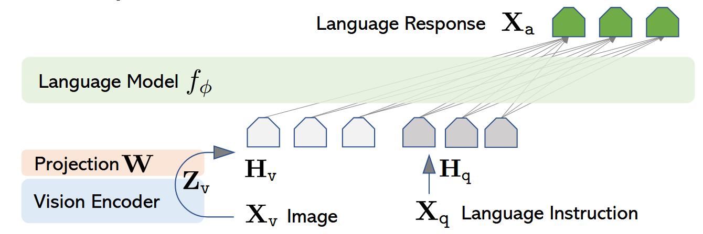

选择 Vicuna-13B 作为 base model，因为在当时的开源模型中 vicuna 的指令遵循能力最强，这样就可以最大程度地保证刚才 GPT 生成的高质量数据集被有效使用。

使用 CLIP 作为 visual encoder，但是取的是倒数第二层 transformer block 的输出作为图像的向量表示，因为 CLIP 的最后一层的特征空间被拉得太偏，语义过于抽象，而倒数第二层能保留更多空间细节，消融实验证明使用倒数第二层的效果更好（**但后来有其他论文证明，其实对于微观任务（例如 ocr 等），倒数第二层并不是最好的，还得往前倒几层**）。

训练时的每一轮问答样本的格式：  
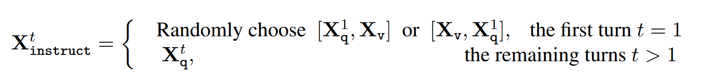
- 第 1 轮：随机选择是把图片放在前面还是把问题放在前面。本意是为了适应“先发问题”还是“先发图片”的变化（**但实际上代码里是把图片是固定在开头的**）。
- 第 n 轮：只发送问题，目的是让模型通过 self attention 自己回去看图片

训练分为两阶段。第一阶段是预训练 projector W；这一阶段用的是 CC595K 数据集（从 CC3M 数据集筛选出 59.5w 个图文对，添加问题语句将每个样本包装成单轮对话的格式）。第二阶段即进行指令微调（W 也参与微调）。训练的时候，只对 stop 标和模型的回答计算 loss  
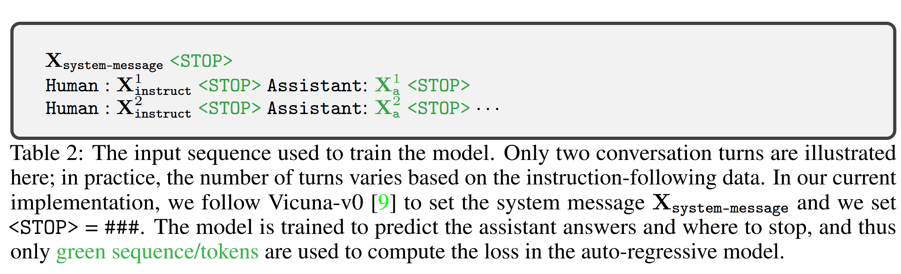

### Experiments

**定性分析**

分析样例表明，相比 BLIP2 和 OpenFlamingo，llava 能遵循用户的指令进行作答，而不是只描述场景。相比 GPT4，即便 instruction 中只是让他描述图像，llava 的回答也更详细。相对与上述几个模型而言，llava 所用的 8w 图 / 15.8w 样本的训练量并不算多，但是其效果展现出了与 GPT4 相近的推理结构与问答结果。

llava 对于图像的理解是 bag of patch 的。有例子为证。对于下图  
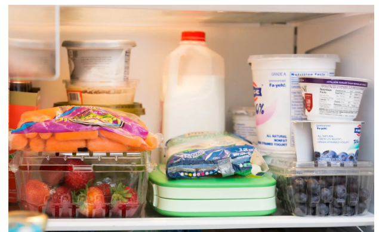
提问“是否有草莓味的酸奶”，模型回答“是”，但实际上图中没有草莓味酸奶，而是一盒草莓和一杯酸奶。

**定量评估**

评估一个样本的回答水平的指标：用一个大模型作为裁判（文中是用 GPT4）来给句子打分，然后计算 llava 回答的相对得分，公式：
$$
\text{score}=\frac{\text{llava 回答的得分}}{\text{gold-ref 的得分}}\times100\%
$$
每一个样本都是一个三元组 `[图像，文本描述，Question]`，其中的“文本描述”即图像的 caption + bounding boxes。然后给 llava 发送 `[图像, Question]` 获得 llava 的回答、给 GPT4 发送 `[文本描述, Question]` 获得 GPT4 的回答。由于 GPT4 用的图像的文字描述，是图像的最完整的真实信息，所以 GPT4 的回答可以视为 gold-ref。于是得到一个四元组 `[Question, 文本描述, llava回答, gold ref]`。然后，把这个四元组发给裁判，让他给 llava 的回答和 gold-ref 分别打 1~10 分，代入上述计算公式得到该样本的回答质量。

***

**COCO benchmark 跑分**

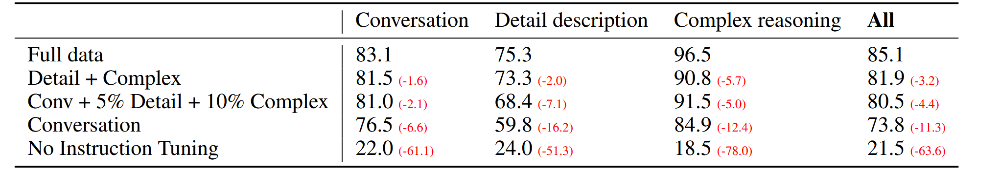

数据集：在 COCO 数据集中选了 30 张图，每张图写了 3 个 question（多轮对话、描述细节、复杂推理各一个）

列表最左侧是“用的什么数据进行的指令微调”。Full data 就是用全部 158K 条数据，detail+complex 就是只有“描述细节”和“复杂推理”这两类数据，其他同理。列表最上方就是“拿什么 question 来问”，all 就是全部 90 个 question，其他就是各自的 30 个 question。得分计算方法和刚才是一样的

结果表明：(1) 指令微调使得得分高了 50 个点；(2) 在“多轮对话”训练数据的基础上，加入少量“描述细节”“复杂推理”使得得分高了 7 个点，这说明描述能力、推理能力的提升，也有助于提高多轮对话能力。

**In-the-Wild benchmark 跑分**

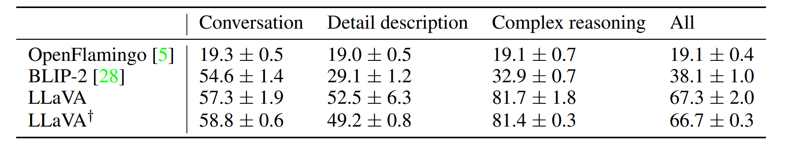

找来了 24 张图，人工编写了详细的图片描述，针对这些图编写了 60 个高难度问题。由于样本数量太少且存在较大的随机性，对于每一个样例都要跑三遍，记录均值和标准差。每个样例的随机性来自于两个地方，一个是 llava 自身的随机性，另一个是裁判打分的随机性。最后一行 llava dagger 就是用来测试裁判给分的随机性的，就是用第三行当中给出的回答、再问裁判一遍重新计算相对得分。结果表明，裁判的打分是稳定的。

***
**ScienceQA**

沿用第一阶段预训练的 projector，第二阶段在 ScienceQA 数据集上重新进行指令微调。

ScienceQA 数据集里，每一个样本包含以下四部分内容：
- 题干：即问题和候选项，部分题目有图片、hint/context 等信息
- 答案：即这个问题的标准答案，是候选项的索引
- 题解：即与这个题目相关的通用科学知识、背景，以及如何根据题干中的信息一步步推导出最终答案的逻辑过程
- 标签：任务类型、难度（根据年级）、学科大类、学科主题、考点类别、考察技能

将其改造成适合本实验的指令微调数据集：
- 输入的 instruction：问题 + 候选项。如果有题干里头有图片和 hint，顺序是图片 - hint - 问题
- 目标输出：题解 + 答案。一定是题解在前、答案在后，相当于一个 CoT

跑分结果如下  
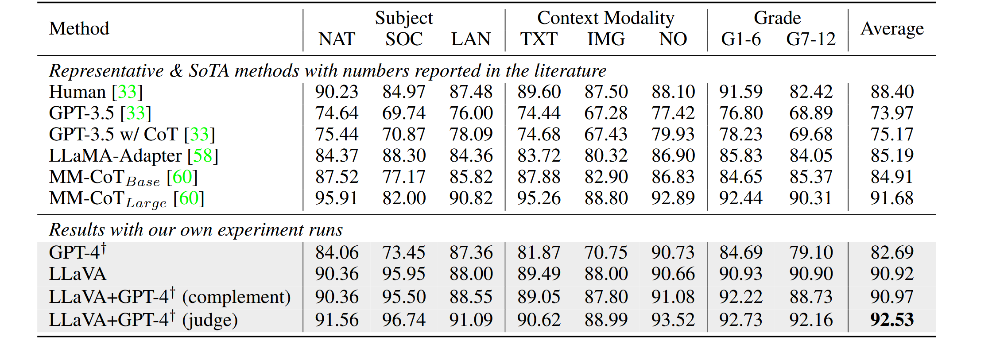

其中 GPT4 dagger 组，用的是 2-shot in context learning，即提供了两个完整的样本，让 text-only GPT4 模仿样本来生成回答。由于没有图像信息，text-only GPT4 的跑分不如 llava。但是对于很大一部分题目，text-only GPT4 答错并不是因为选择错误，而是因为他报告说“缺少必要的图像或上下文信息，无法回答”，也即没有做出选择。这说明 text-only GPT4 是知道缺少图片信息的，理论上只要把图片信息告诉 GPT4，他应该是能回答上来的。

所以设计了两个方法：
- complement。当 text-only GPT4 认为回答不上来时，采用 llava 给出的答案。结果表明这个方法的 acc 只比 llava alone 高一点点
- judge。当 text-only GPT4 给出的答案和 llava 给出的答案不同的时候，找一个裁判来决定选哪一个。该方法取得 sota，这是因为很多题目其实不需要看图片、仅依靠文字就能做出来，而更聪明的 GPT4 能够纠正 llava 在文字范围里犯的低级错误。

关于 ScienceQA 的消融实验：
- 如果图像的向量表示用的是 CLIP 最后一层而不是倒二层，会掉 0.96%
- 如果不用 CoT，也即在指令微调数据集中是先给出答案再给出推理过程，可以加速收敛，但对最终跑分影响不大
- 如果不进行 projector 预训练，直接在 ScienceQA 上面从零开始指令微调，会掉 5.11%
- 如果改用 7B 的 vicuna 作为 base model，会掉 1.08%

## llava1.5

Liu, H., Li, C., Li, Y., & Lee, Y. J. (2024). Improved Baselines with Visual Instruction Tuning. https://doi.org/10.48550/arXiv.2310.03744  
(cvpr 2024 highlight)

### Intro & Preliminary
在前作 llava1 的基础上，后人做了很多补充实验，扩展预训练数据、扩展 instruction-following 数据、换用更好的 visual encoder、换用更好的 base model，都可以提升模型性能。

主要针对的是 InstructBLIP。InstructBLIP 擅长单字或短词回答的 VQA（视觉问答的 bench），但真实视觉对话弱，不知道什么时候要详细回答、什么时候要简短回答；而 llava 擅长做对话式的视觉推理，不会生成短回答，而且在 YesOrNo 的问题上，倾向于回答 yes。这大概是因为：
- prompt 格式含糊。VQA 数据通常长得像是 `Q：{问题} A：{答案}`，这种格式没有明确告诉模型答案应该多长；
- llava1 的数据集是基于 COCO 数据集生成的，有论文证明，这种方法适用于文本理解、长上下文等许多场景；而 InstructBLIP 融入了面向学术任务的 VQA 数据集，倾向于短答；
- InstructBLIP 只微调 Qformer，不微调 LLM，也即要靠 Qformer 输出的视觉 token 去间接控制 LLM 输出长短；而 Qformer 容量有限，不如直接微调 LLM 来学会遵循格式指令好。

另外，实验说明，如果将 VQA 数据和对话数据合并来训练，会导致模型倾向于对 VQA 数据集产生过拟合，从而丧失参与自然对话的能力，除非对数据集做大量复杂的修改。说明多模态模型似乎无法平衡自然对话和学术任务，这与 NLP 当中“在指令微调中加入学术语言任务能有效提高模型的泛化能力”这一结论不符。

### Experiments

逐步搭建 llava1.5 的过程。

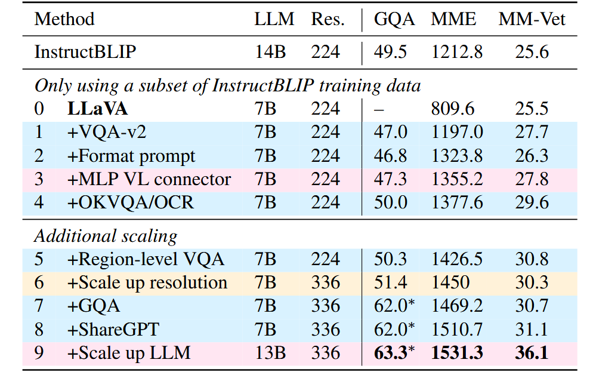

**1：显式要求短回答**  
作者对原始 llava 做了一个实验：对于短问答 benchmark，如果在 prompt 中显式地指出 "Answer the question using a single word or phrase"，得益于 vicuna 强大的指令遵循能力，其在 MME（类似 VQA 的短问答和 YesOrNo）上的跑分高了 1.6 倍，且超过 InstructBLIP。

**2：加入更多图文指令微调数据**  
包括标准 VQA 数据、细粒度局部感知数据等。标准 VQA 数据的加入使得模型见过短回答；对于细粒度任务例如 ocr、视觉细节、小范围理解等，加入其他数据集来补充；加入 GQA 数据是为了使得数据分布与目标相近。跑分结果三个指标都有所提升，数据类型扩展开始带来更广泛能力。

**3：加入更多文本数据**  
ShareGPT，即 ChatGPT 真实的用户数据，用于提升模型的 instruction-following、保持对话上下文、写更自然的长文本的能力。跑分微涨，说明纯文本 instruction data 也能影响多模态模型行为，因为最终回答仍依赖 LLM 基础能力。

**4：升级模型部件**  
(1) visual encoder 的分辨率从 224x224 提到 336x336，使得模型能看清更多细节；跑分微涨，说明当模型已经具备较好的任务数据和连接器后，提高视觉输入清晰度还能继续带来收益。(2) 改用两层 MLP 代替原来的线性 projectior，提升连接器的表征能力。(3)(可选) 把 LLM 从 7B 扩到 13B，MM-Vet 提升明显，说明综合对话、推理、解释等自然视觉对话高度依赖 base model 的能力

**5（llava-1.5-HD）：高分辨率解决方案**  
把大图切成多个小块，每块仍然按 CLIP 原本支持的分辨率编码，然后把这些 feature map 合并，再额外拼接一份低分辨率整图特征作为 global context。这样局部块提供细节，整图提供全局语义，减少切图带来的割裂感。  
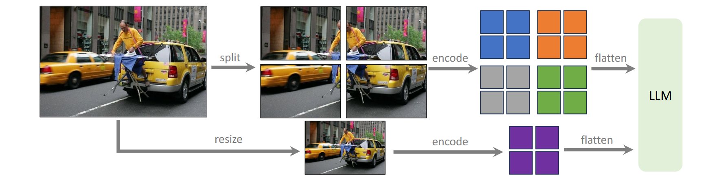

最终得到的模型即 llava1.5。

### Evaluation

**benchmark**

实测表明，llava1.5 在 学术任务 和 自然对话 共 12 个 benchmark 上均表现良好。加入了 VQA/OCR 数据后，短答和自然对话任务均得到高分，没有出现 llava1 / InstructBLIP 所呈现的不均衡现象（但并没有本质上地解决偏科，而是让同一个 checkpoint **根据 prompt 在不同输出模式之间切换，公平性有待考量**）

其他实测样例表明，llava1.5 体现出任务的泛化能力：
- llava1.5 只训练过有限格式指令，但可以泛化到别的格式要求。例如要求无法回答时输出 Unanswerable、或者要求输出 JSON 格式，模型可以正确输出。这说明模型学会了按用户要求控制输出形式。
- llava1.5 的数据都是英文，但它在 MMBench-CN 上比 Qwen-VL-Chat 高，这部分提升可能来自 ShareGPT 里的多语言文本对话能力。

**探索问题 1：数据利用率**

虽然 llava1.5 的数据量比 InstructBLIP、Qwen 等要少，但相比 llava1 还是多了。尝试随机删除，只保留 10% ~ 50% 的数据，发现保留 30% 的时候模型在大部分 bench 上还能保持在原有水平的 95%~99%，只在 MMVet 上跌到 90%；保留 20% 时才有明显的下降。因此可以推断，llava1.5 的数据混合里有明显冗余，未来应当研究更优化的的数据压缩/数据选择。  
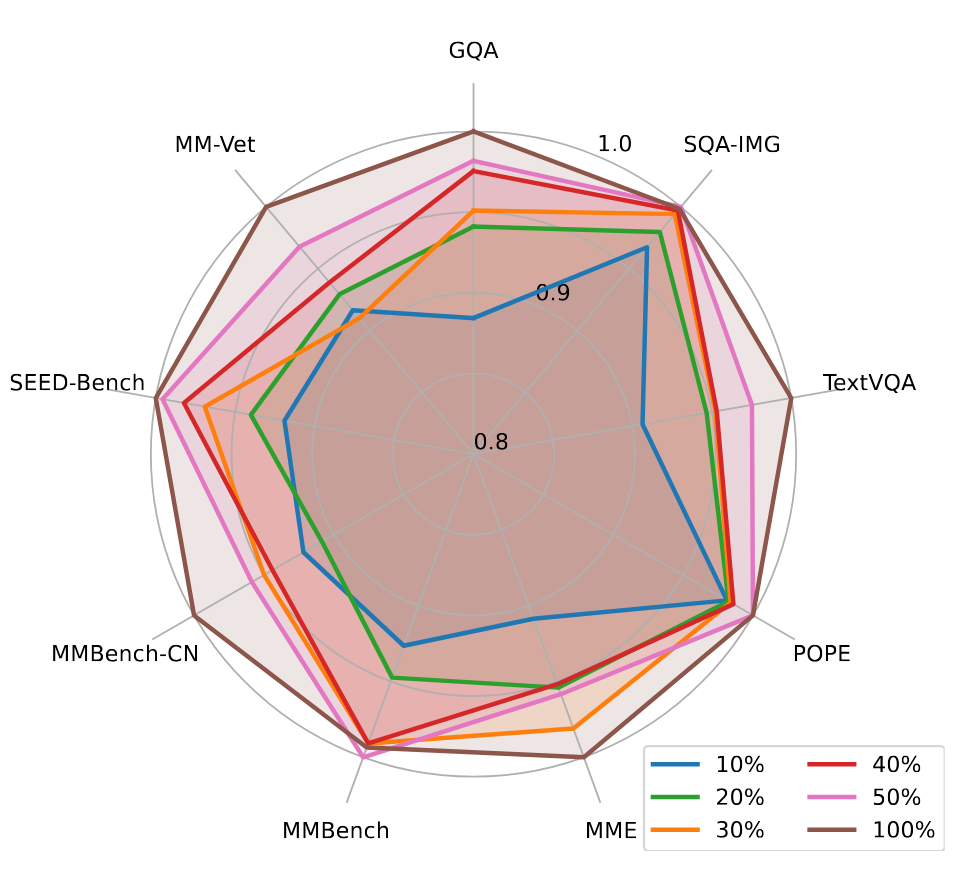

**探索问题 2：多模态幻觉**

采用 448x448 的 visual encoder，幻觉现象明显少于 224x224。这可能是因为 llava1 的数据集是 GPT 根据 caption 和 boxes 生成的，因此包含了很多细节信息，而 visual encoder 看不清这些细节。如果大量训练标注包含超出模型视觉感知能力的细节，模型可能倾向于“即使视觉输入里细节不清楚，也要输出细节描述”，导致幻觉。

另外，前作中提到的“bag of patch”理解模式（草莓酸奶那个例子），

**探索问题 3：组合能力**

实验中加入了针对不同任务的数据。例如 ShareGPT 是纯文本对话数据，没有图片；VQA/OCR 是视觉任务数据，主要是短答案；如果模型只是机械记任务格式，那它应该只能在各自任务里表现好。但在实验中观察到，加 ShareGPT 后，视觉对话里的语言能力变强，回答更长、更详细，也出现多语言视觉对话能力；加 academic-task-oriented visual datasets 后，视觉对话里的 grounding 更好，MM-Vet 和 LLaVA-Wild 也提升。

但这种组合并不完美，比如模型能在 VQA 里答对某个物体属性，不代表它在整图详细描述里一定能准确描述这个属性。

<Aside type="caution">
系列模型更新中
</Aside>

## 案例分析

使用 LLaVA-1.5-7B 模型进行样例测试。参数取 Temperature=0.2、TopP=0.7、Maxtoken=512。由于在先前测试中发现中文提问的效果很差，故均改为英文提问。以下样例中，文字加粗的部分即与图中相符的描述，红色部分是图中未出现的细节（即幻觉）。

### 1. 场景与细节描述

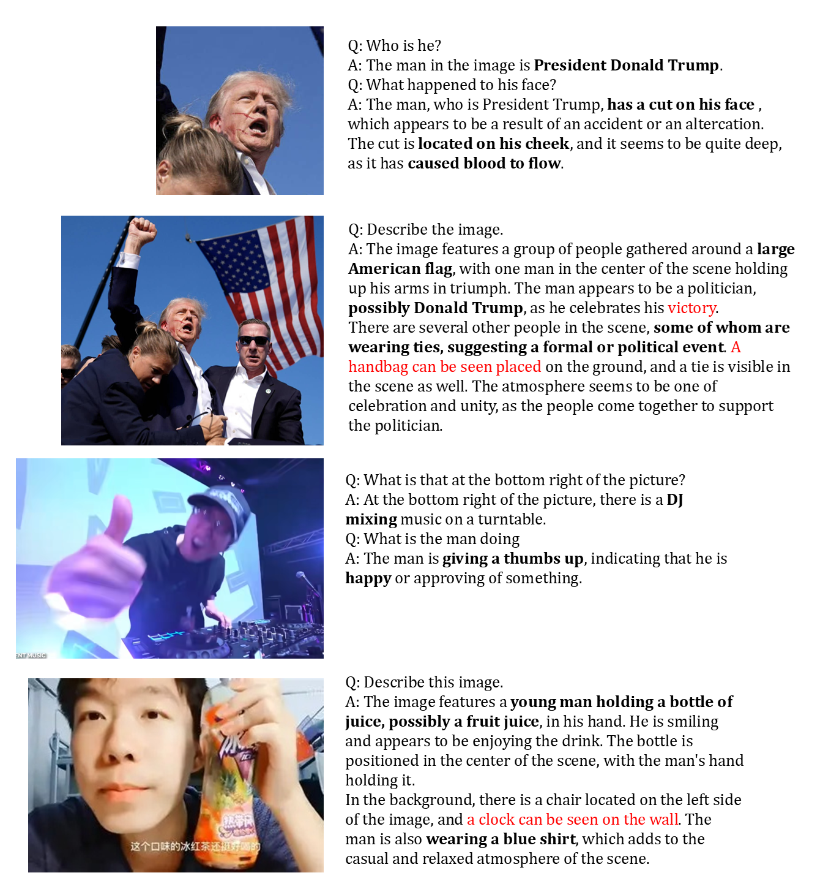

可以看到，对于此类场景细节描述，llava1.5 可以准确指出场景中的主要物体、物体颜色、形态等信息，准确识别出颜色、手势、人体部位、物品名称等内容。若关注幻觉，可以看到其幻觉主要来源于相似的形状，例如将第二张图中右下角的演讲台看作了公文包、将第四张图中背后的床架看作了椅子。

但是，对于含有文字、特别是中文的场景，模型的理解可能存在问题。请看下面的例子。

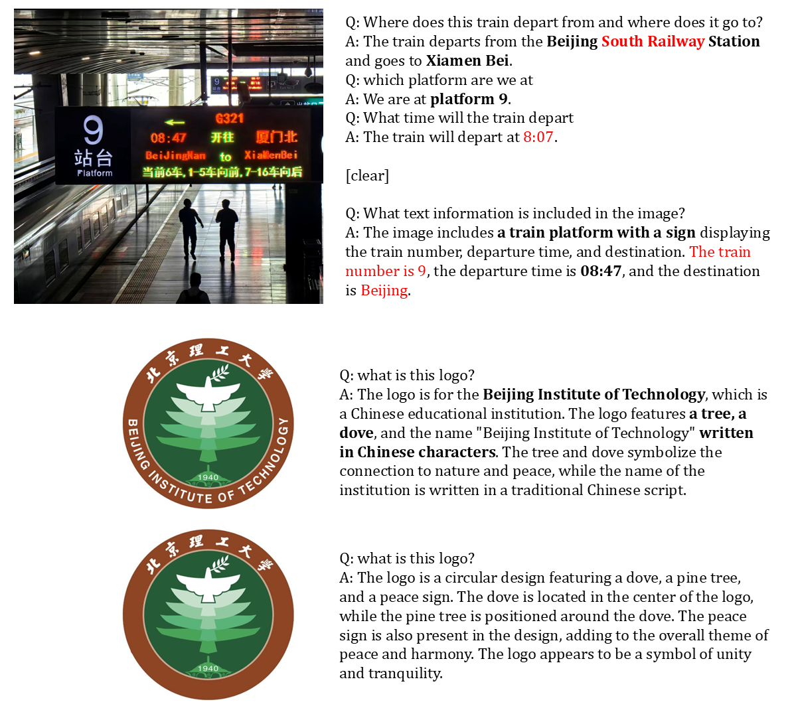

在第一张图中，模型看似能够准确回答站台、到发地、发车时间等信息，但由于对于火车指示牌的理解高度依赖中文字符以及日常经验（例如知道 G 开头的字符串是车次号），一旦让模型自行描述，很可能将图中散乱的文字信息混淆从而无法正确回答。

无法识别中文的问题在第二和第三张图中体现最为明显。当保留校徽中“BEIJING INSTITUTE OF TECHNOLOGY”时，模型可以根据这个信息推断出整个图像的内容，以及识别出“上方写的是中文的校名”；但去掉英文、只保留中文时，模型只能描述校徽中和图案相关的信息，也不能准确地指出中文校名的位置。

***

此外，数据集中的常识性数据将严重影响回答的准确度和质量。请看下面的例子。

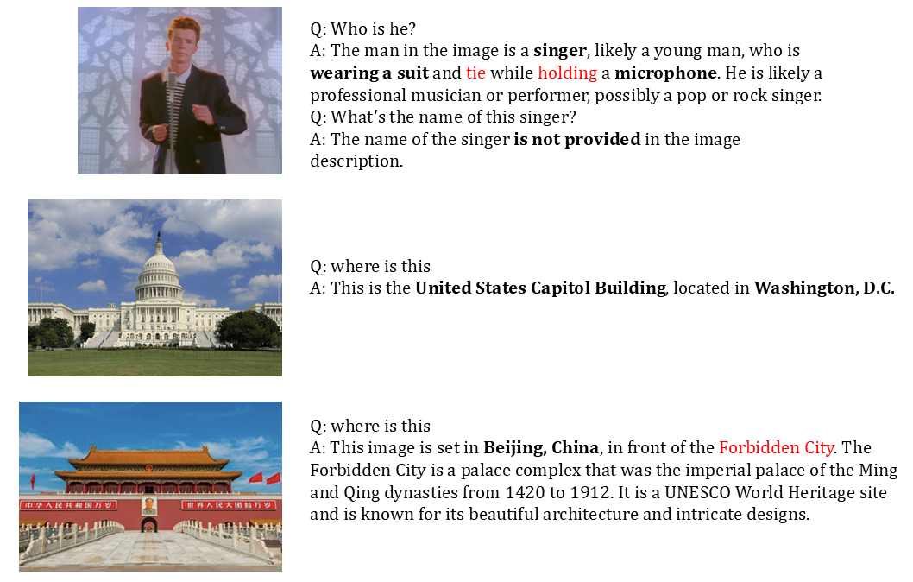

模型能够正确说出“美国国会大厦”，却无法识别天安门城楼，而是识别为故宫。这说明在数据集中并没有对于中国建筑的区分，模型看到红墙黄瓦时只能判断为中国北京的建筑，无法识别出具体的建筑名称；同时再次由于无法识别中文，图中的标语也无法被模型利用以做出准确判断。另外，对于第一张图，模型也只能判断是歌手、无法像“特朗普”“马斯克”那样说出名字，可以判断在训练集中并没有该歌手的信息。

### 2. 信息推理与判断

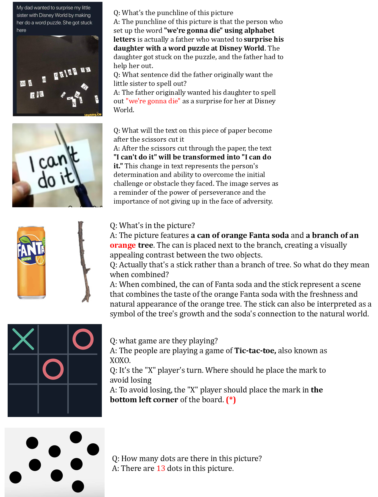

可以看出，llava1.5 能够做出最基本的简单推理，但对于更深入的复杂推理以及语义理解，效果并不好。

第一张图中，模型成功识别出图片中拼出的句子，但完全没有理解右下角散落的字母和推文文本之间的关联，因而无法准确说出原本拼成的句子 (WE ARE GOING TO DISNEYWORLD)。第三张图中，模型能够说出两个物体的名称和位置，即使给出了“stick”的提示，也无法将“fanta”和“stick”两个词从读音角度联系起来，从而无法理解图片的真实含义。第五张图，对于点数量的判断完全错误，说明模型基本不具备数数的能力。

第二张图的成功案例，说明模型基本理解了文本位置、物体位置、物理动态变化之间的交互关系，正确回答出“剪刀剪下后文字将发生的变化”。第四张图需要做出说明，这一结果的出现具有随机性，在多次测试中，回答“下在左下角”、“下在左上角”、“回答井字棋的规则”这三类回答大约各占 1/3。

### 3. 高频信息偏置

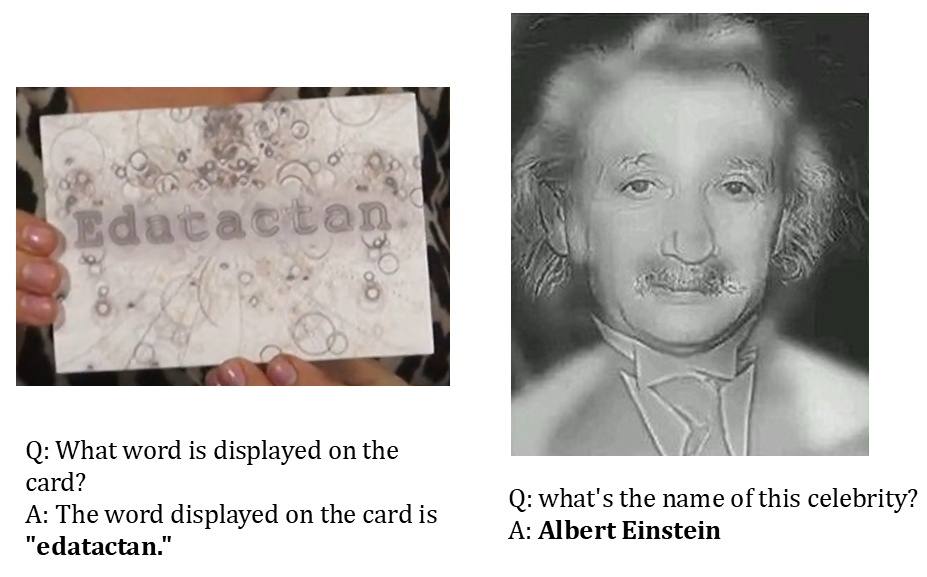

这两张是典型的高低频图像融合图，也即轮廓信息是 A 图的、填充色信息是 B 图的。左图中，图像的高频信息是单词“Edatactan”、低频信息是单词“Education”（也即，拿近了看是 Edatactan，拿远了看是 Education）；右图中，图像的高频信息是爱因斯坦，图像的低频信息是玛丽莲梦露。针对这两张图对模型进行提问，模型均回答的是高频信息。这说明，llava 观察图像时更关注高频信息，而相对忽略低频信息。这可能与训练集中多涉及“描述”这一任务，模型并没有学会从低频角度处理图片。