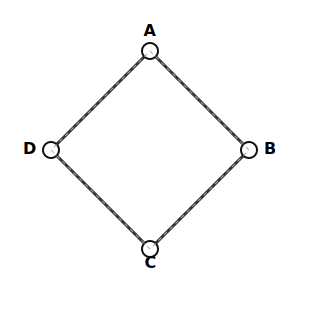

import { Aside } from 'astro-pure/user'

<Aside type="danger">
更新中
</Aside>

概率无向图模型，aka Markov 随机场（Markov Random Field）

## 无向图的因子分解

有向图中我们分析了独立性，无向图这里也需要。有三种等价表示
- 局部 Markov 性：若某个顶点的所有邻居都已知（也即被观测），那么它与其他顶点条件独立
- 成对 Markov 性：若两个顶点之间没有直接相连，那么当其他所有顶点都已知时，这两个顶点条件独立
- 全局 Markov 性：若两个点集之间的通路都必须经过某个第三点集，那么当第三点集已知时，这两个点集之间条件独立

如果两个顶点被观测顶点分割的情况下条件独立，则这个无向图就称为 Markov 随机场

分析概率无向图时同样要做因子分解，但“无向”写不出有向图那样的依赖关系，因此需要使用最大团来做因子分解。*备忘：团 (clique) 又称完全子图，即其中的任意两个顶点都有边连接。“最大团”即包含顶点数最多的团。*

### 势函数
<Aside type="note" title="Hammersley - Cifford 定理">
曰：  
联合分布 $P(X_G)=P(X_1,\cdots,X_d)$ 的概率图 $G$ 是一个 Markov 随机场，当且仅当 $P$ 正比于势函数积：
$$P(X_G=x_G)=\dfrac 1Z\prod_{C}\varphi_C(X_C=x_C)$$
其中 $C$ 为 $G$ 的所有最大团（因为可能不止一个最大团），$\varphi$ 为定义在最大团上的非负函数（称为势函数），$Z$ 为归一化系数
$$Z=\sum\limits_{x_G}\prod_{C}\varphi_C(X_C=x_C)$$
</Aside>

这个分布也叫做 Gibbs 分布。

*特别地，如果定义势函数 $\varphi_C(X_C)=\exp(-E_C(X_C))$，则称为 Boltzmann 分布，其中 $E$ 表示能量。*

### 势函数求 Gibbs 分布例题

**例题**。总统大选中，共有懂王、拜登两位候选人。有 ABCD 四个人，他们四个人的关系网如下，连线表示两个人的投票倾向之间存在相互影响：

图中总共有四个团：AB、BC、CD、DA，都含有两个顶点，因此都是最大团。在这四个最大团上，定义相互影响的势函数为：

| $\varphi_1(A,B)$            | $\varphi_2(B,C)$        | $\varphi_3(C,D)$        | $\varphi_4(D,A)$        |
| --------------------------- | ----------------------- | ----------------------- | ----------------------- |
| $a^0\quad b^0\quad 30\quad$ | $b^0\quad c^0\quad 100\quad$ | $c^0\quad d^0\quad 1\quad$   | $d^0\quad a^0\quad 100$ |
| $a^0\quad b^1\quad 5\quad$       | $b^0\quad c^1\quad 1\quad$   | $c^0\quad d^1\quad 100\quad$ | $d^0\quad a^1\quad 1$   |
| $a^1\quad b^0\quad 1\quad$       | $b^1\quad c^0\quad 1\quad$   | $c^1\quad d^0\quad 100\quad$ | $d^1\quad a^0\quad 1$   |
| $a^1\quad b^1\quad 10\quad$      | $b^1\quad c^1\quad 100\quad$ | $c^1\quad d^1\quad 1\quad$   | $d^1\quad a^1\quad 100$ |

其中，事件“A 投懂王”为 $A=a^0$，“A 投拜登”为 $A=a^1$，其他类推。

势函数表反映了两人之间具体的影响关系。例如可以看出，BC、DA 很可能投同一个人，而 CD 很可能投不同的人。

于是 Gibbs 分布可以由下表计算得到。Gibbs 分布即归一化的势函数积，归一化系数就是中间那一列全部加起来

| $a\ b\ c\ d$ | 势函数积                                     | Gibbs 分布 |
| ------------ | ---------------------------------------- | :------: |
| $0\ 0\ 0\ 0$ | $30\times100\times1\times100 = 300000$   |  0.0417  |
| $0\ 0\ 0\ 1$ | $30\times100\times100\times1 = 300000$   |  0.0417  |
| $0\ 0\ 1\ 0$ | $30\times1\times100\times100 = 300000$   |  0.0417  |
| $0\ 0\ 1\ 1$ | $30\times1\times1\times1 = 30$           |  0.0000  |
| $0\ 1\ 0\ 0$ | $5\times1\times1\times100 = 500$         |  0.0001  |
| $0\ 1\ 0\ 1$ | $5\times1\times100\times1 = 500$         |  0.0001  |
| $0\ 1\ 1\ 0$ | $5\times100\times100\times100 = 5000000$ |  0.6943  |
| $0\ 1\ 1\ 1$ | $5\times100\times1\times1 = 500$         |  0.0001  |
| $1\ 0\ 0\ 0$ | $1\times100\times1\times1 = 100$         |  0.0000  |
| $1\ 0\ 0\ 1$ | $1\times100\times100\times100 = 1000000$ |  0.1389  |
| $1\ 0\ 1\ 0$ | $1\times1\times100\times1 = 100$         |  0.0000  |
| $1\ 0\ 1\ 1$ | $1\times1\times1\times100 = 100$         |  0.0000  |
| $1\ 1\ 0\ 0$ | $10\times1\times1\times1 = 10$           |  0.0000  |
| $1\ 1\ 0\ 1$ | $10\times1\times100\times100 = 100000$   |  0.0139  |
| $1\ 1\ 1\ 0$ | $10\times100\times100\times1 = 100000$   |  0.0139  |
| $1\ 1\ 1\ 1$ | $10\times100\times1\times100 = 100000$   |  0.0139  |

这就求出了联合分布。

从联合分布中可以得出边缘分布。例如我们求 AB 的边缘分布：

| $a\ b$ | $\phi_1$ | 归一化 $\phi_1$ | 联合分布中的 $P(a,b)$ |
| ------ | ------ | ---------- | ------------- |
| $0\ 0$ |    30    |    0.6522    |     0.1250      |
| $0\ 1$ |    5     |    0.1087    |     0.6944      |
| $1\ 0$ |    1     |    0.0217    |     0.1389      |
| $1\ 1$ |    10    |    0.2174    |     0.0417      |

可以看出，全局联系改变了 AB 之间单独的关系。细究起来，这种变化主要来源于 CD 之间的强烈不一致性。
***
下面讲 3 个常用的概率无向图模型

## logistic 回归模型

说是回归，但其实是基于回归的分类模型。本章我们先用一般流程在二分类上做说明，再阐述多分类问题，以及它与概率无向图的关系

### 一般流程
传统的线性回归做分类，就是把正类样本设标签 $y=1$，负类样本设标签 $y=0$，然后得出线性拟合函数 $z=w^\mathrm{T}x$（偏置项通过 $b=[{w^{(0)}}]^\mathrm{T}x^{(0)}$ 塞进 $w^\mathrm{T}x$ 中）；对于测试样本，若拟合值大于某个值（比如 0.5），就分为正类，否则分为负类，这样就分出来了。这本质上是一个分段判别函数：
$$
y=\begin{cases}
1,&z>0.5\\
0,&z\leq 0.5
\end{cases}
$$
它不连续，不可导。而 logistic 回归做分类，就是在传统的线性回归当中，加入了一个性质足够好判别函数。sigmoid 函数（aka logistic 函数）就是一个不错的选择：
$$
y=\sigma(z)=\dfrac{1}{1+\mathrm{e}^{-z}}
$$

它单增、任意阶可导，关于点 $(0,\ 0.5)$ 对称；另外，sigmoid 相当于一个 $\mathbb{R}\to [0,1]$ 的映射，或者说把实数轴映射成概率。于是 sigmoid 的结果便可以解释为：回归出来的数越大，分类为正类的概率就越大。

将样本 $x_{i}$ 分类为正类的概率记为 $p_i$，即
$$
p_i=\sigma(w^\mathrm{T}x_i)=\dfrac{1}{1+\exp(-w^\mathrm{T}x_i)}
$$

于是该样本分类正确的概率即为 $p_i^{y_i}(1-p_i)^{1-y_i}$；若进一步假设分类结果只与特征有关，那么全部分类正确的概率即为 $\prod_i p_i^{y_i}(1-p_i)^{1-y_i}$

于是我们的目标就是最大化对数似然函数：
$$
\begin{aligned}
L(w)&=\log\left[\prod\limits_i p_i^{y_i}(1-p_i)^{1-y_i}\right]\\
&=\sum\limits_i\big(y_i\log p_i+(1-y_i)\log(1-p_i)\big)\\
&=\sum\limits_i\big(y_i\log \dfrac{p_i}{1-p_i}+\log(1-p_i)\big)\\
\end{aligned}
$$
这样变形的目的，是为了凑出对数几率函数 $\mathrm{logit}(p)=\log \dfrac{p}{1-p}$，因为它是 sigmoid 的反函数，而这里 $p=\sigma(w^\mathrm{T}x)$，故 $\log \dfrac{p}{1-p}$ 就等于 $w^\mathrm{T}x$*（因此 logistic 回归也称为对数几率回归）*。于是代入后继续化简得
$$
\begin{aligned}
L(w)&=\sum\limits_i\left[y_i(w^\mathrm{T}x_i)+\log\dfrac{\exp(-w^\mathrm{T}x_i)}{1+\exp(-w^\mathrm{T}x_i)}\right]\\
&=\sum\limits_i\big[w^\mathrm{T}x_iy_i-w^\mathrm{T}x_i-\log\big(1+\exp(-w^\mathrm{T}x_i)\big)\big]\\
\end{aligned}
$$

梯度下降之即可。其中对 $w$ 的偏导可以进一步化简：
$$
\begin{aligned}
\dfrac{\partial L}{\partial w}&=\sum\limits_i\big[x_iy_i-x_i-\dfrac{-x_i\exp(-w^\mathrm{T}x_i)}{1+\exp(-w^\mathrm{T}x_i)}\big]\\
&=\sum\limits_ix_i\big[y_i-1+\dfrac{\exp(-w^\mathrm{T}x_i)}{1+\exp(-w^\mathrm{T}x_i)}\big]\\
&=\sum\limits_ix_i\big[y_i-\dfrac{1}{1+\exp(-w^\mathrm{T}x_i)}\big]\\
&=\sum\limits_ix_i\big[y_i-\sigma(w^\mathrm{T}x_i)\big]\\
\end{aligned}
$$

把偏置项拆出来，即
$$
\begin{aligned}
\frac{\partial L}{\partial w} &= \sum_i x_i [y_i - \sigma(w^\mathrm{T}x_i + b)]\\
\frac{\partial L}{\partial b} &= \sum_i [y_i - \sigma(w^\mathrm{T}x_i + b)]
\end{aligned}
$$

至于最后如何判别，就是看分类为正类的概率是否比负类大，本质上还是和 0.5 比大小，但这种比大小可以从概率角度解释，和传统的回归分类还是有区别的；由 sigmoid 单调性，也可以等价为 $w^\mathrm{T}x$ 和 0 比大小。

### 交叉熵损失
由刚才那个对数似然函数，抽象出交叉熵损失函数：
$$
J(w) = - \dfrac{1}{m} L(w) = -\dfrac 1m\sum\limits_{i=1}^m\bigg[y_i\log p_i+(1-y_i)\log(1-p_i)\bigg]
$$
其中 $m$ 是样本总数，$y_i$ 是第 $i$ 个样本的真实标签，取值 0 或 1，$p_i$ 是模型预测该样本为正类的概率。它衡量了真实概率分布 $(y_i, 1-y_i)$ 与模型预测的概率分布 $(p_i, 1-p_i)$ 之间的差异。

*实践中，为了防止对 0 取对数，需要在 log 里面加上一个小正数 $\varepsilon$*

### softmax 回归模型

同样是要把输出压成概率，但不同于二分类，多分类是把“分为每个类的打分”压成概率。对于一个 $K$ 维的向量 $\vec{z}$，softmax 函数将它转换为一个 $K$ 维的概率分布向量 $\vec{p}$：
$$
p_k = P(y=k|\vec{z}) = \text{softmax}(\vec{z})_k = \dfrac{\exp(z_k)}{\sum_{j=1}^K\exp(z_j)}
$$
其中 $z_k$ 是模型对于第 $k$ 个类别的打分，$w_k$ 是对应第 $k$ 类的权重向量。softmax 相当于输出了一个分类的概率分布

事实上 sigmoid 是 softmax 在 $K=2$ 时的特例。对于二分类，我们关心的是分为正类（即 $k=1$）的概率 $p_1$。按照 softmax 的定义有  $p_1 = \dfrac{\exp(z_1)}{\exp(z_1)+\exp(z_2)}$，两边同除以 $\exp(z_1)$ 得
$$
p_1 = \dfrac{1}{1+\exp(z_2-z_1)} = \dfrac{1}{1+\exp(-(z_1-z_2))}
$$
如果我们令 $z = z_1 - z_2 = (w_1-w_2)^\mathrm{T}x$，并且定义一个新的权重向量 $w = w_1 - w_2$，那么上式就变成了 $p_1 = \dfrac{1}{1+\exp(-w^\mathrm{T}x)}$，这正是 sigmoid 函数的形式。

这说明，二分类的 logistic 回归本质上是在计算两个类别的相对“证据差”。而多分类的 softmax 则是将这种思想推广到了多个类别中。

对于多分类问题，真实标签使用 onehot 编码，例如对于三分类问题，标签“1”、“2”、“3”分别表示为 $[1,0,0]^\mathrm{T}$、$[0,1,0]^\mathrm{T}$ 和 $[0,0,1]^\mathrm{T}$。对应的交叉熵损失函数变为：
$$
J(W) = -\dfrac{1}{m}\sum_{i=1}^my_{i}^\mathrm{T}\log p_{i}
$$ 

但由于使用 onehot 编码，那个点乘实际上就是把**每个样本的预测结果中**真实标签对应的概率加起来。例如真实标签为第三类，预测结果 $p=[0.1,\,0.2,\,0.7]^\mathrm{T}$，那么点乘结果为 0.7

### 无向图模型视角

现在我们回头用概率无向图模型的观点来审视 logistic 回归。事实上，logistic 回归可以被看作一个非常简单的 Markov 随机场。

考虑一个分类问题，我们有输入特征 $X=\{X_1, \dots, X_d\}$ 和输出类别 $Y$。构建一个无向图，其中 $Y$ 和所有的 $X_i$ 都相连，所有 $X_i$ 之间也相互连接。这个图本身就是一个巨大的团，也即该图的唯一最大团。于是分类问题即求条件概率 $P(Y=k\mid X=\vec x)$

根据 Hammersley-Clifford 定理，该图的联合概率分布可以表示为：
$$
P(Y, X) = \frac{1}{Z}\varphi(Y, X)
$$
于是条件概率
$$
P(Y\mid X) = \frac{P(Y,  X)}{P( X)} = \frac{P(Y, X)}{\sum_{Y'}P(Y', X)} = \frac{\frac{1}{Z}\varphi(Y, X)}{\sum_{Y'}\frac{1}{Z}\varphi(Y', X)} = \frac{\varphi(Y, X)}{\sum_{Y'}\varphi(Y', X)}
$$

如果定义势函数
$$
\varphi(Y, X) = \exp\left( \sum_{k=1}^K \mathbb{I}(Y=k) \cdot (w_k^\mathrm{T} X + b_k) \right)
$$
其中 $\mathbb{I}(Y=k)$ 是示性函数（当 $Y=k$ 时为 1，否则为 0），$w_k$ 和 $b_k$ 分别是第 $k$ 类的权重和偏置。当我们只关心 $Y=k$ 这个特定类别时，上式可以简化为 $\varphi(k,X) = \exp(w_k^\mathrm{T}X + b_k)$。

将这个势函数代入条件概率公式中：
$$
P(Y=k|X) = \frac{\varphi(k,X)}{\sum_{j=1}^K \varphi(j,X)} = \frac{\exp(w_k^\mathrm{T}X+b_k)}{\sum_{j=1}^K \exp(w_j^\mathrm{T}X+b_j)}
$$
这正是 softmax 回归的公式

因此，从概率图模型的角度来看，logistic/softmax 回归相当于一个 势函数为**特征的线性组合的指数形式**的 Markov 随机场。这种直接对条件概率 $P(Y|X)$ 进行建模的模型，也称作判别式模型。