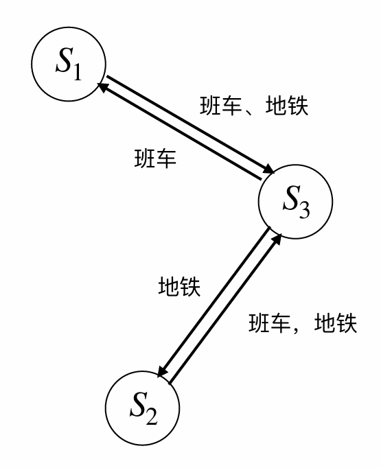
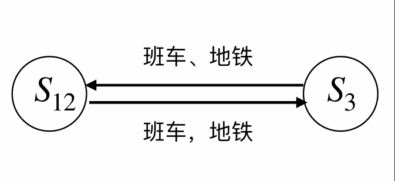
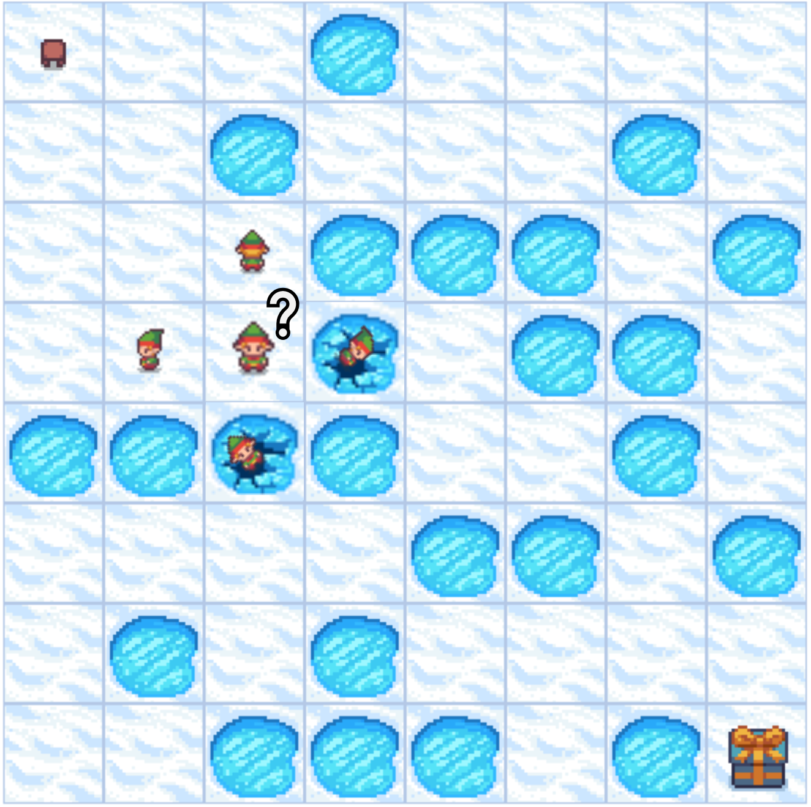

import { Aside } from 'astro-pure/user'

## 1 通勤北理工

研小理是一位在北理工中关村校区的研究生，由于他要做很多实验，而这些实验的仪器设备又分布在不同校区，他经常需要往返良乡校区和西山实验区，然后回到中关村校区。

考虑到这在几年内是一个重复活动，我们把它建模为一个无限时域的 MDP 过程。研小理做实验的时间非常不确定，而班车的发车时间是固定的。为了实现更加灵活的通勤，他构想出了一套校区间通勤的方案。这个过程可以使用一个三状态 MDP 链描述，其中 $S_1$ 是西山实验区，$S_2$ 是良乡校区，$S_3$ 是中关村校区。



<Aside type="note" title="习题1(a)">
每个状态下可执行的动作：班车、地铁。所有转移与奖励都是确定性的。真实（但未知）的奖励如下表所示：

| 奖励 | 班车 | 地铁 |
| :--- | :--- | :--- |
| $S_1$ | +0.7 | -1.0 |
| $S_2$ | +1.0 | -1.3 |
| $S_3$ | -0.5 | -0.7 |

折扣因子 $\gamma = 0.9$。运行值迭代后，你得到如下最优 $Q$-值：

| $Q^*$ | 班车 | 地铁 |
| :---- | :--- | :--- |
| $S_1$ | +1.65| -0.05|
| $S_2$ | +1.95| -0.35|
| $S_3$ | +0.98| +1.05|

请问研小理通勤的最优策略是什么？
</Aside>

**解答:**

对每一状态，以 $Q^*$ 矩阵中行最大值对应的动作为最优策略。即
- 在 $S_1$ 西山实验区时选择班车
- 在 $S_2$ 良乡校区时选择班车
- 在 $S_3$ 中关村校区时选择地铁

***

<Aside type="note" title="习题1(b)">
现在考虑一种“聚合”状态表示：将状态 $S_1$ 与 $S_2$ 合并成一个宏状态 $S_{12}$，而 $S_3$ 保持不变。你会发现可以直接用“在中关村”和“不在中关村”来代表这个 MDP 链，新的 MDP 只有两个状态：$S_{12}$ 和 $S_3$。



在此聚合状态下（仍取 $\gamma = 0.9$），我们仍然在三状态环境中运行 Q-learning，但是使用双状态的 Q 表，可以得到的 $Q^*$ 值为

| $Q^*$ | 班车 | 地铁 |
| :---- | :--- | :--- |
| $S_{12}$ | +1.73| -0.08|
| $S_3$ | +1.03| +0.84|

根据这些 $Q$-值，最优策略是什么？与使用真实三状态表示时得到的最优策略相同？解释原因。
</Aside>
**解答:**

仍以 $Q^*$ 矩阵中行最大值对应的动作为最优策略，也即不论哪个状态均选择班车。

与第一问结果不相同。原因：

$$
Q'(s,a)=Q(s,a)+\alpha\big[R+\gamma \max\limits_{a'}Q(s',a')-Q(s,a) \big]
$$

对于 $S_3$ 中关村，合并状态 1 和 2 后，$Q(s',a')$ 都相等，因此 $Q$ 矩阵的更新仅依赖于奖励 $R$. 又因为在 $S_3$ 时 $R_{班车}=-0.5$ 大于 $R_{地铁}=-0.7$，所以最优策略从地铁变为班车。

另一方面，当使用真实的三状态时，$S_2$ 的“班车”拥有全局最大奖励，而在 $S_3$ 只能通过地铁到达 $S_2$；因此模型将会学习到通过地铁来到 $S_2$，以获取更大的奖励。但是如果合并 $S_1$ 和 $S_2$，这一最大奖励性质不存在，自然会影响其策略。
***

## 2 Frozenlake小游戏

在本次编程作业中，将实现强化学习中的两种算法——策略迭代（Policy Iteration）和 Q-Learning，并在 Gymnasium（前身为 OpenAI Gym）环境中的 Frozenlake 游戏环境中进行应用。通过这次作业，希望你可以理解这几种算法的工作原理及其在不同环境和奖励条件下的表现。非常鼓励探索和调整不同环境参数，分析算法在各种条件下的适应性和性能。



### 2.1 ~ 2.3
<Aside type="note" title="习题 2(i) (ii) (iii)">
请实现策略迭代算法与 Q-Learning 算法，并在确定性环境（冰面不滑）与随机性环境（冰面光滑）中分别运行，记录结果。比较随机性环境中策略迭代算法与 Q-Learning 算法的表现并分析原因。
</Aside>
**解答:**

参数设定
- 地图大小：$4\times4$
- 冰面出现的概率：$0.7$
- 最大步数 1000
- 策略迭代算法：
	- 折扣因子 $\gamma=0.9$
	- 收敛容差 $\text{tol}=10^{-3}$
- Q-Learning 算法：
	- episode = 10000
	- 折扣因子 $\gamma=0.95$
	- 学习率 $\alpha=0.1$
	- 探索率 $\varepsilon=1$
	- 探索率衰减因子 0.999

对于题述的四个实验条件，采用同一地图进行 100 次测试，计算成功率和平均步数以衡量算法的性能。

执行：
```
python run.py --multirun algorithm=policy_iteration,QLearning env.is_slippery=False,Tru env.render_mode=ansi
```

实验结果如下：

| 环境  | 算法         | 成功率  | 平均步数  |
| :-- | :--------- | :--- | :---- |
| 确定性 | 策略迭代       | 100% | 5.00  |
| 确定性 | Q-Learning | 100% | 5.00  |
| 随机性 | 策略迭代       | 100% | 34.50 |
| 随机性 | Q-Learning | 100% | 37.83 |

结果表明：
1. Policy iteration 和 Q-Learning 两种算法在确定性和随机性环境中成功率均为 100\%，表明两个算法均成功学习到了能够到达终点的路径。
2. 冰面光滑时，两种算法的平均步数显著增加。表明环境的随机性对算法效率有显著影响，智能体需要更多步数以应对不确定性。
3. 在确定性环境中，两种算法表现一致，平均步数均为理论最小值 5。但在随机性环境中，Policy iteration 得到的策略在效率上略优于 Q-Learning。
   原因分析：Policy iteration 使用动态规划，直接使用转移概率 $P$ 进行完整的环境建模，直接算出全局最优策略。而 Q-Learning 为 model-free 方法，没有全局状态转移概率，在随机性环境中，状态转移的不确定性增加了学习的难度，使得 Q-Learning 需要更多的步骤，因此效率低。
***
### 2.4
<Aside type="note" title="习题 2(iv)">
上述三小问的地图长度为4，修改地图长度为 \{6, 8\}，再次运行策略迭代和 Q-Learning 算法，比较两者的表现，并分析原因。
</Aside>
**解答:**

除地图大小外，其他参数保持不变，再次进行实验。实验结果如下。

6x6 地图

| 环境  | 算法         | 成功率  | 平均步数  |
| :-- | :--------- | :--- | :---- |
| 确定性 | 策略迭代       | 100% | 9.00  |
| 确定性 | Q-Learning | 100% | 9.00  |
| 随机性 | 策略迭代       | 68%  | 45.02 |
| 随机性 | Q-Learning | 0%   | -  |

8x8 地图

| 环境  | 算法         | 成功率  | 平均步数  |
| :-- | :--------- | :--- | :---- |
| 确定性 | 策略迭代       | 100% | 13.00 |
| 确定性 | Q-Learning | 0%   | -  |
| 随机性 | 策略迭代       | 77%  | 79.90 |
| 随机性 | Q-Learning | 0%   | -     |

实验结果表明，随着地图尺寸的增大，两种算法的表现产生显著差异。

1. Policy iteration 表现稳定。确定性环境中成功率 100%，说明模型总能找到最优路径；在随机性环境中成功率较高，表明它也能学习到一个鲁棒的策略。说明 Policy iteration 算法具有较好的扩展性，其性能不因状态空间的增大而大幅下跌。
2. Q-Learning 算法性能不好。在 6x6 地图、随机性环境中，Q-Learning 成功率为 0%，模型失效，无法学习到有效策略。当地图扩大到 8x8 时，确定性环境与随机性环境中 Q-Learning 算法均失效。

原因：Q-Learning 是 model-free，只有终点有正奖励。当状态空间增大时，一方面奖励稀疏，另一方面 Q 矩阵大小增大，这导致在有限的训练回合内智能体难以充分探索有效动作，Q 矩阵几乎无法得到更新，难以学习到任何有价值的策略。而 Policy iteration 依然进行全局动态规划，即使地图大小增大也不过是在 $n$ 个数中选择最大值，对效率影响不大。

### code
注：可以使用 python 自带的虚拟环境：
```shell
python -m venv env-name
.\env-name\Scripts\activate # windows
source env-name/bin/activate # linux
```

以下是依赖包与主要代码（其他的是老师给的框架

```title="requirements.txt"
gymnasium[toy_text]
hydra-core
tqdm
```

```py title="algorithm.py"
"""Policy Iteration"""
import numpy as np
from typing import Dict, List, Tuple

__all__ = [
    "PType",
    "policy_iteration", 
    "QLearning"
]

PType = Dict[
    int, 
    Dict[
        int, 
        List[
            Tuple[
                float, 
                int, 
                int, 
                bool
            ]
        ]
    ]
]

def policy_evaluation(
    P: PType, 
    nS: int, 
    nA: int, 
    policy: np.ndarray, 
    gamma: float = 0.9, 
    tol: float = 1e-3
) -> np.ndarray:

    value_function = np.zeros(nS)
    counter=0
    while True:
        delta=0
        for s in range(nS):
            prev=value_function[s]
            a=policy[s]
            sum=0
            rsa=0
            for pssa, next_s, r, _ in P[s][a]:
                rsa=r
                sum+=pssa*value_function[next_s]
            newv=rsa+gamma*sum
            
            value_function[s]=newv
            delta=max(delta, abs(prev-value_function[s]))
        if delta<tol:
            break
    return value_function


def policy_improvement(
    P: PType,
    nS: int,
    nA: int,
    value_from_policy: np.ndarray,
    policy: np.ndarray,
    gamma: float = 0.9
) -> np.ndarray:

    new_policy = np.zeros(nS, dtype="int")
    for s in range(nS):
        q=np.zeros(nA)
        for a in range(nA):
            sum=0
            for pssa, next_s, r, _ in P[s][a]:
                rsa=r
                sum+=pssa*value_from_policy[next_s]
            q[a]=rsa+gamma*sum
            
        new_policy[s]=np.argmax(q)
    return new_policy


def policy_iteration(
    P: PType, 
    nS: int, 
    nA: int, 
    gamma: float = 0.9, 
    tol: float = 1e-3
) -> Tuple[np.ndarray, np.ndarray]:

    value_function = np.zeros(nS)
    policy = np.zeros(nS, dtype=int)

    while True:
        value_function=policy_evaluation(P, nS, nA, policy, gamma, tol)
        new_policy=policy_improvement(P, nS, nA, value_function, policy, gamma)

        if np.array_equal(new_policy, policy):
            break
        
        policy=new_policy
        
    return value_function, policy


"""Q-Learning"""

import gymnasium
from tqdm import tqdm

def QLearning(
    env:gymnasium.Env, 
    num_episodes=2000, 
    gamma=0.9, 
    lr=0.1, 
    epsilon=0.8, 
    epsilon_decay=0.99
) -> np.ndarray:

    nS:int = env.observation_space.n
    nA:int = env.action_space.n

    Q = np.zeros((nS, nA))

    for _ in tqdm(range(num_episodes)):
        state, _ = env.reset()
        stop=False

        while not stop:
            if np.random.rand()<epsilon:
                # action=env.action_space.sample()
                action=np.random.randint(nA)
            else:
                action=np.argmax(Q[state])

            next_state, r, terminated, truncated, _=env.step(action)
            
            stop=terminated or truncated

            best_action=np.argmax(Q[next_state])
            Q[state][action] += lr * (r + gamma*Q[next_state][best_action] - Q[state][action])
            state=next_state

        epsilon*=epsilon_decay

    return Q
```
```yaml title="config.yaml"
env:
  map_size: 8
  frozen_prob: 0.7
  seed: 114514
  is_slippery: False
  render_mode: human
policy_iteration:
  gamma: 0.9
  tol: 1e-3
qlearning:
  num_episodes: 10000
  gamma: 0.95
  learning_rate: 0.1
  epsilon: 1
  epsilon_decay: 0.999
render:
  max_steps: 1000
algorithm: policy_iteration
```