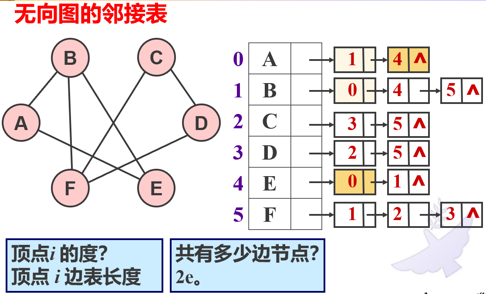
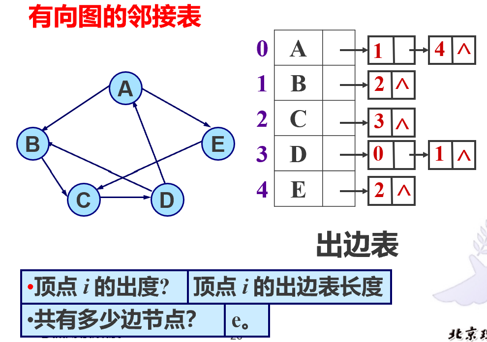
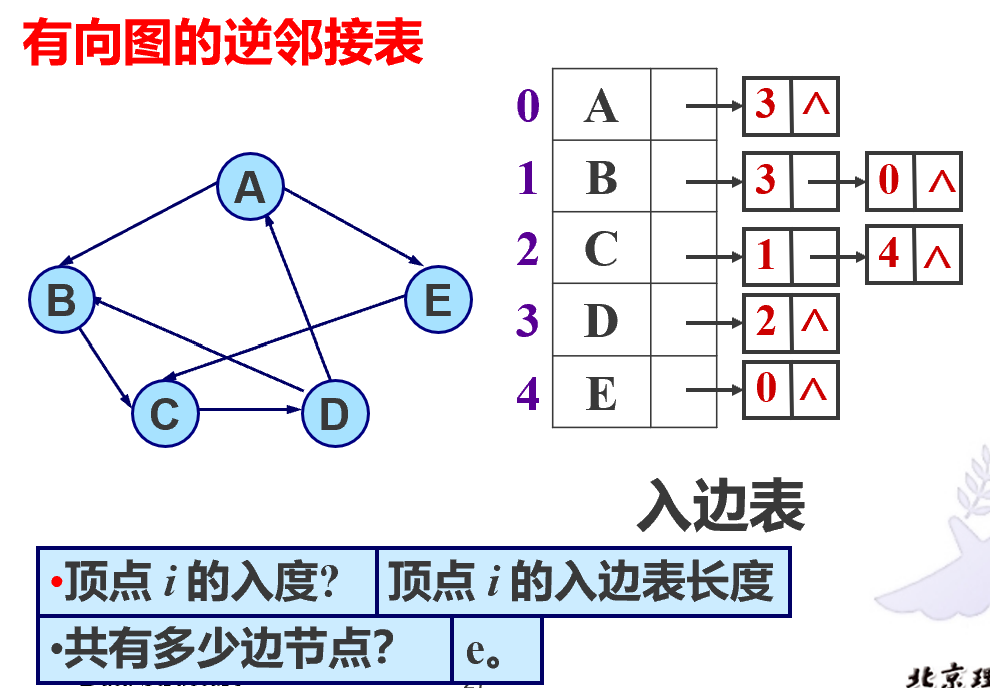
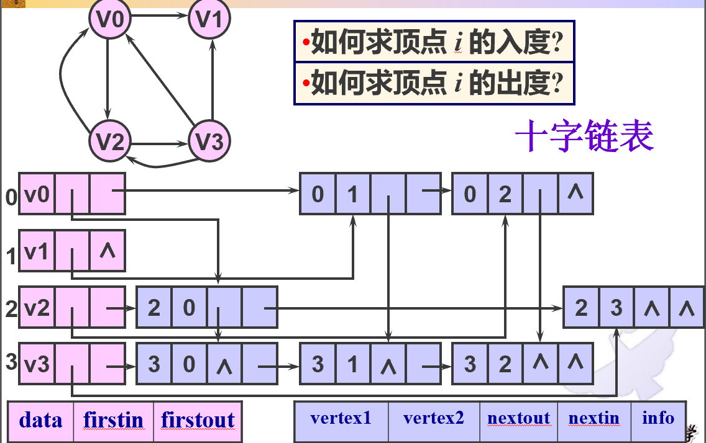
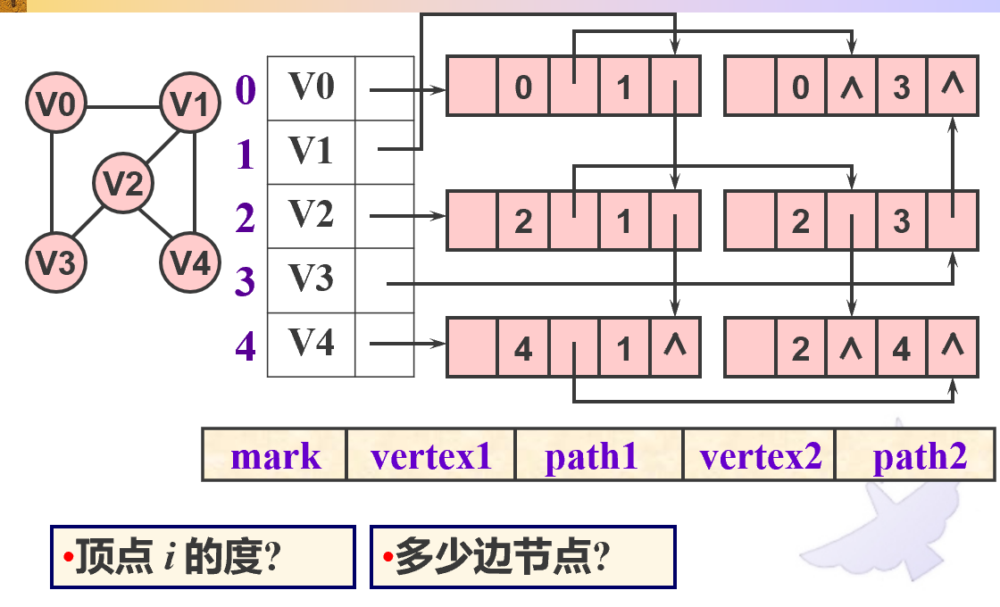
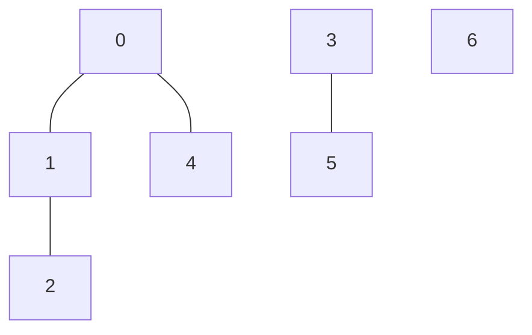
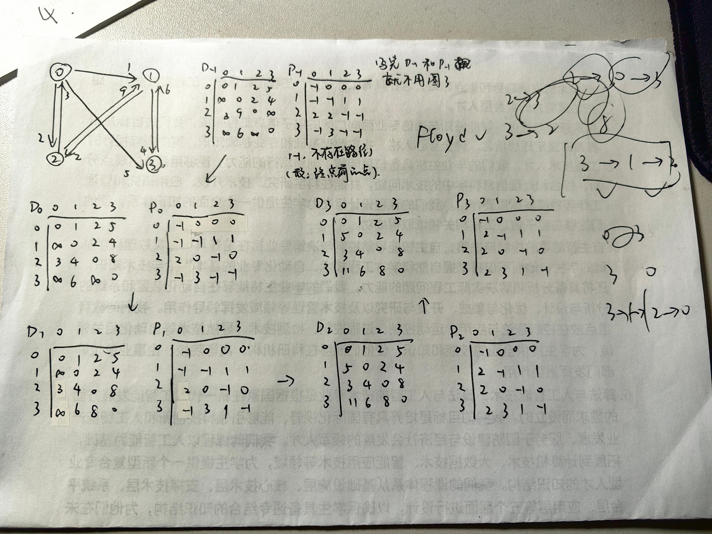

封面图源 https://www.eet-china.com/mp/a363612.html

## 图的定义
- 有向图：点和弧。弧：尖括号+两个点
- 无向图：点和边。边：圆括号+两个点，相当于两个方向的弧重在一起
- 点和顶点是一个东西

图的基本假设：不考虑自环、不考虑平行边（即完全一致的两条线。注意对于有向图，一个 a 到 b 一个 b 到 a，这不叫平行边，因为这是两条不同的线。如果是无向图则是平行边）

弧或边带权的图称为网，有向网或无向网

若两个点之间有一条边或弧，则称这两个点为邻接点，并称这条边与这两个顶点相关联。与某个点相关联的边的数目称为顶点的度。在有向图中，根据边是 to 这个点还是 from 这个点，进一步细分为入度和出度。

曰（握手原理）：对于无向图，所有点的度数之和等于边数的二倍；对于有向图，出度之和等于入度之和

子图：从图的边集和点集中抽一些构成的一个新图

对于一个有 $n$ 顶点的图
- 含有 $C_n^2=\dfrac{n(n-1)}{2}$ 条边的无向图称为完全图，即任意两个点之间都有边
- 含有 $A_n^2=n(n-1)$ 条弧的有向图称为完全图，即任意两个点之间都有双向边
- 若边数 $e<n\log n$ 则称为稀疏图，否则称为稠密图

路径。路径上边的数目称为路径长度。简单路径：顶点不重复。简单回路：第一个顶点和最后一个顶点相同的简单路径

- 连通图：任意两个点之间存在路径相同
- 对于非连通图，各个极大连通子图称为这个图的连通分量
- 对于有向图，若任意两个顶点之间存在一条有向路径，则成为强连通图
- 非强连通图也有各个极大强连通子图，称为强连通分量

## 图的存储
### 邻接矩阵
无向图的邻接矩阵是对称阵，有边就是 1，没边就是 0（没有自环，所以自己和自己之间是 0）。求顶点的度，就是求对应行的和。打印图的时间复杂度 $O(n^2)$。firstneighbor 就是从左往右扫第一个非零的，$O(n)$

有向图的邻接矩阵非对称，左边竖着排的 to 上面横着排的，能到就是 1，不能到就是 0。求顶点的出度，即求横行和；求顶点的出度，即求纵列和

### 邻接表
把邻接点串在一起放在数组里。适合稀疏图。

无向图。求 firstneighbor $O(1)$，nextneighbor $O(e)$，打印图 $O(n+e)$


有向图，分为出边表和入边表



### 邻接多重表
有向图的邻接多重表（十字链表），不仅有点结构（vbox，粉色）还有边结构（ebox，紫色）


无向图的邻接多重表。path1 即与 vertex1 关联的下一条边，path2 即与 vertex2 关联的下一条边。顶点的度，就是沿着 path1 有多少个边结点。整个图一共 e 个边结点。


## 图的遍历
### 深度优先搜索
深度优先搜索 (Depth First Search, DFS)：一直往下走，走不通回头，换条路再走，直到无路可走。

选择一个起始点 u 作为当前结点，执行如下操作：  
1. 访问当前结点，并且标记该结点已被访问，然后跳转到第二步  
2. 如果存在一个和当前结点相邻并且尚未被访问的结点 v，则将 v 设为当前结点，继续执行第一步
3. 如果不存在这样的 v，则进行回溯，回溯的过程就是回退当前结点

这就是一个递归过程，生成了一棵树，称为深度优先生成树 (DFS Tree)

```cpp
bool visited[MAXVNUM];
void DFS(Graph G,int v)//v是结点编号
{
	visit(v);//访问当前结点
	visited[v]=true;
	w=firstneighbor(G,v);
	while(w!=-1)
	{
		if(visited[w]==false) DFS(G,w);//没访问过就从这个邻接点开始DFS
		w=nextneighbor(G,v,w);
	}
}
void DFStraverse(Graph G)//入口
{
	for(int v=0;v<G.vnum;v++) visited[v]=false;//visited数组清空
	for(int v=0;v<G.vnum;v++) 
	{
		if(visited[v]==false)
			DFS(G,v);//没见过的点就做一遍DFS
	}
}
```
### 广度优先搜索
深度优先搜索 (Breadth First Search, BFS)：每访问一个点，就把他所有没访问过的邻接点入队，然后当前点出队，访问队首。广搜得到的路径是不带边权的最短路。

```cpp
bool visited[MAXVNUM];
void BFS(Graph G,int v)
{
	queue<int> q;
	visit(v);
	visited[v]=true;
	q.push(v);
	while(q.empty()==false)
	{
		u=q.front();
		q.pop();
		w=firstneighbor(G,u);
		while(w!=-1)
		{
			if(visited[w]==false)//如果没见过，那就见一下
			{
				visit(w);
				visited[w]=true;
				q.push(w);
			}
			w=nextneighbor(G,v,w);
		}
	}
}
void BFStraverse(Graph G)//入口
{
	for(int v=0;v<G.vnum;v++) visited[v]=false;//visited数组清空
	for(int v=0;v<G.vnum;v++) 
	{
		if(visited[v]==false)
			BFS(G,v);//没见过的点就做一遍BFS
	}
}
```

深搜广搜的复杂度是一样的，因为相当于每一条边都要走一遍，和打印的时间复杂度是一样的
- 用邻接矩阵存，$O(n^2)$
- 用邻接表存，$O(n+e)$
## 最小生成树
- 称一张无向图是连通的，如果任意两个顶点之间存在通路。
- 称一个没有回路的连通图为一棵树
- 生成树是连通图的子图，它含有连通图中的全部 $n$ 个顶点，有且仅有足以构成一棵树的 $n-1$ 条边。因为既然要连通，那么每多一条边就意味着多一个点，如果存在环的话，多一条边并不会对连通起来的点数有贡献
- 最小生成树 (Mini Span Tree)，即所有生成树中边权和最小的生成树。或者说，找到一个方案，用最小的花费连通所有点。

一个典型的例子：$n$ 个城市之间要铺设光缆，使得任意两个城市之间都存在通信的链路。已知各个城市之间铺设光缆的费用，求使得总费用最低的铺设方案

最小生成树有 Prim 算法和 Kruskal 算法。本质是贪心

### Prim 算法（加点法）
- 用一个集合存储访问过的点。选一个起始点，考虑它的所有邻边，选边权最小的邻边。将这个邻边连接的点加入集合。
- 现在这个集合里有两个点，把这两个点的所有邻边都考虑进来，选边权最小的邻边。检查这个邻边连接的点，如果连接的点没见过，那么将这个点加入集合，并选取这条边；如果见过了，那就顺延下去选边权第二小的，类推。
- 重复第二步直到所有顶点都加入集合。此时选择的邻边以及它们连通的顶点就构成了最小生成树

时间复杂度：$O(n^2)$，与边数无关，适用于稠密图

```cpp
//采用邻接矩阵存图
int nearvex[MAXVNUM];//在最小生成树上、离i号点最近的那个点的编号
int lowcost[MAXVNUM];//i号点到刚才那个最近点的边权，-1表示已经在生成树中了
void prim(Graph G,int u)
{
	for(int j=0;j<G.vnum;j++)//初始化
	{
		lowcost[j]=G.edge[u][j];
		nearvex[j]=u;
	}
	lowcost[u]=-1;
	for(int i=0;i<G.vnum-1;i++)//依次向生成树上添加n-1个顶点（加上起点就是n个了）
	{
		v=min_index(lowcost);//在非-1的数当中找最小值，返回对应邻接点的编号
		lowcost[v]=-1;
		for(int j=0;j<G.vnum;j++)//修改其他顶点的最小边
		{
			if(lowcost[j]>G.edge[u][j])
			{
				lowcost[j]=G.edge[v][j];
				nearvex[j]=v;
			}
		}
	}
}
```
### Kruskal 算法（加边法）
- 从整个连通图中最小的一条边开始做。不断往子图上加边，能用最小的边的就用，只要不成环就行。直到加了 n-1 条边，这棵树就出来了。合并操作、判断成环，用的是并查集。

复杂度：选最小边用小根堆做，建堆 $O(e)$，筛选复杂度 $O(\log e)$，所以总的复杂度 $O(e+(e-1)\log e)=O(e\log e)$。

两种都是贪心，但策略不同。Kruskal 从整个图的所有边进行贪心，所以适用于稀疏图。Prim 则无所谓。在贪心过程中，可能遇到存在两个最小边权的情况，这时候选哪个都可以，也就是说最小生成树不唯一。但是边权和一定是唯一的。

## 并查集

并查集是数据结构。其上有两个最基本的操作：并，即连接两个元素`void connect(a,b)`；查，即判断两个元素之间是否存在通路`bool pd(a,b)`

我们只需要知道两个元素之间是否存在通路，不关心它们之间到底是怎么连在一起的。所以，使用传统的存图方式显然不合适（那种是 $O(n^2)$ 的）。我们换一种存储方式，**只关心元素的集合方式**：
- 一开始每一个元素都是一个独立的集合，一旦连接一个集合中的某个元素与另一个集合的某个元素之间，我就把这两个集合揉在一起，表示这两个孤岛被联络起来了。
- 判断函数即判断两个元素是否属于同一个集合。

**现在问题转化为：如何记录元素的集合关系。**

*尝试*：使用一个一维数组来记录元素所属的集合。将元素进行编码，`id[i]`即存储编码为 i 的节点所属集合的编号。这样判断是否属于一个集合，只需要判断它们的 id 是不是一样的。但是这也有问题，就是连接两个集合的时候，要对涉及连接的每一个元素的 id 都进行修改。这是一个 $O(n)$ 的操作，显然不合适。**现在问题转化为：如何实现只改变一个值**

*尝试*：我们不记录元素的所属的集合，**而记录元素的父节点**。举个例子。对于下面这个集合组，我们可以写出 parent 数组：（-1 表示没跌）

| parent | -1  |  0  |  1  | -1  |  0  |  3  | -1  |
| :----: | :-: | :-: | :-: | :-: | :-: | :-: | :-: |
|  元素编码  |  0  |  1  |  2  |  3  |  4  |  5  |  6  |


执行`connect(5,2)`，相当于把 5 的根（3）和 2 的根（0）连起来。这样只需要把 3 的 parent 改成 0 就行了。但是这也有问题，这样的连接实际上是一个建树的过程。当这棵树高度很大的时候，爬树找根的过程很慢（考虑极端情况：单支树）。我们应当让生成的树的高度尽可能小。**现在问题转化为：如何让生成的树不偏**

对于刚才这个例子，考虑：把 3 连到 0 上，最终的高度为 2；把 0 连到 3 上，最终高度为 3。可以看出，**把小树连到大树上，可以使得最终的高度小一些**。至于如何量化一棵树的大小，可以使用树中元素数量，也可以用树的高度，两个都可以使得生成树尽可能平衡。

因此对策就出来了：保留 parent 数组，只不过作出如下修改：原本我们用 -1 表示根节点，现在还用负数，但**负越多代表树越大**。例如刚才的例子，如果用元素个数衡量树的大小，那么`parent[0]=-4`、`parent[3]=-2`，代表 0 这棵树大小为 4，3 这棵树大小为 2，因此把 3 连到 0 上。采用这种规则建树，最坏情况是 $O(\log n)$，够用了。

还能凹。建立一个备忘录，在执行`pd`函数遍历的过程中，直接把元素的父节点设到根上，这样路径上的每一个节点深度都是 1。这称为路径压缩(Path Compression)。这个算法可以把复杂度降低到几乎常数时间。

## 最短路

### Dijkstra
只能做非负边权（注意非负边权包括 0）。可以求单源点到任意点的最短路。本质是广搜+贪心。
- Dijkstra 是一个从起点开始按边数往外扩展最短路径的过程。设一个点列（有序），一开始里面什么都没有。设一个数组 dist，记录起始点到每一个点的最少花费。
- 从起点开始，走一步，有的点能一步到达，有的点到不了。对于那些可以到达的点，dist 数组内则记录这一步的花费；对于那些到不了的点，花费记为无穷大。根据 dist 数组，选择花费最少的那个点加入点列。这就是到第一个点的最短路径
- 现在这个点列里面新增了一个点，我们看看利用这个点能不能使得起点到其他点的距离更短，如果短则更新，如果比原来还长（或者到不了别的点、距离为无穷大）就别更新，保持原来的长度。这时候再根据 dist 数组，选择花费最少的那个点加入点列。这就是到第二个点的最短路径
- 重复，得到第三个点的最短路径、第四个点……

这是 $O(n^2)$ 的。但是求任意两个点之间的话他做不了，当然你可以对每个点都做一次 Dijkstra，那样就是 $O(n^3)$，也好不到哪里去

模板
```cpp
void dijkstra(Graph &G,int v,int dist[],int path[])//v起点
{
	int s[MAXVNUM];//最短路的顶点集（用子集序列表示）
	n=G.vnum;
	//初始化---------------------------------
	for(int i-0;i<n;i++)
	{
		dist[i]=G.edge[v][i];
		s[i]=0;
		if(dist[i]<INF) path[i]=v;
		else path[i]=-1;
	}
	path[v]=v;//将顶点v加入最短路路径
	s[v]=1;//顶点进入最短路顶点集
	dist[v]=0;//没有自环
	//--------------------------------------
	for(int i=0;i<n-1;i++)//求到其他点的最短路径
	{
		int u=min_index(dist);//找dist中最小值的编号
		s[u]=1;//把他加入最短路的顶点集
		for(int k=0;k<n;k++)
		{
			if(s[k]==0 && dist[u]+G.edge[u][k]<dist[k])
			{//顶点没见过，并且比原来的记录小，可以更新
				dist[k]=dist[u]+G.edge[u][k];//执行更新
				path[k]=u;//记录最短路前驱
			}
		}
	}
}
```
### Floyd
允许有负边权，不允许有负回路（否则路径可以在负回路中转圈，每转一圈花费都会变小）。可以得到任意两点之间的最短路。本质是动态规划。根据邻接矩阵，依次选择一个点作为中间点，看一下经过中间节点之后路径和会不会更小一些，如果小则更新最短路径。标路径的方法：都是记录这个点的前驱，生成路径的时候倒着回去找到起点即可

下图是一个例子。其中
- $D$ 矩阵表示任意两点之间最短路径长度（左边纵列数字为起点，上方横排数字为终点）
- $P$ 矩阵表示“$D$ 对应的最短路径中，终点的前驱点”。-1 表示不存在前驱。例如 $P_0$ 的第二行第三列是 $0$，表示“从2到3的最短路径中，3的前驱是0”
- $D_{-1}$ 是起始状态
- $D_0$ 表示选取点 0 作为中间点后的最短路径长度矩阵，$D_1$ 表示选取点 1 作为中间点后的最短路径长度矩阵，依次类推。



最后得到 $D_3$ 和 $P_3$，已经蕴含了网络中任意两个节点最短路径的所有信息

例如从 3 走到 0，根据 $D$ 矩阵，第 3 行第 0 列的值为 11，所以 3 到 0 的最短路径长度为 11。  
然后根据 $P$ 矩阵确定路径。3 到 0 的最短路径上（即 $P$ 矩阵的第三行），0 的前驱是 2，2 的前驱是 1，1 的前驱是 3（起点）。因此路径是 3 - 1 - 2 - 0。

模板
```cpp
void floyd(Graph G,int d[][MAXVNUM],int path[][MAXVNUM])
{//d[i][j]是顶点i到j之间的最短路径长度
	int n=G.vnum;
	for(int i=0;i<n;i++)//初始化
	{
		for(int j=0;j<n;j++)
		{
			d[i][j]=G.edge[i][j];//一开始直接复制邻接矩阵，就是图上的D_{-1}
			if(i==j) path[i][j]=-1;
			else if(d[i][j]<INF) path[i][j]=i;
			else path[i][j]=-1;
		}
	}
	for(int k=0;k<n;k++)//选取中间节点k
	{
		for(int i=0;i<n;i++)
		{
			for(int j=0;j<n;j++)
			{
				if(d[i][k]+d[k][j]<d[i][j])
				{
					d[i][j]=d[i][k]+d[k][j];
					path[i][j]=path[k][j];
				}
			}
		}
	}
}
```
它是 $O(n^3)$ 的

### Bellman-Ford
允许有负边权，允许有负回路（算法能判断出存在负回路）。可以得到单源点到任意点的最短路。基本思路：一开始所有点的路径都是无穷大。对于一趟考察，按照某一个固定的顺序考察所有边，如果引入这条边能够使得路径变小，则引入这条边并更新路径最小值。总共做 $n-1$ 趟（因为 n 个点连通只需要 n-1 条边。当然如果中间某一趟下来一次都没有更新，就可以直接结束了），做完后得到的数组就是单源点最短路。标路径：也是记他的前驱

判断负回路的方法：做完之后再做一趟考察，如果这一过程把某个数更新了，说明最短路径还能减，即存在负回路。


它是 $O(ne)$ 的，但是边数一般会很大，是 $n^2$ 级别的。所以如果不是有负回路或者负边权，还是回到 Dijkstra 或者 Floyd。