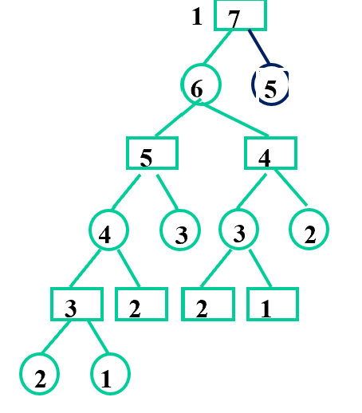
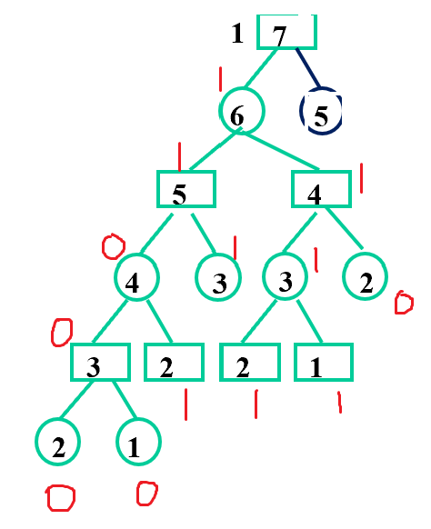
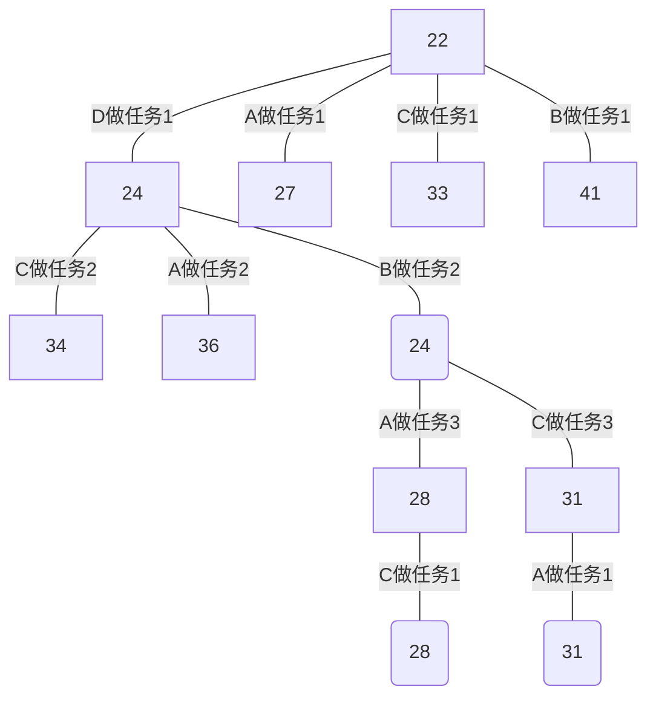
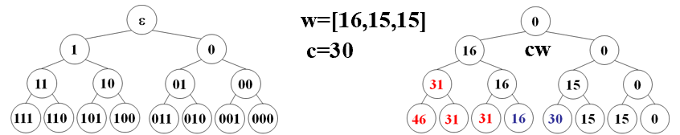
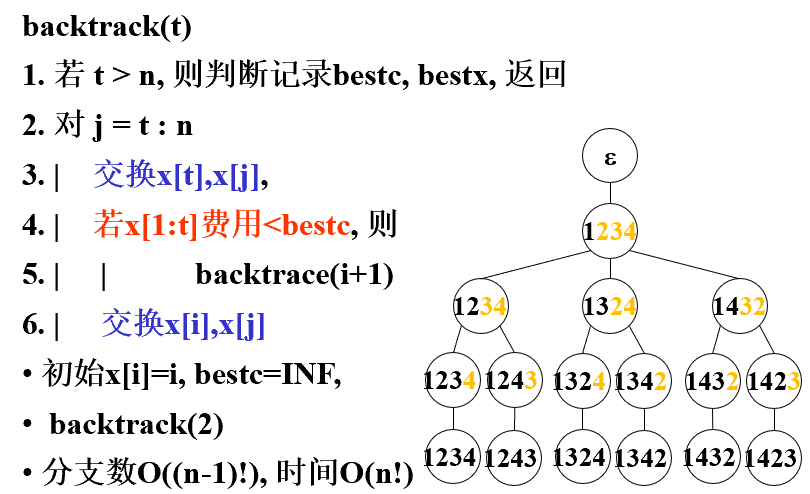
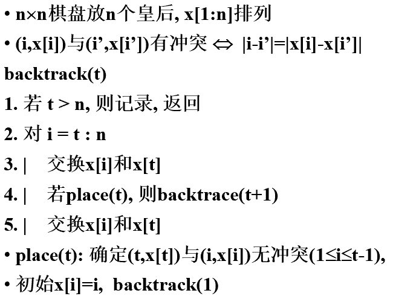
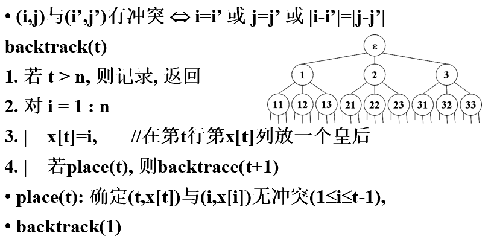
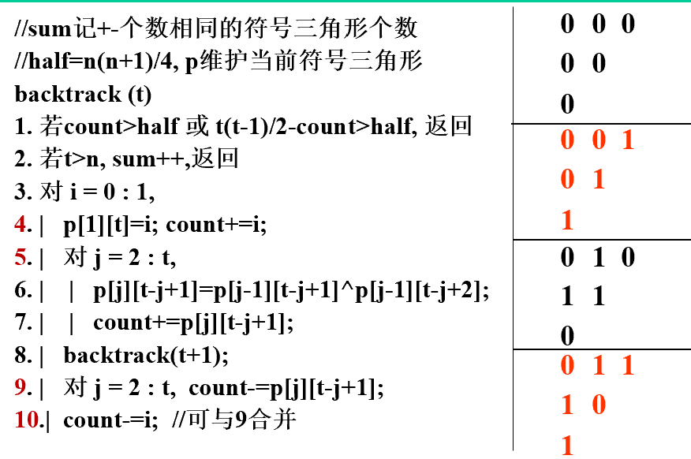
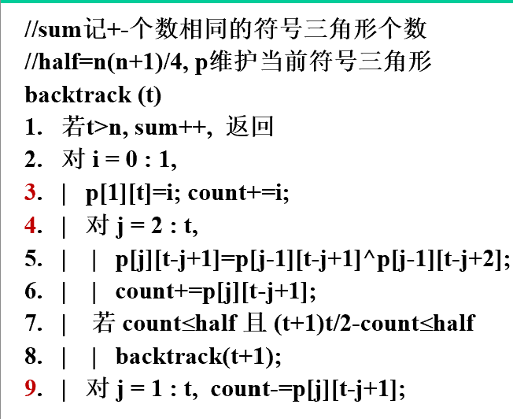

分类：
- 暴力搜索（真叫这个名，brute-force search）
- 图遍历
	- 广度优先搜索 BFS
	- 深度优先搜索 DFS
- 树遍历
	- 回溯 (Back tracking)，即有剪枝的深搜
	- 分枝限界
	- 博弈树搜索
- 启发式搜索

## 1 小记（无关本篇文章）
### 1.1 博弈树搜索
问题：7 根火柴，两个人轮流取火柴，要么取 1 根要么取 2 根，谁拿到最后一根火柴谁赢。

用方框表示先手面对的情况（即剩下的火柴数），圆框表示后手面对的情况，可以画出一棵树；当面对的情况是 1 或 2 时则胜利。下面是一部分图。可以看出，它是一个按层交替进行的树，一层是先手一层是后手。因此博弈树搜索也叫 α-β 搜索


我们给每个结点都打一个标记，1 则是先手胜利，0 则是后手胜利。那么可以直接把叶子结点的标记写出来。对于分支结点，如果是先手结点，我一定希望选择走 1 的方向，如果是后手结点，我一定希望选择走 0 的方向，这就是剪枝。在实际问题中，定义先手胜利为大、后手胜利为小，那么填分支结点过程就是先手取大值、后手取小值。这样就可以把整棵树所有结点的标记全部得出来。（下面图只是一部分，树太大了画不下）


在博弈中，对手是不能配合你的。所以作为先手应该尽可能走全 1 的路线，作为后手应该尽可能走全 0 的路线

结论：对于这种 1 根 2 根的，只要维护一个事情：我的回合结束后，必然剩下 3 的倍数（$3=1+2$）。这样往后每一轮，如果对手取 1 根我就取 2 根。对手取 2 根我就取 1 根，这样最后剩 3 根火柴到对手面前，我必胜。

反过来，如果取到最后一根火柴的人输，则需要维护我的回合结束后，必然剩下 $3k-1$，然后还是他一根我两根，他两根我一根。

### 1.2 灌水问题
灌水问题：一个 7 升的桶和一个 3 升的桶，量出 5 升水。直接暴搜，一个结点两个量，表示两个桶的水量。每一个结点都可以伸出来好多情况，要么装满，要么倒空，要么一个往另一个倒，只要最后整出来两个数中有一个是 5 就齐活。

实际上这是一个数学问题。数学上可以证明，如果两个桶容量的最大公约数可以整除目标数（即`5 % gcd(7,3) == 0`），那么就一定存在解。只需要求 $7x+3y=5$ 的整数解即可。例如其中一组解 $x=-1,\ y=4$，代表 7 升的桶要清空一次，3 升的桶要装满 4 次。所以过程就是：**3 升桶灌满**，往 7 升桶倒；**3 升桶灌满**，往 7 升桶倒；**3 升桶灌满**，往 7 升桶倒，这时候只能倒 1 升，7 升桶满了，3 升桶剩 2 升；把 **7 升桶清空**，3 升桶剩下的 2 升往 7 升桶倒（*只有装满的桶才能清空，然后把灌水的桶中剩下来的水倒到清空的桶中*）；**3 升桶灌满**，往 7 升桶倒，这时候 7 升桶里面就是 5 升水。再例如还有一组解 $x=2,\ y=-3$，代表 7 升桶要装满 2 次，3 升桶要清空 3 次。

## 2 分枝限界
例：有 ABCD 四个人，1234 四个任务，要求每人选一个任务做，一个任务只能一个人做。已知不同人完成不同任务所需时间的表格，找出一个总时间最少的分配方案。

| 人员  | 任务1 | 任务2 | 任务3 | 任务4 |
| :-: | :-: | :-: | :-: | :-: |
|  A  |  2  | 10  |  9  |  7  |
|  B  | 15  |  4  | 14  |  8  |
|  C  | 13  | 14  | 16  | 11  |
|  D  |  4  | 15  | 13  |  9  |

朴素（暴力）地来看，直接枚举 $A_4^4$ 一定可以找到最优解。这样相当于构造一棵树，根结点出来 $n$ 条边连到第一层，第一层每个结点出来 $n-1$ 条边连到第二层，以此类推。这玩意会变得相当大，接近 $n^n$ 级别增长的。

优化：在搜之前，先做一个预判。忽略掉“每人选一个任务做，一个任务只能一个人做”这一限制条件，对这个点做一个**美好的估计**，求一下在目前已经选好人选的条件下，未来总用时的理论最小值。

### 2.1 美好的估计
- 一开始还没安排，那么已经确认的时间是 0。我们做一次美好估计，让 A 做任务 1，B 做任务 2，A 做任务 3，A 做任务 4，总时间就是 $2+4+9+7=22$。这是总用时的理论最小值，最后的实际用时一定大于等于 22。
- 现在决定一下到底谁做任务 1。
	- 假设 A 做任务 1，那么 A 那一行和任务 1 那一列就被占掉了，那么已经定下来的时间就是 2，剩下 BCD 做任务 234，我们还是让最快的人做，即让 B 做任务 2、D 做任务 3、B 做任务 4，这样美好的估计就是 $2+4+13+8=27$
	- 假设 B 做任务 1，那么 B 那一行和任务 1 那一列就被占掉了，那么已经定下来的时间就是 15，剩下 ACD 做任务 234，美好估计为 $15+10+9+7=41$
	- 假设 C 做任务 1，美好估计为 $13+4+9+7=33$ 
	- 假设 D 做任务 1，美好估计为 $4+4+9+7=24$
- 这么来看，如果 D 做任务 1，美好估计的值最小。我们说真实情况一定比美好估计要大于等于，也就是“D 做任务 1”有更大概率可以通向那个解。我们就从 D 开始往下搜，决定谁做任务 2
	- 假设 A 做任务 2，美好估计为 $4+10+14+8=36$
	- 假设 B 做任务 2，美好估计为 $4+4+9+7=24$
	- 假设 C 做任务 2，美好估计为 $4+14+9+7=34$
- 于是任务 2 我们就让 B 来做。用同样的方法安排任务 3
	- 假设 A 做任务 3，美好估计为 $4+4+9+11=28$
	- 假设 C 做任务 3，美好估计为 $4+4+16+7=31$
- 所以 A 做任务 3，C 只能选剩下的任务 4，总时间的美好估计为 28

### 2.2 检验最优解
我们刚才的过程实际上给出了一个树（不要在意层内的顺序，mermaid 画图不好控制结点顺序）

现在有 27、41、33、36、34 这些点还没安排完。对于后面四个，已经可以不用看了，因为它们几个再安排下去只能比 41、33、36、34 要大，不可能比 28 还小。但是这些没安排完的结点里面有一个 27 是比 28 小的，也就是说这个结点下面可能会有比 28 要小的解。

所以 27 这个结点要继续做安排。往下安排任务 2，得到美好估计为 28、37、39，都不比 28 小，说明 28 确实是最优解了。

**注意区分**
- 分枝限界中每个点只有一次机会，而回溯中每个点有多次机会
- 回溯建立在深搜，分枝限界参考广搜但不是广搜，是优先队列

## 3 装载问题
例：给定 n 件货物及他们的重量 $w_i$，来了一艘容量 c 的船，给出最优装载方案。

没有任何剪枝纯暴力算法，直接搜
```cpp
//暴搜
//全局：curw为当前重量，bestw为最优重量，n为货物总数，c为船的载重量
void backtrack(int t)//t是子集树的层号（即目前正在装载第几件货物）
{
	if(t>n)//触底了
	{
		if(curw<=c && curw>bestw)
			bestw=curw;//如果这个子集合理且更优则更新
		return;
	}
	curw+=w[t];
	backtrack(t+1);//如果放当前货物，往下尝试
	curw-=w[t];//还原，回到进入结点时的状态
	backtrack(t+1);//如果不放当前货物，往下尝试
}
```

暴搜的代码没有任何数据结构，但是它跑起来的时候隐含了一棵树，称为子集树（例如有三个元素，我们考虑他的所有子集，每一位代表一个元素，用 0 代表不取、1 代表取。例如 110 就是取第一个和第二个不取第三个。000、001、010、011、100、101、110、111，我称之为子集序列）。下图左边就是子集树，右边是代入具体例子得到的树。


### 3.1 约束条件
刚才那张图上，红色部分是超过总容量的。而重量大于零，一旦超过总容量，它往后的所有点一定都是不符合条件的。这时候就可以引入**剪枝条件**，当`curw+w[t]>c`的时候就不用往左分支再尝试了，即把左分支剪掉。
```cpp
//优化：约束条件
void backtrack(int t)
{
	if(t>n)
	{
		if(curw<=c && curw>bestw)
			bestw=curw;
		return;
	}
	if(curw+w[t]<=c)//只有符合条件的才能往下尝试
	{	
		curw+=w[t];
		backtrack(t+1);
		curw-=w[t];//如果成功往下尝试了记得要还原
	}
	backtrack(t+1);
}
```

### 3.2 限界条件
约束条件是题目内在的需求，而限界条件则是剪掉不可能得到最优解的子树，这个条件是要自己设计的。不过一般都是一个下界或者一个上界。

在本题中，我们定义一个数`r`表示剩余物品的总重量。如果`r`和当前物品重量`curw`加起来还到不了`bestw`，那这一路往下都不可能比 `bestw`大，可以直接剪掉。
```cpp
//优化：约束条件+限界条件
//全局：r为剩余重量，x[i]是当前子集序列（给出最优解用的），bestx[i]是最优解的子集序列
void backtrack(int t)
{
	if(t>n)
	{	
		if(curw>bestw)
			bestw=curw;
			bestx=x;
		return;
	}
	r-=w[t];//考虑当前物品，不管放不放入，剩余重量都要减小
	if(curw+w[t]<=c)//约束条件，判断去不去左子树
	{	
		curw+=w[t];
		x[t]=1;
		backtrack(t+1);
		curw-=w[t];
	}
	if(curw+r > bestw)//限界条件，判断去不去右子树
	{	
		x[t]=0;
		backtrack(t+1);//如果不放当前货物，往下尝试
	}
	r+=w[t];//还原，表示两个子树都不去，这个情况往下不考虑了
}
```

本题中只有左分支有约束条件，只有右分支有限界条件。

### 3.3 提前更新最优解 
（没听懂）
```pseudo
//优化：约束条件+限界条件+提前更新
backtrack(t)
{
	if(t>n)
		if(curw>bestw)
			bestw=curw;
			bestx=x;
		return;
	r-=w[t];
	int tmp=curw+w[t];
	if(tmp<=c)
		if(tmp>bestw) bestw=tmp;//提前把最优解变得更优
		curw+=w[t];
		x[t]=1;
		backtrack(t+1);
		curw-=w[t];
	if(curw+r > bestw)
		x[t]=0;
		backtrack(t+1);
	r+=w[t];
}
```
只有部分题目可以做提前更新。符号三角形问题不能做提前更新

## 4 回溯模型
刚才讨论的就是回溯。把回溯理解成有剪枝的深搜。回溯函数中包含的内容和深搜是一样的，即**返回条件、设置左分支+进入左分支+还原、设置右分支+进入右分支+还原**

### 4.1 子集树回溯模型
类似装载问题这种，在给定约束条件内、选择集合内某些物品使得某个量最优的问题，都可以用**子集树回溯**来解。

把上面的代码抽象成流程思路
```pseudo
backtrack(t)
{
	if(t>n)//触底
		判断是否比当前最优解更优，更优则更新最优解
		return;
	if(满足约束条件 && 满足限界条件)
		设置左分支条件;
		backtrack(t+1);
		还原左分支条件;
	if(满足约束条件 && 满足限界条件)
		设置左分支条件;
		backtrack(t+1);
		还原左分支条件;
}
```

#### 01 背包问题
装载问题实际上就是“价值=重量”条件下的 01 背包。类比刚才的思路，可以写出 01 背包的回溯解法，只需要多一个价值数组`v[i]`，定义`r`为剩余物品的价值和即可
```cpp
void backtrack(int t)
{
	if(t>n)
	{
		if(curw<=c && curv>bestv) {bestv=curv;bestx=x;}
		return;
	}
	r-=v[t];//考虑当前物品，不管放不放入，剩余价值都要减小
	if(curw+w[t]<=c)//约束条件，判断去不去左子树
	{
		curw+=w[t];
		curv+=v[t];
		x[t]=1;
		backtrack(t+1);
		curv-=v[t];
		curw-=w[t];
	}
	if(curv+r > bestv)//限界条件，判断去不去右子树
	{	
		x[t]=0;
		backtrack(t+1);//如果不放当前货物，往下尝试
	}
	r+=v[t];//还原，表示两个子树都不去，这个情况往下不考虑了
}
```

**附：01背包问题中对限界条件的进一步优化**
计算一个更紧的理论界，筛掉更多不可能得到解的分支。
- 计算出单价（价值除以重量）
- 当前结点往下总价值的理论上界有三个部分：
	- 第一部分：已经装进去的价值，这个数是根据当前结点的子集序列算出来的
	- 第二部分：还能装进去的价值。优先装剩余物品中单价高的，装完如果还能装下单价次高的就装，以此类推直到装不下
	- 第三部分：忽略“整数物品”的条件，把刚才那个刚好装不下的物品拆成小数个物品强行把背包填满
	>  例如：
	>  背包容量：50
	>  单价：05、15、25、27、30  
	>  价值：12、30、44、46、50  
	>  单价排名：12435  
	>  
	>  现在计算子集树中 110 结点的总价值理论上界：
	>  - 第一部分：已经装进去的：第一件、第二件，价值 $12+30=42$，背包剩余容量 $50-5-15=30$
	>  - 第二部分：还能往里装的。前三件是已经定好装不装的，现在考虑第四件第五件物品，优先从单价最高的第四件物品考虑，发现可以装下，总价值 $42+46=88$ 背包剩余容量 $30-27=3$。考虑单价次高的第五件物品，装不下了。
	>  - 第三部分：强行填满背包。用刚才装不下的第五件物品，填满背包剩余的 $3$，这部分价值即单价乘以重量即 $\dfrac{50}{30}\times3=5$。总价值 $88+5=93$。这个 93 就是总价值上界

#### 最大团问题
对于一个无向图，选出几个点。如果这些点两两都有边直接相连，则称这些点和这些边构成一个完全子图，又称为团。几个点构成的团就叫几团。现在求任意一个无向图中最大的团是多少。

还是子集树问题，就是当前点取不取的问题。
```cpp
//全局：curn当前团大小，bestn最大团大小，x当前子集序列，bestx最优子集序列
void backtrack(int t)//考虑第t个点
{
	if(t>n)//触底，判断，更新，返回
	{
		if(curn>bestn) bestn=curn,bestx=x;
		return;
	}
	if(/*t号点与已有的那些点都相连*/)//约束条件
	{
		x[t]=1;curn++;//设置左分支
		backtrack(t+1);
		curn--;x[t]=0;//还原
	}
	if(curn+n-t>bestn)//如果加上剩余的能够超过最优解则尝试，否则剪枝
	{
		x[t]=0;
		backtrack(t+1);
	}
}
```

这个算法是 $O(n2^n)$ 的。
### 4.2 排列树回溯模型
思路：对于一个序列，选一个数放到最前面，剩下的全排列。这个程序生出来的树称为排列树，最后的解即为全排列。
```cpp
//全局：x为解，n为位数
void backtrack(int t)
{
	if(t>n) {print(x); return;}
	for(int i=t;i<=n;i++)//对于序列内的每一个数，这里相当于以前的几个分支
	{
		swap(x[t],x[i]);//把这个数扔到序列开头
		backtrack(t+1);
		swap(x[t],x[i]);//还原
	}
}
```
#### 游商问题
**游商问题**（Traveling Salesman Problem, TSP，aka 旅行售货员问题/货郎担问题）描述如下：某游商要到若干城市推销商品，已知各个城市之间的旅费，求一条从驻地出发、经过每个城市再回到驻地的路线，使得总旅费最小。

累了 先贴一下ppt


#### n 皇后问题
**n 皇后问题**描述如下：在一个 $n\times n$ 的棋盘上摆 $n$ 个皇后，使得他们不能互相攻击。（皇后的攻击范围：自己所在行、列、斜线）

累了，先贴ppt。两种做法
- 第一种：重新写限界条件和约束条件

- 第二种：用排列树，扣除斜线重叠的部分


### 4.3 符号三角形
无法提前更新最优解，因为必须全部做完才出结果


