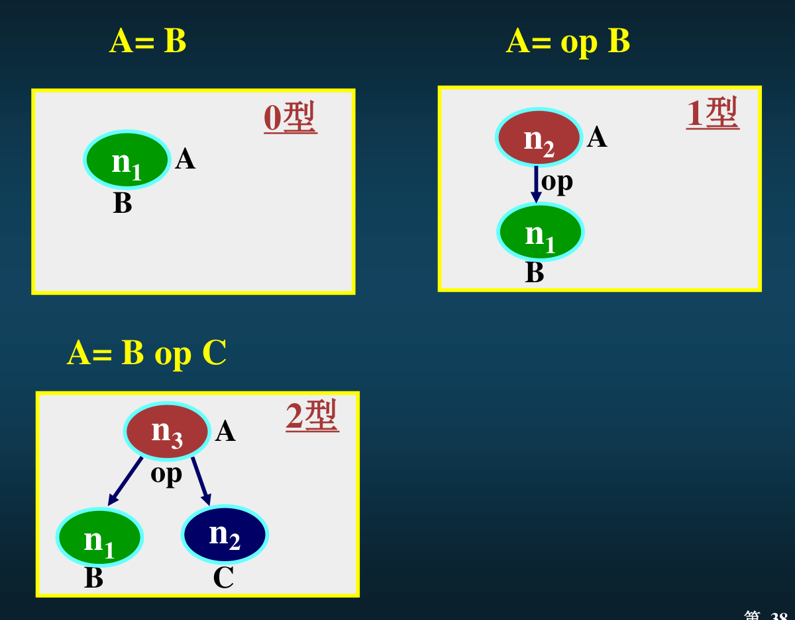
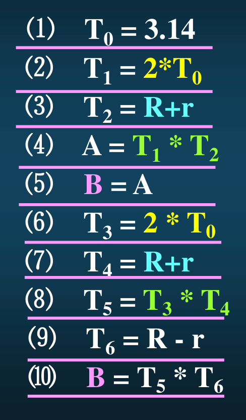
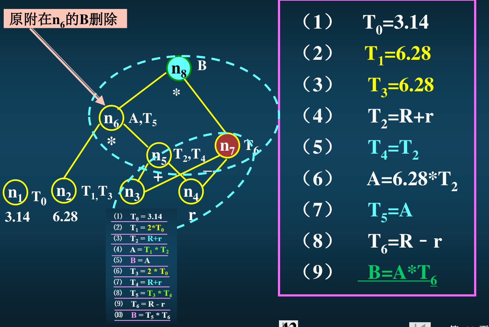
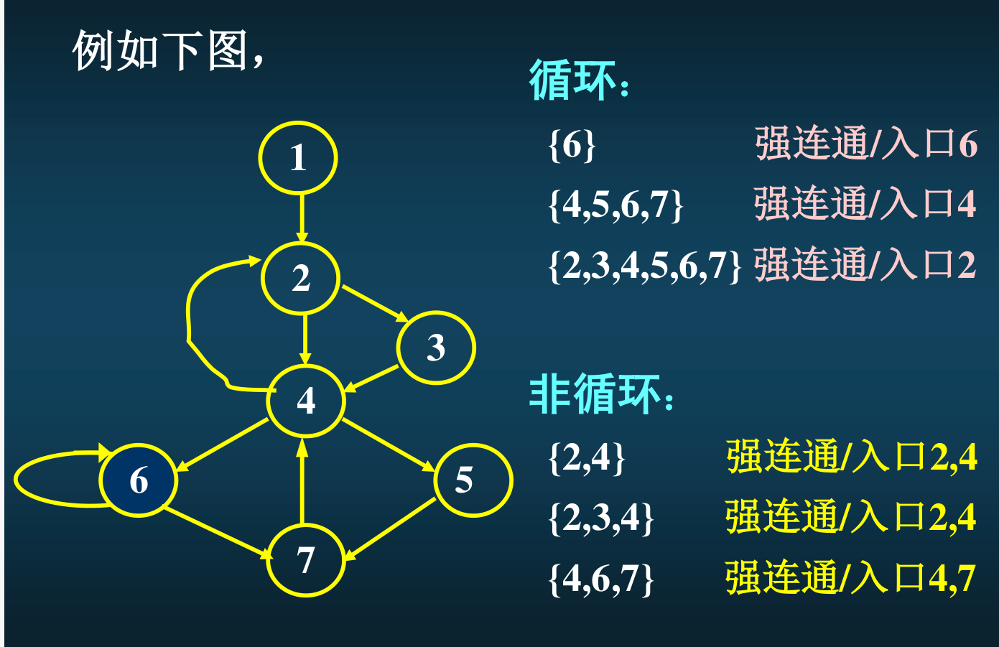
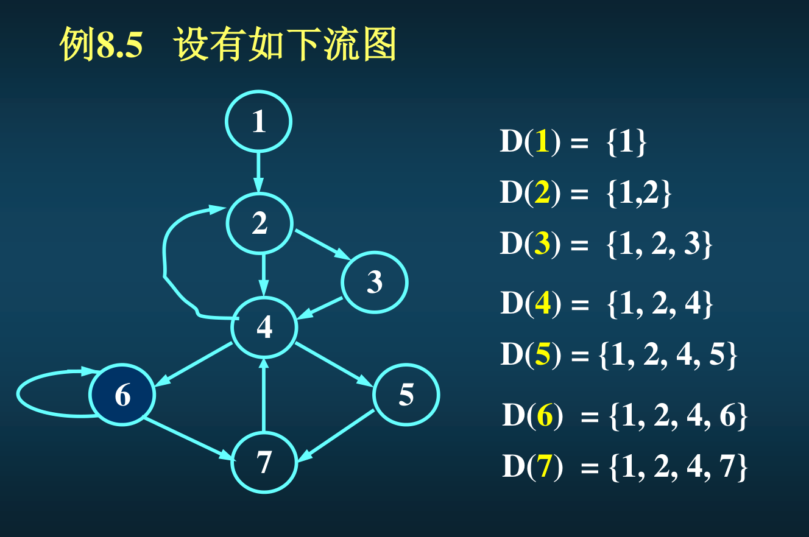
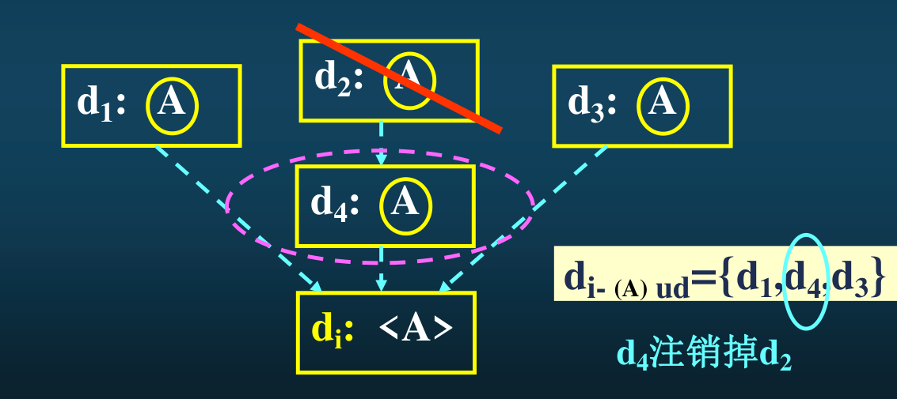
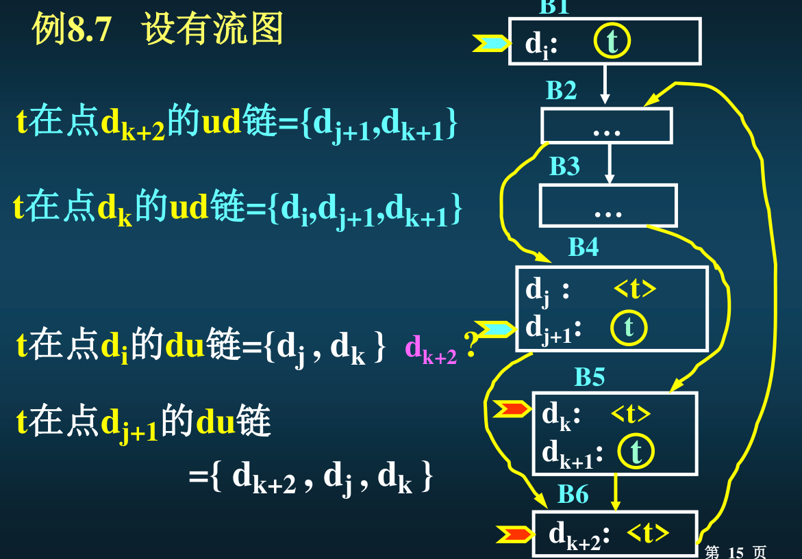
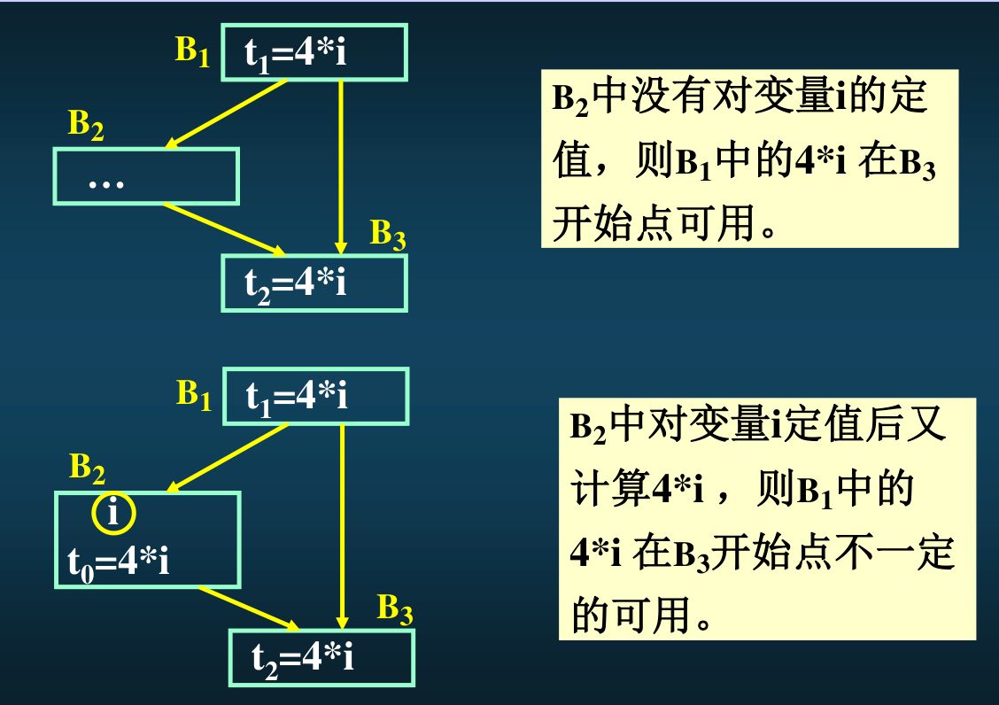
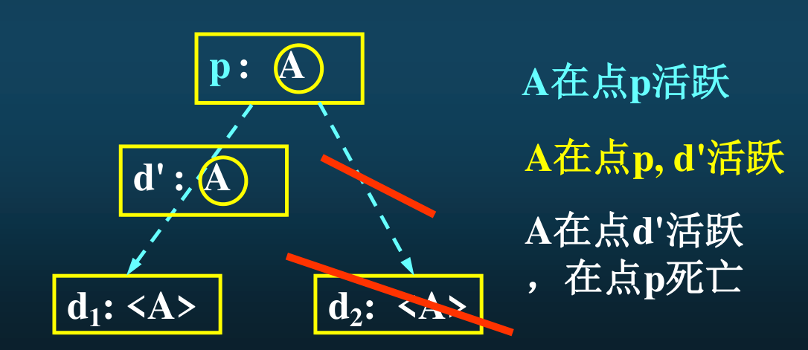

节约时间、节约空间都叫做优化
### 优化技术分类

按优化范围分：
- 局部优化：基本块内的优化
- 循环优化：循环体里头的优化
- 全局优化：在整个源程序范围内优化

按优化时间分：
- 中间代码级优化：目标代码生成之前优化
- 目标代码级优化：目标代码生成之后优化

基本技术
- 常量合并（在定义变量/常量的值的时候 如果能直接算出来就直接算出来）
- 公共子表达式删除（两个算式都使用了同一个子表达式）
- 循环不变量或不变代码外提
- 无用赋值删除（比如先定义了 a=5 且没用，后面又定义了 a=7，那么 a=5 就可以删掉）
- 死代码删除（比如 ifelse 的条件句永假时，只需要保留 else 的代码）
- 多跳删除（一个 goto 之后到的那个地方又是一个 goto）
- 函数嵌入
- 循环内运算强度削弱
- 降低循环次数（把 n 次循环拆成：n/4 次四倍效果的循环 + n%4 次的单倍效果循环）

优化过程：控制流分析、数据流分析、代码变换

#### 局部优化

基本块：一个顺序执行的语句序列，只有唯一入口和唯一出口，分别对应序列的第一个语句和最后一个语句。没有转进转出，没有分叉汇合。在基本块里头做优化一定不会影响到程序的执行顺序

基本块的划分方法。先找出所有的入口语句。入口语句：程序的第一个语句 / 转移语句中转移到的那个语句 / 紧跟在转移语句后面的语句。然后从上到下顺序扫描：
- 找到一个入口语句，基本块开始
	- 如果遇到一个入口语句，则从刚才那个入口语句（含）到当前语句（不含）之间的所有语句构成一个基本块。继续寻找下一个入口语句
	- 如果遇到一个转移语句/暂停语句，则从刚才那个入口语句（含）到当前语句（含）之间的所有语句构成一个基本块。继续寻找下一个入口语句

程序的控制流图：有向图，节点是基本块。a 到 b 有边的条件：
- 要么基本块 b 紧跟在基本块 a 的后面，且 a 的出口语句不是无条件转移或者停语句
- 要么基本块 a 的出口语句是转移到基本块 b 的入口语句的转移语句（可以无条件也可以有条件）

一个基本块内的代码可以表示成有向无环图 DAG。
- 叶节点是变量名或常数，写在节点的下面，代表该变量或常数的值，通常标识符下标加 0 表示变量初值
- 内部节点是运算符号，写在节点下面，代表运算出来的结果（相当于一个值了）
- 每个节点可能附加一个或多个标识符，写在节点右边

考试只考虑三种四元式：0、1、2 型，分别表示有几个操作数。0 个操作数就是纯赋值。三种的 DAG 长这样长这样长这样长这样  
  
从基本块中的四元式构造出这个基本块的 DAG 的算法：构造叶节点、捕捉已知量并合并常数、捕捉公共子表达式、捕捉无用赋值。对每一个四元式都走一遍这个步骤。例子：  

- 捕捉已知量合并常数：能算出来的变量值，就当作常数来用。比如图中的 T1
- 捕捉公共子表达式：遇到相同的表达式或值，直接把对应的变量名写到同一个节点的右边，比如图中的 A 和 T5
- 捕捉无用赋值：发现对同一个变量赋值且之前没使用过，那么就把之前那个赋值删掉，比如图中的 B

写完之后，根据这个图重新写一遍四元式，就是最终的优化结果

#### 控制流分析寻找循环

循环：是一个节点集，集合里头任意两个节点之间必有一条通路，且==只有一个入口==能够进入该集合。特别的，自环的节点认为是“自己到自己有通路”  

***
**如何找循环**

定义：a DOM b，表示 a 是 b 的必经节点，也即从==程序入口节点==开始到达节点 b 的任意一条路径，都要经过点 a。DOM 是流图节点集上的偏序关系，自反性、传递性、反对称性  
必经节点集：$D(n)=\{a\mid \forall a \ \ \text{DOM}\ \ n\}$ ，里头一定有 a 有 n  

定义：回边 `<a,b>`，指的是一条有向边，从路径下游的某个点 a 指回 a 上游的某一个必经节点 b。例如上图中，7->4 就是回边，因为 7 的必经节点集里头有 4。

循环的求法：从回边开始。对于一条回边 `<n,d>`，他将定义出一个循环 `<n,d>_loop`，循环里的节点是 **所有 终点为 n 且不经过 d 的通路** 上的所有节点，再加上 n 和 d 自己。d 是循环的唯一入口。

例如上图中，7->4 是一条回边，说明 7 是下游、4 是上游。那么就看所有从入口到 7 的路径，把路径中 4 之前的部分砍掉，剩下的部分会是一个从 4 到 7 的通路，再加上 7 回到 4 的回边，就构成了一个循环。

#### 数据流分析

点：就是一个位置

按语句位置分
- 入口点：基本块第一个代码之前的位置
- 出口点：基本块最后一个代码之后的位置
- 相邻点：两个代码中间的点

按语句功能分
- 定值点：使得变量 A 获得值的那个语句的位置，称为 A 的定值点。可以是赋值可以是输入可以是函数调用。用 `圈A` 表示对 A 的定值
- 引用点：引用变量 A 的值的那个语句的位置，称为 A 的引用点。例如 i=i+1，第一个 i 是定值点、第二个 i 是引用点；i++，i 既是引用点又是定值点。用 `<A>` 表示对 A 的引用

几个关于通路的
- 到达 - 定值：称变量 A 在某点 d 的定值到达了点 p，如果存在一条 d->p 的通路、且一路上没有对变量 A 再进行定值。
- 变量 A 在引用点 p 的**引用 - 定值链（ud 链）**：即所有能改变到我在 p 点引用变量 A 的值的那些定值点的全体。如图所示，由于 d2 这个定值会被 d4 覆盖掉，所以 d2 并不属于 A 的 ud 链  

- 变量 A 在定值点 p 的**定值 - 引用链（du 链）**：即所有会使用到我在 p 点对变量 A 的定值的那些引用点的全体。
- ud 和 du 怎么区分：看==后面那个==，如果是 d 就是定值点的集合，如果是 u 就是引用点的集合

#### 数据流方程
基本形式：$\text{out}[B]=\text{gen}[B]\cup(\text{in}[B]-\text{kill}[B])$  
out 输出的信息、gen 生成的信息、in 输入基本块的信息、kill 注销掉的信息
***
到达 - 定值数据流方程：在数据流分析中采集变量定值情况
$$
\text{out}[B]=\text{gen}[B]\cup(\text{in}[B]-\text{kill}[B])
$$
$$
\text{in}[B]=\bigcup(B_k\in \text{Prev}(B))\ \text{out}[B_k]
$$
- in 集合 = 能够到达当前基本块入口点的定值点的集合
- out 集合 = 能够到达当前基本块出口点的定值点的集合
- gen 集合 = 在当前基本块中的定值点（且这个定值能够到达出口点）的集合
- kill 集合 = 在其他基本块中的定值点（且在当前基本块中重新被定值，和实际流不流得到无关）的集合

***
表达式在 p 点可用，就是说到达 p 点的所有路径当中都计算该表达式，且路上没有对表达式当中的变量定值。  

可用表达式数据流方程：
$$
\text{out}[B]=\text{gen}[B]\cup(\text{in}[B]-\text{kill}[B])
$$
$$
\text{in}[B]=\bigcap(B_k\in \text{Prev}(B))\ \text{out}[B_k]
$$

刚才是并 现在是交，是因为只有当在所有前驱块结束点都有效的时候，这个表达式才可用，只要有一个无效，就会出现冲突
***

活跃变量：对于某个点 p，若存在一条从 p 开始的通路，路上引用了 A 在 p 点的值，则称 A 在 p 是活跃的。例如图中，如果右边不划掉，A 就在 p 活跃，因为存在一条路使得这个定值是有效的；划掉之后，A 就在 p 死亡，而在 d' 活跃

活跃变量数据流方程：
$$
\text{inL}[B]=\text{useL}[B]\cup(\text{outL}[B]-\text{defL}[B])
$$
$$
\text{outL}[B]=\bigcup(B_k\in \text{Succ}(B))\ \text{inL}[B_k]
$$
- inL 集合 = 在当前基本块入口点活跃的活跃变量的集合
- outL 集合 = 在当前基本块出口点活跃的活跃变量的集合
- defL 集合 = 在当前基本块中被定值、且定值前未曾在当前块中引用的变量的集合
- useL 集合=在当前基本块中被引用、且引用前未曾在当前块中定值的变量的集合

#### 循环优化
先用控制流分析找到循环，然后对于循环里头的每一个基本块做数据流分析性
***
代码外提：寻找不变运算（即运算对象的定值在循环之外）
