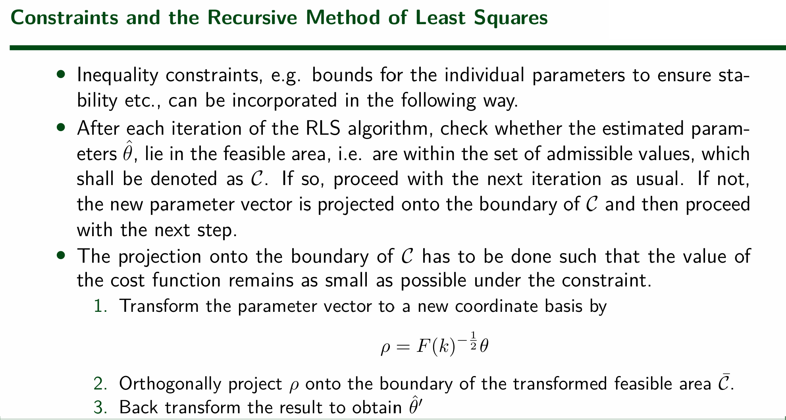
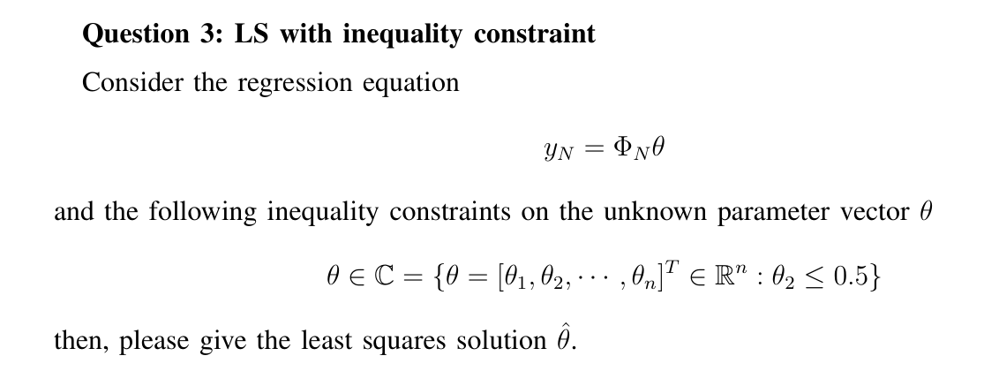
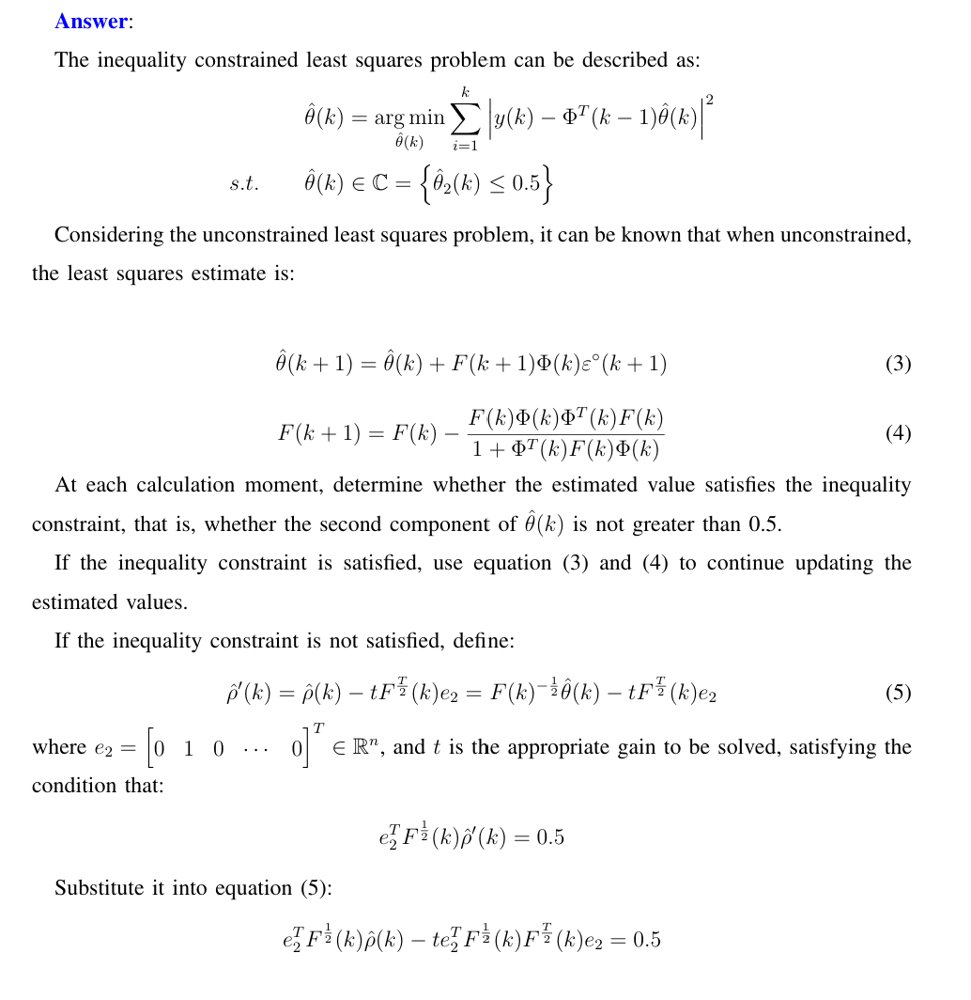
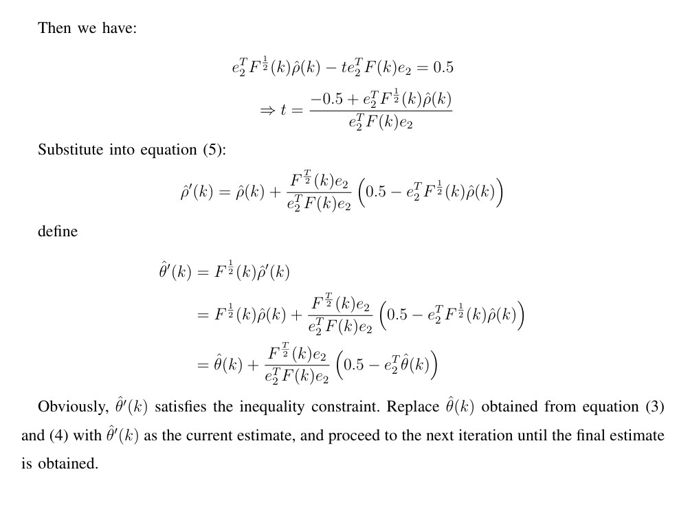

import { Aside } from 'astro-pure/user'

优化问题：就是求最值。涉及两类函数
- $\min$ 或 $\max$，意思就是求它后面那个函数的值
- ${\rm argmin}{}$ 或 ${\rm argmax}{}$，意思就是求“使得它后面东西最大”时自变量的值
- 符号下面写的东西：自变量+自变量范围
- 对于一个方程组 $Ax=b$，定义它的最小二乘解为 $\mathrm{argmin}\ \|Ax-b\|^2$
- 基本求法：令对自变量的偏导为零

## 偏导结论
约定：
- $x$ 为 $n$ 维列向量
- $y$ 为 $m$ 维列向量

则
- $\dfrac{ {\partial}(\alpha x)}{ {\partial}x}=\alpha^{\rm T}{}$，其中 $\alpha$ 为 $n$ 维行向量
- $\dfrac{ {\partial}(\alpha x)}{ {\partial}x^{\rm T} }=\alpha$
- $\dfrac{ {\partial}(x^{\rm T}\beta)}{ {\partial}x}=\beta$，其中 $\beta$ 为 $n$ 维列向量
- $\dfrac{ {\partial}(x^{\rm T}Ax)}{ {\partial}x}=(A^{\rm T}+A)x$，其中 $A$ 为 $n\times n$ 方阵
- $\dfrac{ {\partial}(x^{\rm T}By)}{ {\partial}x}=By$，其中 $B$ 为 $n\times m$ 方阵
- $\dfrac{ {\partial}\|Ax\|^2}{ {\partial}x}=\dfrac{ {\partial}x^{\rm T}A^{\rm T}Ax}{ {\partial}x}=2A^{\rm T}Ax$，其中 $A$ 为任意矩阵，$b$ 为任意可以相加的列向量
- 最小二乘解
    $$
    \begin{aligned}\dfrac{ {\partial}\|Ax-b\|^2}{ {\partial}x}&=\dfrac{ {\partial}(x ^{\rm T}A^{\rm T}-b ^{\rm T})(Ax-b)}{ {\partial}x}=\dfrac{ {\partial}(x ^{\rm T}A ^{\rm T}Ax-x ^{\rm T}A ^{\rm T}b-b ^{\rm T}Ax+b ^{\rm T}b)}{ {\partial}x}\\&=2A ^{\rm T}Ax-2A ^{\rm T}b=2A ^{\rm T}(Ax-b)\end{aligned}{}
    $$

## 问题描述与记号规定
想象一个黑箱系统，它里头有 $n$ 个未知量，我们打包成列向量 $\theta$，称为“参数”。我的目标是估计这个参数。

现在让这个系统动起来。它会吞进去一堆东西，我们打包成列向量 $u$，称为“输入”；吐出来一堆东西，我们打包成列向量 $y$，称为“输出”。我们在 0 时刻、1 时刻、……、N-1 时刻，观测这个系统，记录这些时刻的输入，我们记为 $u(0),\,u(1),\,\cdots,\,u(N-1)$；以及这些输入在下一时刻所产生的输出，我们记为 $y(1),\,y(2),\,\cdots,\,y(N)$

使用线性模型来拟合这个系统，也就是说，假定系统的输出关于那 $n$ 个未知参数是线性的，也即对于 $t$ 时刻的输出，存在一个系数矩阵（aka 测量向量）$\phi(k)$ 使得 $\phi^\mathrm T(k)\cdot\theta$ 能够拟合 $y(k+1)$，于是 $\theta$ 也就是方程组 $y(k+1)=\phi^\mathrm{T}(k)\cdot\theta$ 的数值解。（注意，$\phi$ 中可以含有过去时刻的 $y$ 和 $u$，因为对于现在时刻，过去时刻是已知的。）

显然，观测的数据越多，拟合效果越好。本章后面所讲的所有方法，就是要解决：怎么利用这么多输入输出数据，具体求出这个数值解。

## 梯度下降法
思路：迭代之，每次利用一个新数据，更新已有的估计值

**先验误差与后验误差**
- 先验误差，即在更新参数之前，用当前的参数看看与真实情况差多少，再更新参数：
	$$
    \varepsilon^o(k+1)=y(k+1)-\phi^\mathrm{T}(k)\cdot\hat\theta({\color{red}k})\quad
    $$
- 后验误差，即先更新参数，再用更新后的参数看看这一轮迭代的效果如何：
	$$
    \quad\varepsilon(k+1)=y(k+1)-\phi^\mathrm{T}(k)\cdot\hat\theta({\color{red}k+1})
    $$

<Aside type="note" title="曰（梯度下降法）：">
基于先验误差的迭代：
$$
\hat\theta(k+1)=\hat\theta(k)+F\phi(k)\varepsilon^o(k+1)
$$
基于后验误差的迭代：
$$
\hat\theta(k+1)=\hat\theta(k)+\dfrac{F\phi(k)\varepsilon^o(k+1)}{1+\phi^\mathrm{T}(k)F\phi(k)}{}
$$
其中 $F$ 相当于学习率，可以取任意正定矩阵，一般用单位矩阵。后验误差稳定性比先验误差好一些。
</Aside>

**推导：**

(1) 先验误差情形。误差函数定为 $\dfrac12\|\varepsilon^o(k+1)\|^2$。令更新沿着梯度反方向
$$
\begin{aligned}
\Delta\theta&= -F\dfrac{\partial\,\|\varepsilon^o(k+1)\|^2}{2\ \partial\theta(k)}\\
&= -F\dfrac{\partial\,\|y(k+1)-\phi^\mathrm{T}(k)\theta(k)\|^2}{2\ \partial\theta(k)}\\
&= F\phi (k)\big(y(k+1)-\phi^\mathrm{T}(k)\theta(k)\big)\\
&= F\phi (k)\varepsilon^o(k+1)
\end{aligned}
$$

(2) 后验误差情形。这意味着误差函数要改为 $\dfrac12\|\varepsilon(k+1)\|^2$，取 $k\!+\!1$ 时刻的梯度。

令 $\Delta\theta$ 沿误差函数梯度反方向。误差函数的梯度和之前类似：$\dfrac{\partial\,\|\varepsilon(k+1)\|^2}{2\ \partial\theta(k+1)}=-\phi (k)\varepsilon(k+1)$，但是不能只用 $\Delta\theta=F\phi(k)\varepsilon(k+1)$ 来计算，因为在计算 $\varepsilon(k\!+\!1)$ 之前需要先知道 $\theta(k\!+\!1)$，相当于互为因果了。所以要把 $\varepsilon(k\!+\!1)$ 从 $\theta(k\!+\!1)$ 中剥离开：
$$
\begin{aligned}\\
\varepsilon(k+1)&= y(k+1)-\phi^\mathrm{T}(k)\big(\theta(k)+\Delta\theta\big)\\
&= y(k+1)-\phi^\mathrm{T}(k)\theta(k)-\phi^\mathrm{T}(k)\Delta\theta\\
&= \varepsilon^o(k+1)-\phi^\mathrm{T}(k)\Delta\theta\\
&= \varepsilon^o(k+1)-\phi^\mathrm{T}(k)F\phi (k)\varepsilon(k+1)\\
\varepsilon(k+1)&= \dfrac{\varepsilon^o(k+1)}{1+\phi^\mathrm{T}(k)F\phi (k)}
\end{aligned}
$$
这样就分开了，于是就可以说 $\Delta\theta=F\phi(k)\varepsilon(k+1)=\dfrac{F\phi(k)\varepsilon^o(k+1)}{1+\phi^\mathrm{T}(k)F\phi (k)}{}$
## 最小二乘法
刚才是逐个考虑，而这个方法则是同时把所有数据都考虑进来。将这些数据同时列出并写成矩阵表达式：
$$
\left\{
\begin{aligned}
y(1)&=\phi^\mathrm{T}(0)\cdot\theta\\
y(2)&=\phi^\mathrm{T}(1)\cdot\theta\\
&\cdots\\
y(N)&=\phi^\mathrm{T}(N-1)\cdot\theta
\end{aligned}
\right.\ 
\Rightarrow\ 
\begin{bmatrix}y(1)\\y(2)\\\vdots\\y(N)\end{bmatrix}=\begin{bmatrix}\phi^\mathrm{T}(0)\\\phi^\mathrm{T}(1)\\\vdots\\\phi^\mathrm{T}(N-1)\end{bmatrix}\cdot\theta
$$
记这个表达式为
$$
y_N=\Phi_N \cdot\theta
$$
因此 $\theta$ 就是这个方程组的数值解。这块就不用迭代了，直接最小二乘法

<Aside type="note" title="曰（最小二乘法）：">
$$
\hat\theta_{LS}=\big(\Phi_N^\mathrm{T}\Phi_N\big)^{-1}\Phi_N^\mathrm{T}y_N
$$
</Aside>

## 各种改进的最小二乘法
算那么大一个 $\Phi$ 矩阵毕竟很麻烦，且只用一条公式去推导的时候稳定性也很差，因此做出改良。赌他不考推导，死记（最后真的没考）
### 递归最小二乘

递归形式具有如下形式：$\Delta\theta=$ 增益 $\times$ 测量向量 $\times$ 误差
$$
\begin{aligned}
F(k+1)&=  F(k) - \dfrac{F(k)\phi(k)\phi^\mathrm{T}(k) F(k)}{1 + \phi(k)^\mathrm{T} F(k)\phi(k)}\\
\hat{\theta}(k+1)&= \hat{\theta}(k) + F(k+1)\phi(k)\varepsilon^o(k+1)
\end{aligned}
$$

### 加权最小二乘
使用一个正定对称矩阵 $W_N$，规定误差函数中每个参数各自误差的权重，也即优化 $J=\varepsilon^\mathrm{T}\cdot W_N\cdot\varepsilon$

非递归：
$$
\hat\theta_{WLS}=\big(\Phi_N^\mathrm{T}W_N\Phi_N\big)^{-1}\Phi_N^\mathrm{T}W_Ny_N
$$

递归：
$$
\begin{aligned}
\overline{F}_W(k+1) &=  F_W(k+1)\phi(k)w(k) = \dfrac{F_W(k)\phi(k)}{\frac{1}{w(k)} + \phi^\mathrm{T}(k)F_W(k)\phi(k)}\\
F_W(k+1) &=  \left( \boldsymbol{I} - \overline{F}_W(k+1)\phi^\mathrm{T}(k) \right) F_W(k)\\
\hat{\theta}(k+1)&= \hat{\theta}(k) + \overline{F}_W(k+1)\varepsilon^o(k+1)
\end{aligned}
$$

### 带遗忘因子的递归最小二乘
按顺序迭代
$$
\begin{aligned}
\overline F_W(k+1)&=\dfrac{F_W(k)\phi(k)}{\lambda+\phi^{\rm T}(k)F_W(k)\phi(k)}\\
F_W(k+1)&=\big(\boldsymbol{I}-\overline F_W(k+1)\phi^{\rm T}(k)\big)F_W(k)\dfrac1\lambda\\
\hat\theta(k+1)&=\hat\theta(k)+\overline F_W(k+1)\varepsilon^o(k+1)
\end{aligned}
$$

### 带正则化的最小二乘
对于 $J=\|y_N-\Phi_N\theta\|^2$，引入正则项

L2正则化：即最小化 $J+\lambda\|\theta\|^2$，结论：$\hat\theta=\left( \Phi_N^\mathrm{T} \Phi_N + \lambda I\right)^{-1} \Phi_N^\mathrm{T}y_N$

Tikhonov正则化（吉洪诺夫）：即最小化 $J+\gamma\theta^\mathrm{T}\boldsymbol{K}\theta$，其中后面那项记为 $\Omega(\theta)$，$\boldsymbol{K}{}$ 一般是对称的。结论：$\hat\theta=\left( \Phi_N^\mathrm{T} \Phi_N + \gamma \boldsymbol{K} \right)^{-1} \Phi_N^\mathrm{T}y_N$

### 带约束的最小二乘
等式约束：例如约束 $\theta\in \mathrm{col}(U)$，做法：$\theta=Ub$，这样 $b$ 就是一个不受约束的变量，只要对 $b$ 做无约束的最小二乘，然后 $\hat\theta_{LS}=U\hat b_{LS}{}$

不等式约束：递推最小二乘。如果递推过程中某一项 $\theta$ 违反了这个约束，则映射到另一个空间上：$\rho=F(k)^{-1/2}\theta$，在这个另外的空间上投影（沿着法向量）到约束边界上，然后再反向映射回原来的那个空间

例题：

