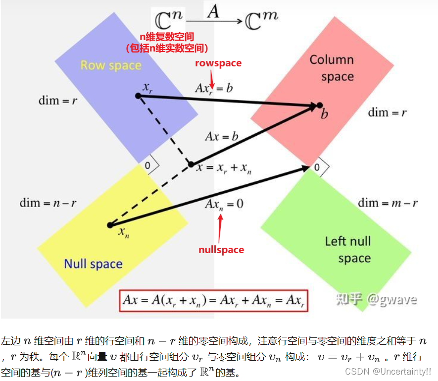
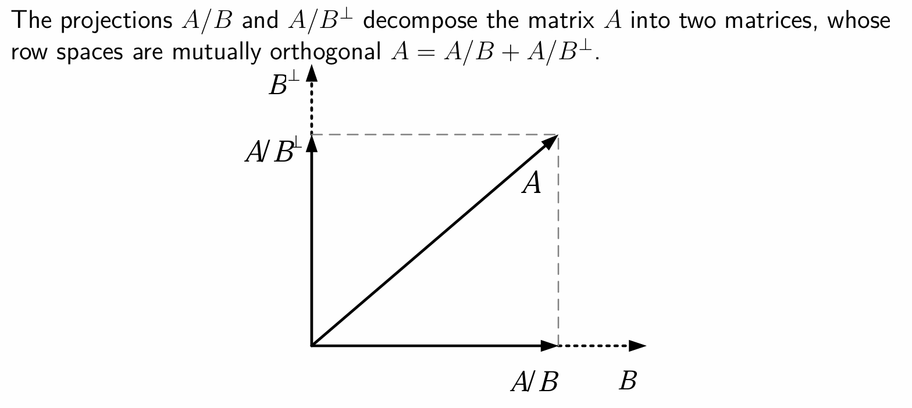
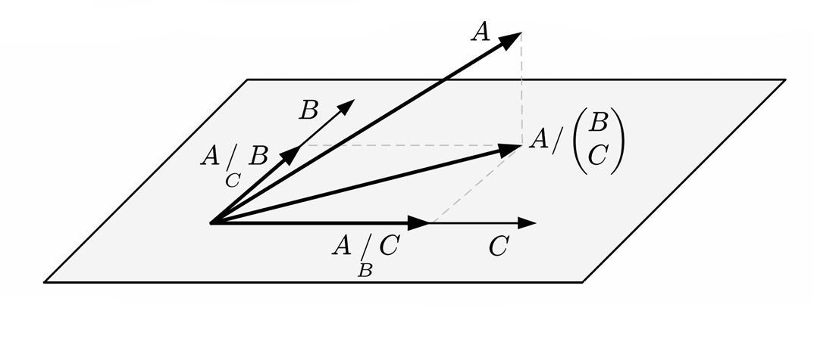
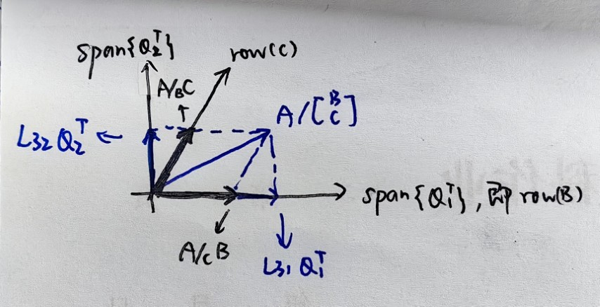

import { Aside } from 'astro-pure/user'

## QR分解/LQ分解

即将矩阵分解为“正交矩阵$Q$ $\times$ 上三角矩阵$R$”的形式。其中 $Q$ 为**单位正交向量组**拼起来的矩阵，$R$ 为**对角线下方（不含）全零**的矩阵。

### 为什么要QR分解
我们经常需要解 $A\vec x=\vec b$。如果 $A$ 是上三角阵，相当于已经做好高斯消元了（因为上三角相当于阶梯形方程组），那么只需要从下往上回代就解完了

如果不是上三角阵，那么就需要求 $\vec x=A^{-1}\vec b$，求逆太难了。但是我们知道正交矩阵的求逆非常简单：$Q^{-1}=Q^{\rm T}{}$

结合二者：如果能够分解成 $A=QR$，那么 $QR\,\vec x=\vec b\Rightarrow R\vec x=Q^{\rm T}\,\vec b$，只需要通过一次转置就可以转化为好解的阶梯形方程组

### 方法
将 $A$ 按列分块，把列向量组正交化。然后把这些向量模长归一，拼在一起就是 $Q$。这种求 QR 分解的方法叫做 Gram-Schmidt 正交化方法。*但是实际运用一般不用这个方法，涉及减法可能丢失精度。*

Gram-Schmidt 标准正交化：每进来一个向量，就从这个向量中减去它在已有向量上的投影（投影长 $\times$ 单位方向向量），然后再归一化
例如 $A=\begin{bmatrix}\alpha_1&\alpha_2&\alpha_3\end{bmatrix}$。首先正交化 $\lbrace\alpha_1,\alpha_2,\alpha_3\rbrace$
$$
\begin{aligned}
\beta_1 &= \alpha_1\\
\beta_2 &= \alpha_{2}-{(\alpha_2,u_1)}u_{1}\\
\beta_3 &= \alpha_{3}-{(\alpha_3,u_1)}u_{1}-{(\alpha_3,u_2)}u_2
\end{aligned}
\Longrightarrow\ \ 
\begin{aligned}
u_1 &= \beta_1\,/\,||\beta_1||\\
u_2 &= \beta_2\,/\,||\beta_2||\\
u_3 &= \beta_3\,/\,||\beta_3||
\end{aligned}
$$

然后把减号项移到左边，即用 $u$ 表示 $w$，写成矩阵形式自然就是 QR 分解了
$$
A=[\alpha_1,\alpha_2,\alpha_3]=[u_1, u_2, u_3]
\begin{bmatrix}
||\beta_1|| & {(\alpha_2,u_1)} & {(\alpha_3,u_1)}\\
0 & ||\beta_2|| & {(\alpha_3,u_2)}\\
0 & 0 & ||\beta_3||
\end{bmatrix}
$$

### 约化QR和完全QR

$u$ 不一定是3列的，因此 $Q$ 也不一定是方阵，但是不影响 $Q^{\rm T} Q=I$ 这个事。因此所有计算都是对的，只是公式上需要把“逆”改成“伪逆”。这种叫做**约化QR分解**

<Aside type="note" title="关于伪逆">
伪逆矩阵（Moore-Penrose 伪逆）是一个更广泛的概念，它适用于任何矩阵（包括非方阵），并且在某些情况下可以视为左逆或右逆的推广。以下是伪逆与左逆、右逆之间的关系：

伪逆矩阵 $A^\dagger$ 满足以下四个 Penrose 条件：
1. $A A^\dagger A = A$
2. $A^\dagger A A^\dagger = A^\dagger$
3. $(A A^\dagger)^{\rm T} = A A^\dagger$
4. $(A^\dagger A)^{\rm T} = A^\dagger A$

* 当矩阵 $A$ 是方阵且可逆时：其伪逆 $A^\dagger$ 就是它的逆矩阵 $A^{-1}$，并且此时 $A^{-1}$ 既是左逆也是右逆。
* 当矩阵 $A$ 是列满秩矩阵（$A$ 是 $m \times n$ 矩阵且秩为 $n$，$m \geq n$）时：伪逆矩阵 $A^\dagger$ 就是它的左逆 $A^L$，满足 $A^L A = I_n$。因为在这种情况下，$A^{\rm T} A$ 是可逆的，伪逆矩阵可以表示为 $A^\dagger = (A^{\rm T} A)^{-1} A^{\rm T}$。
* 当矩阵 $A$ 是行满秩矩阵（$A$ 是 $m \times n$ 矩阵且秩为 $m$，$m \leq n$）时：伪逆矩阵 $A^\dagger$ 就是它的右逆 $A^R$，满足 $A A^R = I_m$。此时，伪逆矩阵可以表示为 $A^\dagger = A^{\rm T} (A A^{\rm T})^{-1}$。
</Aside>

如果仍然想要 $Q$ 是方阵，就再多引入几个正交基补成方阵即可，这叫做**完全QR分解**

### LQ分解
即对 $A^{\rm T}$ 进行 QR 分解。$L$ 表示下三角矩阵。假定 $A$ 的 QR 分解为 $A=QR$，则 $A^{\rm T}=R^{\rm T} Q^{\rm T}$。记 $L=R^{\rm T}$，这是一个下三角矩阵，也即 LQ 分解的结果表示为
$$
A^{\rm T}=LQ^{\rm T}
$$

这里写 $Q^{\rm T}$ 而不写 $Q$，可以不用管，这些都是记号上的琐碎。$Q^{\rm T}$ 只是为了表示“行向量正交化”，而以前的 $Q$ 则表示“列向量正交化”。

总之操作上只需要记住，LQ分解就是“对行向量组正交化”

## 正交投影/斜交投影

首先，什么是空间的正交：我们说两个空间正交，就是说在两个空间中各取一任意向量，这两个向量都是正交的。曰：若两空间正交，则各自的正交基也正交

投影的概念和之前是一样的。理解上你先假设空间是一维的，用向量当中的投影概念来理解。

我们这里考虑的空间是**矩阵行空间**。$A/B$，表示求 $A$ 的行空间在 $B$ 的行空间上的投影。

### 投影矩阵
例如我要将某个东西投影到 $B$ 的行空间，我希望“投影”这个操作可以使用一个矩阵来表示，记为 $\Pi_B$。也即，如果我要求向量 $x$ 在 ${\rm row}(B)$ 上的投影，只需要左乘投影矩阵即可：$\Pi_Bx$

投影后的向量应当满足：
1. 首先它肯定得先 $\in{\rm row}(B)$，不然怎么叫“在 ${\rm row}(B)$”上的投影呢？所以肯定是 $B$ 每一行的线性组合，即存在某列向量 $y$ 使得 $\Pi_Bx=B^{\rm T} y$
2. 减掉投影结果之后，剩下的东西应该垂直于投影面，这是投影“正交性”的内涵。即 $x-\Pi_Bx$ 应垂直于 ${\rm row}(B)$，也就是垂直于 $B$ 的每一行，即 $B(x-\Pi_Bx)=\vec 0$

先消 $\Pi_B$，解得 $y=(BB^{\rm T})^{-1}Bx$，于是 $\Pi_Bx=B^{\rm T} y=B^{\rm T} (BB^{\rm T})^{-1}Bx$，也即投影矩阵
$$
\Pi_B=B^{\rm T} (BB^{\rm T})^{-1}B
$$

曰：投影矩阵是对称的。这很好证：外面两个 $B$ 没变，而对于中间那个 $(BB^{\rm T})^{-1}$，只需要证明求逆（或伪逆）和转置可以交换：
$$
\begin{aligned}
MM^{-1}=I\ \ {\xRightarrow{\rm T}}\ (MM^{-1})^{\rm T}&=I^{\rm T}=I\\
(M^{-1})^{\rm T} {\color{orange}M^{\rm T}}&=I\\
(M^{-1})^{\rm T}=(&{\color{orange}M^{\rm T}})^{-1}
\end{aligned}
$$

### 正交投影
以前使用投影我们得到了“正交分解”，这里也希望做类似操作，即将空间拆成“平行分量”与“垂直分量”，即
$$
A=A/B+A/B^\perp 
$$

$A/B$，也即“$A$ 的行空间投影到 $B$ 的行空间”，只需要把它的每一行都投影过去即可。只不过投影矩阵要作用在列向量上、且返回一个列向量，因此乘投影矩阵之前要先把 $A$ 转置一下，最后还得转回来：
$$
A/B=(\Pi_BA^{\rm T})^{\rm T}=A\Pi_B^{\rm T}=A\Pi_B=AB^{\rm T} (BB^{\rm T})^{-1}B
$$
这个就是 ${\rm row}(A)$ 在 ${\rm row}(B)$ 上的分量（投影）。进一步推得，垂直方向的分量
$$
A/B^\perp=A-A\Pi_B=A(I-\Pi_B)
$$

### 使用LQ分解求正交投影
一个用于数值计算的方法。

我们说“正交分解”，就是把一个向量根据“某一给定向量”拆成平行与垂直两部分。对应到正交投影，就是要把 ${\rm row}(A)$ somehow“组合进” ${\rm row}(B)$ 中。而正交化正是其中一种方法。

考虑 $M=\begin{bmatrix}B\\A\end{bmatrix}$，对它的行做正交化。这样当做完矩阵 $B$ 的部分时，$B$ 的正交基就出来了。接下来开始做矩阵 $A$ 的部分，它把 $A$ 行空间中“平行于 $B$”的部分全部抹掉了，只剩下“垂直于 $B$”的部分。

做完之后，把正交矩阵按 $B$ 和 $A$ 分成上下两块
$$
M=\begin{bmatrix}B\\A\end{bmatrix}=LQ^{\rm T}=\begin{bmatrix}L_{11}&\boldsymbol0 \\ L_{21}&L_{22}\end{bmatrix}\begin{bmatrix}Q_1^{\rm T}\\ Q_2^{\rm T}\end{bmatrix}
$$
这上下两块，上面一块是 ${\rm row}(B)$ 的正交基，下面一块是 ${\rm row}(A)$ 中垂直于 ${\rm row}(B)$ （也即 $B^\perp$）的那一部分的正交基。

单独提取 $A$ 的部分：$A=L_{21}Q_1^{\rm T}+L_{22}Q_2^{\rm T}$，前一项就是 $B$ 基线性组合，后一项就是 $B^\perp$ 基线性组合，所以前一项就是落在 ${\rm row}(B)$ 里的 $A/B$，后一项就是落在 ${\rm row}(B)^\perp$ 里的 $A/B^\perp$。也即

$$
\begin{aligned}
A/B&= L_{21}Q_1^{\rm T}\\
A/B^\perp&= L_{22}Q_2^{\rm T}
\end{aligned}
$$

这种理解其实不太准确，之后LQ分解求斜交投影时会细说。如果要严谨，应该这样写：

<Aside type="tip" title="公式证明">
按块提取：$B=L_{11}Q_1^{\rm T},\,A=L_{21}Q_1^{\rm T}+L_{22}Q_2^{\rm T}$，故
$$
\begin{aligned}
A/B &= AB^{\rm T} (BB^{\rm T})^\dagger B \\
&= (L_{21}Q_1^{\rm T}+L_{22}Q_2^{\rm T})Q_1L_{11}^{\rm T}(L_{11}Q_1^{\rm T} Q_1L_{11}^{\rm T})^\dagger L_{11}Q_1^{\rm T} \\
&=
(L_{21}Q_1^{\rm T}+L_{22}Q_2^{\rm T})Q_1L_{11}^{\rm T}(L_{11}L_{11}^{\rm T})^\dagger L_{11}Q_1^{\rm T} \\
&=
(L_{21}Q_1^{\rm T}+L_{22}Q_2^{\rm T})Q_1L_{11}^{\rm T} (L_{11}^{\rm T})^\dagger L_{11}^\dagger L_{11}Q_1^{\rm T} \\
&=
(L_{21}Q_1^{\rm T}+L_{22}Q_2^{\rm T})Q_1Q_1^{\rm T} \\
&=
(L_{21}Q_1^{\rm T} Q_1+L_{22}Q_2^{\rm T} Q_1)Q_1^{\rm T} \\
&=
(L_{21}+{0})Q_1^{\rm T}\\
&=L_{21}Q_1^{\rm T}
\end{aligned}
$$
这个过程实际上是：一开始保留 $(BB^{\rm T})^\dagger$，是因为 $B$ 不一定是方阵，没法把伪逆拆到里面去。但是，一旦写成 $B=L_{11}Q_1^{\rm T}$，一方面由 $Q_1$ 的正交性，$Q_1^{\rm T} Q_1$ 消掉只剩下 $L_{11}$；另一方面，$L_{ii}$ 一定是方阵。
</Aside>

### 斜交投影

引入第二个投影空间 ${\rm row}(C)$，构建联合投影空间。垂直分量和之前类似，即 $A\big/\begin{bmatrix}B\\C\end{bmatrix}^\perp$。平行分量 $A\big/\begin{bmatrix}B\\C\end{bmatrix}$ 进一步拆到两个投影空间上，斜杠后面是投影空间、角标是**另一个投影空间**。于是
$$A=A/\!_CB+A/\!_BC+A\big/\begin{bmatrix}B\\C\end{bmatrix}^\perp$$

下面考虑怎么求 $A/\!_CB$。

之前是 $A/B=AB^{\rm T} (BB^{\rm T})^{-1}B$，把 $B$ 换成 $\begin{bmatrix}B\\C\end{bmatrix}$：
$$
\begin{aligned}
A/\begin{bmatrix}B\\C\end{bmatrix}&= A\begin{bmatrix}B\\C\end{bmatrix}^{\rm T} \left(\begin{bmatrix}B\\C\end{bmatrix}\begin{bmatrix}B\\C\end{bmatrix}^{\rm T}\right)^{-1}\begin{bmatrix}B\\C\end{bmatrix}\\
&= A\left[B^{\rm T},\,C^{\rm T}\right]\left(\begin{bmatrix}B\\C\end{bmatrix}\left[B^{\rm T},\,C^{\rm T}\right]\right)^{-1}\begin{bmatrix}B\\C\end{bmatrix}
\end{aligned}
$$
这个式子仍然可以看作是 $A\Pi$ 的形式，即投到 $BC$ 的联合行空间上。

我们想要的 $A/\!_CB$ 只是 ${\rm row}(B)$ 上的分量，所以只需要取 $B$ 那一部分的基，也就是说只需要提取前几行 $B$ 的部分、最后 $C$ 的部分直接去掉。因此
$$
\begin{aligned}
A/\!_CB&= \left(A\big/\begin{bmatrix}B\\C\end{bmatrix}\right)\begin{bmatrix}I&{\boldsymbol0}\\{\boldsymbol0}&{\boldsymbol0}\end{bmatrix}\\
&= A\left[B^{\rm T},\,C^{\rm T}\right]\left(\begin{bmatrix}B\\C\end{bmatrix}\left[B^{\rm T},\,C^{\rm T}\right]\right)^{-1}\begin{bmatrix}B\\C\end{bmatrix}\begin{bmatrix}I&{\boldsymbol0}\\{\boldsymbol0}&{\boldsymbol0}\end{bmatrix}\\
&= A\left[B^{\rm T},\,C^{\rm T}\right]\left(\begin{bmatrix}B\\C\end{bmatrix}\left[B^{\rm T},\,C^{\rm T}\right]\right)^{-1}\begin{bmatrix}B\\{\boldsymbol0}\end{bmatrix}
\end{aligned}
$$

对于 $A/\!_BC$，不是提取后几行。因为 $C$ 在联合空间的下面，正交化的时候 ${\rm row}(C)$ 的基向量中平行于 ${\rm row}(B)$ 的部分都被抹掉了，因此后几行根本不是 ${\rm row}(C)$ 原来的基。正确的做法是，在构造联合空间时把 $C$ 放在上面：
$$
\begin{aligned}
	A/\!_BC&= \left(A\big/\begin{bmatrix}C\\B\end{bmatrix}\right)\begin{bmatrix}I&{\boldsymbol0}\\{\boldsymbol0}&{\boldsymbol0}\end{bmatrix}\\
	&= A\left[C^{\rm T},\,B^{\rm T}\right]\left(\begin{bmatrix}C\\B\end{bmatrix}\left[C^{\rm T},\,B^{\rm T}\right]\right)^{-1}\begin{bmatrix}C\\B\end{bmatrix}\begin{bmatrix}I&{\boldsymbol0}\\{\boldsymbol0}&{\boldsymbol0}\end{bmatrix}\\
	&= A\left[C^{\rm T},\,B^{\rm T}\right]\left(\begin{bmatrix}C\\B\end{bmatrix}\left[C^{\rm T},\,B^{\rm T}\right]\right)^{-1}\begin{bmatrix}C\\{\boldsymbol0}\end{bmatrix}
\end{aligned}
$$

### 使用LQ分解求斜交投影
思路和正交是一样的，投影空间放上面、被投影空间放到下面，即
$$
M=\begin{bmatrix}B\\C\\A\end{bmatrix}
$$
LQ 分解之，$Q^{\rm T}$ 矩阵按 $B$、$C$、$A$ 分成上中下三块
$$
M=\begin{bmatrix}B\\C\\A\end{bmatrix}=
\begin{bmatrix}
L_{11} & 0 & 0 \\
L_{21} & L_{22} & 0 \\
L_{31} & L_{32} & L_{33}
\end{bmatrix}
\begin{bmatrix}
Q_1^{\rm T} \\
Q_2^{\rm T} \\
Q_3^{\rm T}
\end{bmatrix}
$$
从中提取 $A=L_{31}Q_1^{\rm T}+L_{32}Q_2^{\rm T}+L_{33}Q_3^{\mathrm{T}}$

这时候，**不能像之前正交投影一样直接对应分解式**。$L_{33}Q_3^{\rm T}$ 的确对应 $A\big/\begin{bmatrix}B;C\end{bmatrix}^\perp$，但是不能说 $L_{31}Q_1^{\rm T}=A/\!_CB$，也不能说 $L_{32}Q_2^{\rm T}=A/\!_BC$，因为 $B$ 和 $C$ **不一定正交**！*见下图，注意这是平面图而非立体图，${\rm row}(C)$ 是斜交轴*

$Q_1^{\rm T}$ 的确是 ${\rm row}(B)$ 的基，但是 $Q_2^{\rm T}$ 不是 ${\rm row}(C)$ 的基，只是 ${\rm row}(C)$ 垂直于 ${\rm row}(B)$ 的部分。因此为了表达 ${\rm row}(C)$ 的基，我们从 LQ 分解中写出 $C$ 的提取式
$$
C=L_{21}Q_1^{\rm T}+L_{22}Q_2^{\rm T}
$$
解得 $Q_2^{\rm T}=L_{22}^{-1}(C-L_{21}Q_1^{\rm T})$，我们把这个东西往 $L_{32}Q_2^{\rm T}$ 里面代：
$$
\begin{aligned}
A&= L_{31}Q_1^{\rm T}+L_{32}Q_2^{\rm T}+L_{33}Q_3^{\rm T}\\
&= L_{31}Q_1^{\rm T}+L_{32}L_{22}^{-1}(C-L_{21}Q_1^{\rm T})+L_{33}Q_3^{\rm T}\\
&= (L_{31}-L_{32}L_{22}^{-1}L_{21})Q_1^{\rm T}+L_{32}L_{22}^{-1}C+L_{33}Q_3^{\rm T}
\end{aligned}
$$
这三个基就出来了。因此
$$
\begin{aligned}
A/\!_CB&= (L_{31}-L_{32}L_{22}^{-1}L_{21})Q_1^{\rm T}\\
A/\!_BC&= L_{32}L_{22}^{-1}C\\
&= L_{32}L_{22}^{-1}\begin{bmatrix}L_{21}&L_{22}\end{bmatrix}\begin{bmatrix}Q_1^{\rm T}\\Q_2^{\rm T}\end{bmatrix}\\
A\big/\begin{bmatrix}B\\C\end{bmatrix}^\perp&= L_{33}Q_3^{\rm T}
\end{aligned}
$$

推论（用公式或看图立即可得）：
- $A/\!_AC=0$
- $A/\!_CA=A$