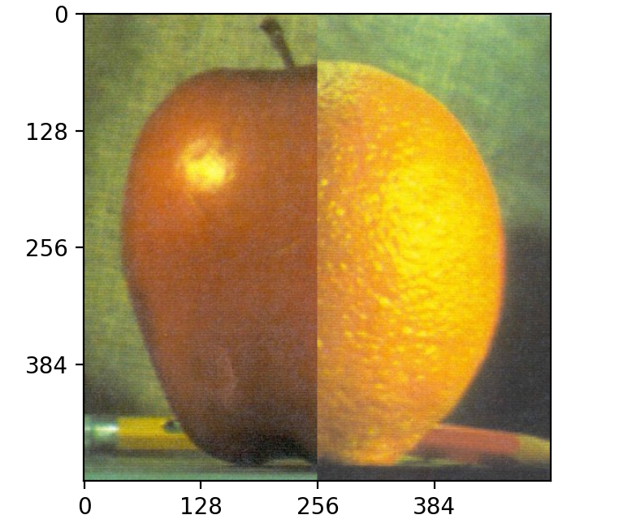
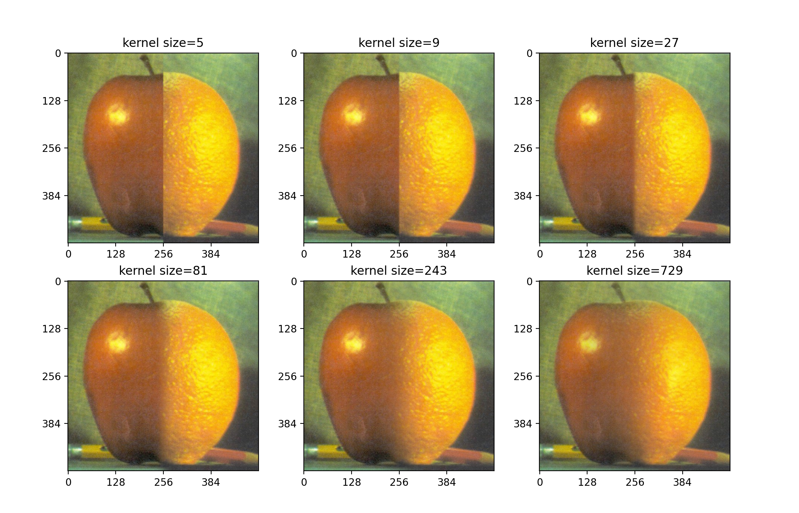
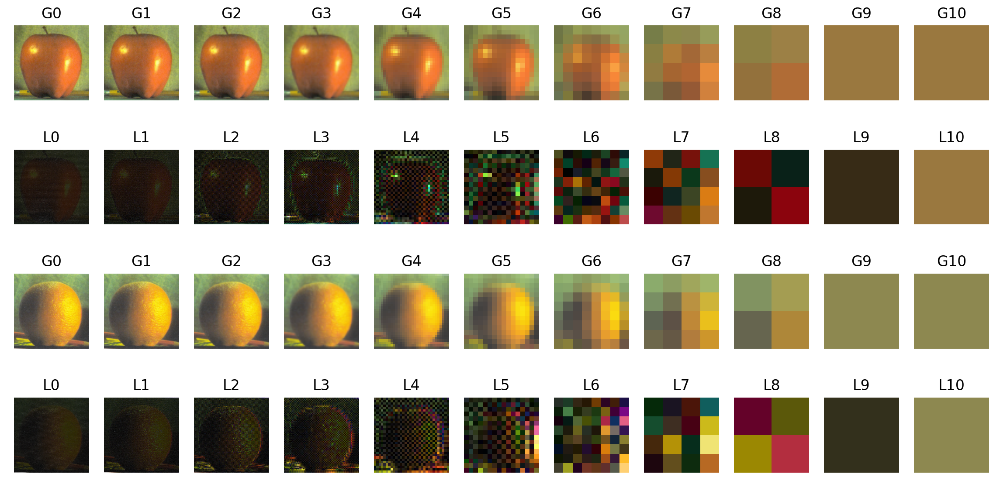
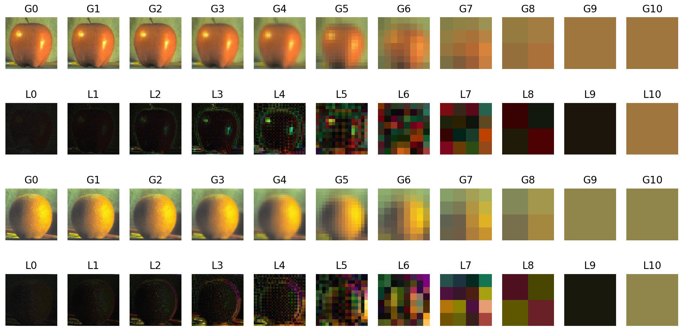
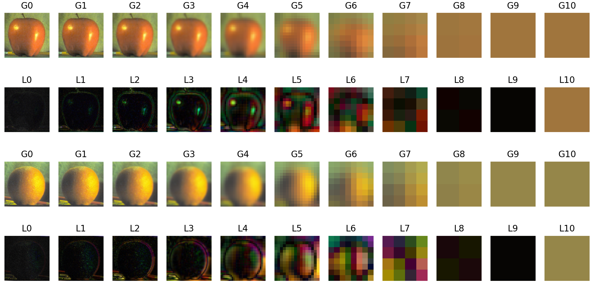
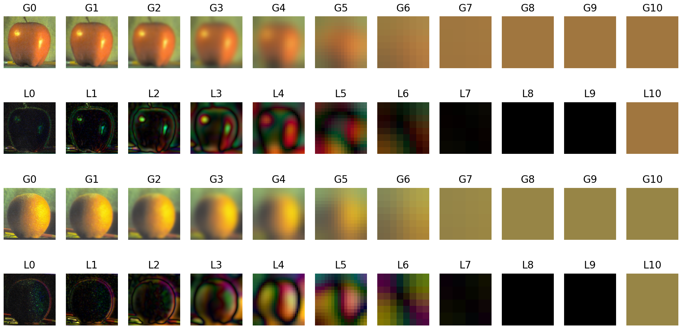
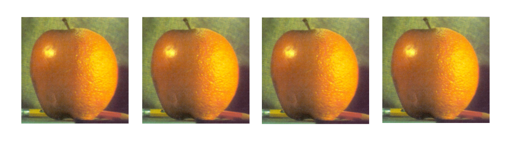
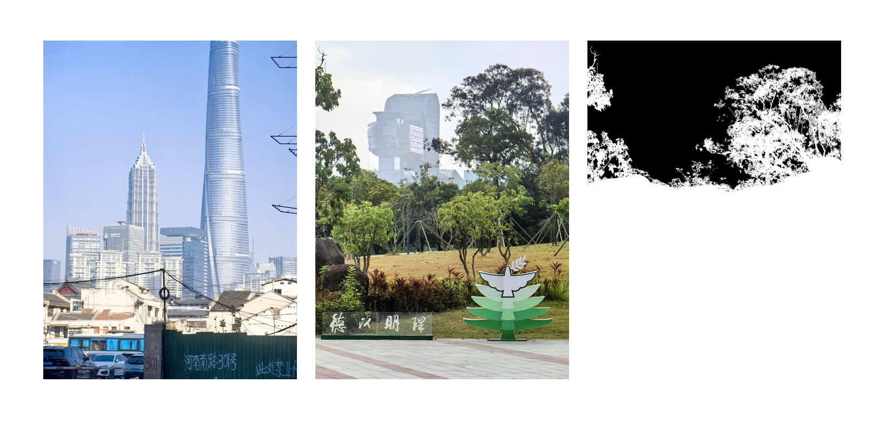
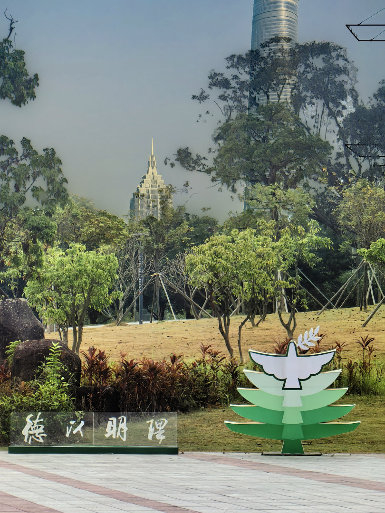

## 1 动机与方法

下面以“融合苹果和橘子两张图片”这一任务为例，阐述 Laplacian Pyramid 的基本思路与方法。

### 1.1 Alpha 混合及其问题

一种基础的图像融合方式是 Alpha 混合。该方法通过一张 mask（掩膜）确定每个像素的融合程度。对于待融合的图像 a 和 b，融合后图像 c 上的每个像素的色值由下式决定：
$$
c = a \cdot m + b \cdot (1-m)
$$
其中，$a$ 和 $b$ 是图像在对应像素点的色值；$m$ 是 mask 在对应像素点的明度，取值范围为 $[0,1]$。例如，使用一个左半边为白色（$m=1$）、右半边为黑色（$m=0$）的硬 mask 进行融合，效果等同于将 a 图的左半边和 b 图的右半边直接拼接，在连接处会产生明显的接缝。



因此需要先对硬 mask 进行模糊处理，使其在黑白边界处形成一个平滑的过渡带。一种常见的方法称为 Gauss 模糊，即进行反射 padding 后与 Gauss kernel 做卷积。Gauss kernel 定义为：
$$
k(x,y)=\frac{1}{Z}\exp\left(-\frac{x^2+y^2}{2\sigma^2}\right)
$$
其中，$Z$ 为归一化系数，保证所有卷积后图像能量不变。$\sigma$ 的取值需要适中，若 $\sigma$ 过小，会使 kernel 边缘处的值产生截断；若 $\sigma$ 过大，又会使得边缘处的值接近 0 导致计算时间的浪费。在 OpenCV 中，$\sigma$ 的取值为
$$
\sigma=0.3\left(\dfrac{n-1}{2}-1\right)+0.8
$$
其中 $n$ 是 Gauss kernel 的边长。计算可得，当 $n$ 足够大时，该 $\sigma$ 恰好使得 kernel 边缘处的值约为中心值的 1/255，即 uint8 所能表示的最小亮度，消除截断效应的同时最大限度减少计算浪费。

Gauss 模糊可以使得图像变得平滑，因此将硬 mask 进行 Gauss 模糊后，将得到带有过渡效果的软 mask。此时再进行 Alpha 混合，就可以获得较好的融合效果。kernel 越大，mask 的模糊程度越高，接缝处的过渡越自然，如图所示。



但这种方法存在两方面的局限性。
- 第一，Gauss 卷积的时间复杂度与 kernel 直径的平方成正比，为了获得足够平滑的过渡带，需要使用一个尺寸很大的 Gauss kernel，计算非常耗时。
- 第二，Gauss kernel 越大，过渡带越宽，虽然使得颜色过渡更自然，但在分界线两侧的纹理过度混合，也即无论对于图像中的低频区域还是复杂纹理，都使用相同的过渡宽度来混合，导致连接处的纹理扩散（例如直径为 729 的 kernel 下，左半部分出现了较为明显的橘子纹理，而右半的部分橘子纹理又被苹果的平滑纹理所稀释）。

### 1.2 Laplacian Pyramid

针对问题一，一个直观的想法是，“增大 kernel 直径”可以通过“减小图片本身的尺寸”来近似。也即，大尺寸卷积核对原图进行卷积，可以近似为小尺寸卷积核对缩小后的图像进行卷积。而 Gaussian Pyramid 就是一种表示多尺度图像的方式，其构建过程包括两个基本操作：

- 下采样：首先对当前层级的图像进行 Gauss 模糊，然后移除所有的偶数行和偶数列，得到尺寸为原来 1/4 的小图像。
- 上采样：首先将图像的每个像素都扩大为原来的 4 倍，为新像素（奇数行和奇数列）填充 0，随后使用一个 4 倍值的 Gauss kernel 进行卷积，以对新像素进行插值。4 倍是为了补偿因插入大量 0 值而导致的亮度损失，从而维持图像的整体能量。

通过构建 Gaussian Pyramid，可以将大尺寸卷积核的卷积，转化为在不同尺度下使用小尺寸卷积核进行卷积，并上采样为原分辨率，有效降低了计算复杂度。

然而，Gaussian Pyramid 的下采样过程会丢失图像的高频细节信息，导致仅通过上采样无法完美重建原图。为了解决信息丢失的问题，Burt 和 Adelson 于 1983 年提出了 Laplacian Pyramid。 Laplacian Pyramid 的第 $i$ 层 $L_i$ 记录了对应层级 Gaussian Pyramid 图像与其上采样版本之间的差（也即丢失的高频细节信息），即
$$
L_i = G_i - \text{Expand}(G_{i+1})
$$

其中，$G_i$ 是 Gaussian Pyramid 的第 $i$ 层图像，$\text{Expand}(G_{i+1})$ 是对更高一层图像 $G_{i+1}$ 进行上采样后的结果。若定义 Laplacian Pyramid 的最顶层为 Gaussian Pyramid 的最顶层，则只需要通过不断将高频信息叠加到上低频的底图中，也即
$$
\begin{aligned}
G_n&=L_n\\
G_{n-1} &= L_{n-1}+\text{Expand}(G_{n})\\
G_{n-2} &= L_{n-2}+\text{Expand}(G_{n-1})\\
&\cdots \\
G_1&=L_1+\text{Expand}(G_2)\\
G_0&=L_0+\text{Expand}(G_1)\\
\end{aligned}
$$
从而无损地从 Laplacian Pyramid 中重建出原始图像。因此，Laplacian Pyramid 实质上就是将图像分解为低频部分和高频部分，顶层为最低频的底图，往下每一层代表了不同尺度下的高频信息。

### 1.3 基于 Laplacian Pyramid 的融合

利用 Laplacian Pyramid 对图片进行的频域分解，可以解决问题二中纹理扩散的问题。只需要对不同频段分别进行不同程度的融合，对高频信息（边缘与纹理）使用较硬的 mask 进行融合以防止纹理扩散，对低频信息（颜色与光照）使用较软的 mask 进行融合以实现平滑过渡，即可实现高质量的图像融合。具体步骤如下：

1.  为待融合的两个源图像（苹果 A 和橘子 B）分别构建 Laplacian Pyramid $LA$ 和 $LB$，将图像分解为低频底图 + 不同尺度的高频信息；由于原图分辨率为 512x512，需要构建 $\log_{2}512+1=10$ 层金字塔。
2.  为 mask 构建一个 Gaussian Pyramid $GM$，提供不同尺度下的平滑表示。
3.  构建融合后的 Laplacian Pyramid $LS$：对于第 $i$ 层，使用对应层级的 mask $GR_i$ 作为权重，对 $LA_i$ 和 $LB_i$ 进行 Alpha 混合：
$$
LS_i = GM_i \cdot LA_i + (1 - GM_i) \cdot LB_i
$$
4.  利用融合后的 Laplacian Pyramid $LS$ 重建最终的图像：从最顶层开始，逐层进行上采样并加上当前层的 Laplacian 细节，直至恢复到原始分辨率，得到最终的无缝融合图像。

## 2 实验与结果分析


依据上述原理编写程序，尝试不同 kernel 直径下生成的 Gauss Pyramid、Laplacian Pyramid 以及最终的融合图像。其中，为了便于观察，Laplacian Pyramid 在展示时，其像素值均取绝对值并统一放大 4 倍；同时，所有图像的像素值在生成后都需 clip 到 `[0, 255]`，以防止像素值循环溢出。取 kernel 直径为 3、5、9、27，生成的金字塔以及融合结果如下：

kernel 直径 = 3：


kernel 直径 = 5：
  

kernel 直径 = 9：
  

kernel 直径 = 27：


融合结果（从左到右 kernel 直径依次为 3、5、9、27）：



对比不同 kernel 尺寸生成的金字塔可知，kernel 对金字塔的分解效果有显著影响。kernel 直径越大，其低通滤波效应越强，导致在构建高斯金字塔的每一层时，图像的模糊程度也越高。这反映在拉普拉斯金字塔上，就是各层所分离出的频率带信息更加平滑，尤其是在低频分量中。另外，当 kernel 直径增大至 27 时，从高斯金字塔的第 8 层开始，图像已收敛为一个恒定色值的区域，所有像素的色值都已相等。这表明在该尺度下，图像的所有细节信息均已被平滑掉，因此不必继续增大 kernel 直径。

对比不同 kernel 尺寸得到的融合图像可知，不论是大尺寸 kernel 还是小尺寸 kernel，其表现几乎一致，苹果和橘子的分界线完全消失，过渡区域的色彩与纹理融合自然，没有出现可察觉的失真或纹理溢出现象。这表明基于 Laplacian Pyramid 的图像融合方法实现了在不同频率尺度上分别进行融合的功能，能够在实现低频分量相融的同时，有效保护高频分量的信息。

除了苹果橘子的经典例图，本次实验还尝试了对两张实拍照片的融合，将一张图片的天空部分换成另一张图片。其中 mask 是通过手动绘制遮罩实现的。除了由于精度不足导致对树枝等细节处的抠图不够精细，其他部分能够较好的融合，特别是交界处并没有产生纹理扩散，如图所示。

实拍原图：（图一摄于上海方浜中路附近；图二摄于北京理工大学珠海校区）
  


## 3 实验代码

```python title="laplacian_blend.py"
import numpy as np
import matplotlib.pyplot as plt
from PIL import Image

from matplotlib import use as muse
muse('TkAgg')

def conv(image:np.ndarray, kernel:np.ndarray) -> np.ndarray:
    # single channel image
    kh, kw = kernel.shape
    padding = np.pad(image, ((kh//2,kh//2), (kw//2,kw//2)), 'reflect')
    result = np.zeros_like(image, dtype=np.float32)
    
    for i in range(image.shape[0]):
        for j in range(image.shape[1]):
            region = padding[i:i+kh, j:j+kw]
            result[i, j] = np.sum(region*kernel)

    return result

def gausskernel(size, sigma=1.0) -> np.ndarray:

    ax = np.linspace(-(size//2), size//2, size)
    xx, yy = np.meshgrid(ax, ax)
    kernel = np.exp(-(xx**2+yy**2) / (2.0*sigma**2))
    return kernel / np.sum(kernel)

def downsample(image:np.ndarray, kernel:np.ndarray) -> np.ndarray:

    downimage = np.copy(image)
    for channel in range(3):
        sc = downimage[:,:,channel]
        sc = conv(sc, kernel)
        downimage[:,:,channel] = sc
    
    return downimage[::2, ::2]

def upsample(image:np.ndarray, kernel:np.ndarray) -> np.ndarray:
    
    height, width = image.shape[:2]
    up_height = height * 2
    up_width = width * 2

    upimage = np.zeros((up_height, up_width, 3), dtype=np.float32)

    for channel in range(3):

        scbg = np.zeros((up_height, up_width), dtype=np.float32)
        scbg[::2, ::2] = image[:,:,channel]
        
        sc = conv(scbg, kernel*4)
        upimage[:,:,channel] = sc

    return upimage

def gaussian_pyramid(img:np.ndarray, kernel:np.ndarray, levels) -> list:
    
    img = img.astype(np.float32)
    gplist = [img]
    
    for i in range(levels):
        print(f"Gauss Pyramid Level {i}")
        g = downsample(gplist[i], kernel)
        gplist.append(g)

    return gplist

def laplacian_pyramid(gplist:list[np.ndarray], kernel:np.ndarray) -> list:

    levels=len(gplist)
    lplist=[]

    for i in range(levels-1):
        print(f"Laplacian Pyramid Level {i}")
        g_expanded = upsample(gplist[i+1], kernel)
        
        h, w, _ = gplist[i].shape
        g_expanded = g_expanded[:h, :w, :]
        
        lplist.append(gplist[i] - g_expanded)

    lplist.append(gplist[-1])

    return lplist

def reconstruct(lplist:list[np.ndarray], kernel:np.ndarray) -> np.ndarray:

    levels=len(lplist)
    image=lplist[-1]

    for i in range(levels-2,-1,-1):
        print(f"Reconstruct Level {i}")
        upimage = upsample(image, kernel)
        
        h, w, _ = lplist[i].shape
        upimage = upimage[:h, :w, :]
        
        image = upimage + lplist[i]

    return image

def plot_plist(type, plist:list[np.ndarray], ypos, totallines):

    levels=len(plist)
    for i in range(levels):
        plt.subplot(totallines, levels, (i+1) + ypos*levels)
        img=plist[i]

        disp=img.copy().astype(np.float32)

        if type=='L' and i<levels-1:
            disp = 4*abs(disp)
        
        disp=np.clip(disp, 0, 255)
        plt.imshow(disp.astype(np.uint8))
        plt.title(f'{type}{i}')
        plt.axis('off')


def blend_img(imga:np.ndarray, imgb:np.ndarray, mask:np.ndarray) -> np.ndarray:
    
    blended = imga.astype(np.float32)
    blended = imga*mask + imgb*(1-mask)
    return blended.astype(np.float32)


if __name__ == '__main__':

    # ---------------------------------------
    # 苹果橘子

    img1=Image.open('apple.png')
    img2=Image.open('orange.png')

    img1=np.array(img1)
    img2=np.array(img2)

    mask=np.zeros_like(img1).astype(np.float32)
    mask[:, :mask.shape[1]//2, :] = 1.0
    levels=10
    # ---------------------------------------

    # ---------------------------------------
    # 实拍照片

    # img1=Image.open('reala.jpg')
    # img2=Image.open('realb.jpg')
    # mask=Image.open('realmask.jpg')

    # img1=np.array(img1)
    # img2=np.array(img2)
    # mask=np.array(mask)/255.0

    # levels=13
    # ---------------------------------------
    
    kernel_size=27
    kernel_sigma=0.15*kernel_size+0.35
        
    kernel=gausskernel(kernel_size, kernel_sigma)
    
    print("img1")
    img1_g=gaussian_pyramid(img1, kernel, levels)
    img1_l=laplacian_pyramid(img1_g, kernel)

    print("img2")
    img2_g=gaussian_pyramid(img2, kernel, levels)
    img2_l=laplacian_pyramid(img2_g, kernel)

    print("mask")
    mask_g=gaussian_pyramid(mask, kernel, levels)
    # plot_plist('mask',mask_g,0,1)


    totallines=4
    plt.figure(figsize=(30, 40))


    fused_l=img1_l.copy()
    for i in range(levels):
        fused_l[i]=blend_img(img1_l[i], img2_l[i], mask_g[i])

    # ---------------------------------------
    # 画出 Pyramid
    # plot_plist('G',img1_g,0,totallines)
    # plot_plist('L',img1_l,1,totallines)
    # plot_plist('G',img2_g,2,totallines)
    # plot_plist('L',img2_l,3,totallines)
    # plt.show()
    # ---------------------------------------

    fused_image=reconstruct(fused_l, kernel)
    fused_image=np.clip(fused_image, 0, 255)

    plt.imshow(fused_image.astype(np.uint8))
    plt.axis('off')
    plt.savefig('real_fuse_uplevel.png')
    plt.show()
```