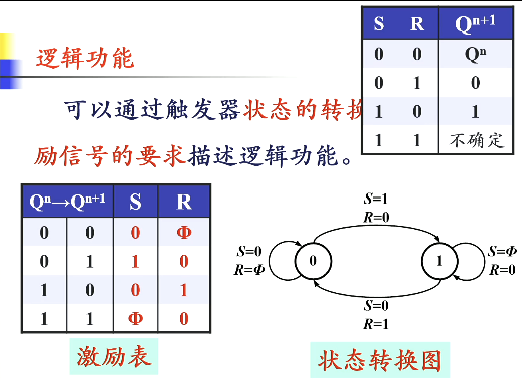

能够存储 1 位二进制数字信号的基本单元电路称为触发器

按逻辑功能分类
- RS
- JK
- D
- T 或 T'
- （基本 RS 不算）

按结构分类
- 基本 RS 触发器
- 同步触发器
- 主从触发器
- 边沿触发器

## 基本 RS 触发器
两个与非门首尾相连或交叉耦合

电路图
。这么做可能会降低速度，但是只要我时钟足够快就可以。计算机芯片主频越做越快就是提高效率用的（提一嘴，注意 CP 和 CR 的区分，CP 是时钟，CR 是 clear 的缩写，是清空或者复位的）

![](./assets/chapter5/6.png]]
右边两个是一个基本 RS 触发器，左边两个是输入控制电路

$\overline{S_D}$ 和 $\overline{R_D}$ 称为异步输入信号，$S$ 和 $R$ 称为同步输入信号。以后我们管在时钟控制下的信号叫同步信号，和时钟没关系的叫异步信号。$S$ 和 $R$ 高电平有效，$\overline{S_D}$ 和 $\overline{R_D}$ 低电平有效

看看工作原理

先考虑同步工作时候。令 $\overline{S_D}=1$、$\overline{R_D}=1$，两个都无效，处于保持状态。如果 $CP=0$，左边两个与非门都被封锁，不管 $R$、$S$ 输入什么信号，左边两个门的输出都是 1，将触发器置于保持状态；如果 $CP=1$，左侧门导通，$R$、$S$ 经过反向后进入触发器，就和之前一样了。分类如下
- $S=R=0\ \ \ \Rightarrow Q^{n+1}=Q^n$
- $S=1,R=0\Rightarrow Q^{n+1}=1$
- $S=0,R=1\Rightarrow Q^{n+1}=0$
- $S=R=1\ \ \ \Rightarrow$ 无意义，禁止出现

发现这与或非门构成的基本 RS 触发器是一致的

表达式 $Q^{n+1}=S+\overline RQ^n$，约束条件 $SR=0$

这里解释一下 Directly 的意思，因为 $\overline{R_D}$ 和 $\overline{S_D}$ 这两个端可以直接对触发器进行更改，而不受到时钟信号的限制，可以随时预置（预置后应该使得异步端处于无效状态）

## 主从触发器
刚才说使用同步的目的就是希望一令一动。如果在 $CP=1$ 时输入信号发生多次变化，那么触发器的状态也会发生多次翻转，称为空翻。为了尽可能减少空翻现象，发明了主从型、边沿型等形式的触发器

主从型，符号上面有一个直角标记。**注意！！！！符号图有错误！！！符号那里 CP 前面有一个圈！！！！有圈表示下降沿触发！！！没圈表示上升沿触发！！！**

工作原理：$CP=1$ 时，主触发器根据 S、R 的状态翻转，从触发器处于保持状态。CP 回到 0 时，主触发器处于保持状态，CP 经过反向器接到从触发器，此时从触发器被打开，并按照与主触发器的输出进行翻转。即 $CP=1$ 时候设定 S、R 的信号但不产生效果，直到 CP 下降沿时才按照设定的信号产生效果，这个效果的表达式与基本 RS 触发器是一致的，即把 $Q'$ 的信号直接传过来

## JK 触发器

为了解决 $S=R=1$ 无意义状态的问题，发明了 JK 触发器。JK 是两个人名的缩写。对应关系：J 和之前的 S 对应，K 和之前的 R 对应。记忆方法：把 R 的上半部分折起来，看起来和把 K 上半部分遮起来一模一样，同理 J 和 S 也是

CP=1 时，主触发器根据 JK 状态而动作，从触发器处于保持状态；CP=0 时，从触发器根据主触发器的状态进行输出。对于 $JK=0$ 的输入组合，这些和之前都是一样的。

当 $J=K=1$ 的时候，出现无意义状态，即当 CP 下降沿的时候电路变得随机。但不论怎么随机，要么 Q=0 要么 Q=1，分类讨论一下。发现当 $Q=0$ 的时候，推导完得 $Q=1$；当 $Q=1$ 的时候，推导完得 $Q=0$。于是得出结论：$J=K=1\ \Rightarrow Q^{n+1}=\overline {Q^n}$

完整列表：
- $J=0,K=0\ \Rightarrow Q^{n+1}=Q^n$
- $J=1,K=0\ \Rightarrow Q^{n+1}=1$
- $J=0,K=1\ \Rightarrow Q^{n+1}=0$
- $J=1,K=1\ \Rightarrow Q^{n+1}=\overline {Q^n}$
- 特性方程 $Q^{n+1}=J\overline{Q^n}+\overline KQ^n$

 

上面说的功能，有一个基本前提：CP=1 时 J 与 K 不发生变化。如果 J、K 在 CP=1 时发生了变化，则不能直接根据 CP 下降沿前的 JK 状态判断 Q 的变化。因为 CP=1 时，主触发器的左侧两个门总会有一个是被封锁的，只能接受没被封锁的那个门的信号。见下图

## 边沿触发器

进一步优化，把 CP=1 时输入状态可能发生的变化也优化掉。我们不用 CP=1 这么长一段时间，只用 CP 的上升或者下降时刻输入信号的状态，而其他时候输入信号的任何变化都不会影响触发器的次态。电路图比较复杂，也不考。只要知道符号表达即可。

对于边沿触发器，CP 里面有一个小三角。如果 CP 外面没有圆圈，说明是上升沿触发；如果 CP 外面有圆圈，说明是下降沿触发

## T 触发器与 D 触发器

描述功能的方法：特性表、状态转换图、特性方程

所谓什么 RS、什么 JK，它是描述功能的名词，而不是描述电路的名词。就像 RS 触发器既可以用与非门又可以用或非门，只要是实现对应功能的电路，都能叫某某触发器。

下面补充几个触发器类型

D 触发器：输入什么我就记忆什么。例如下图中，当 CP 上升沿的时候，输入是什么输出就是什么，相当于导线，只是它有记忆功能。

T 触发器：当触发器有效时，$T=0$ 时保持，$T=1$ 时翻转

T' 触发器：让 T 触发器的输入端接 1。例如图中，每来一个上升沿就翻转。这个东西可以作为计数器的最低位。特性方程 $Q^{n+1}=\overline{Q^n}$

## 触发器功能转换

用一个已有触发器，加一个转换电路变成一个新的触发器。其实前面从基本 RS 到同步 RS 再到同步 JK，就是功能转换的一个例子

基本方法：已有触发器的特性方程和待实现触发器特性方程联立，把已有触发器的输入用待实现触发器的输入表示。

D 触发器转 JK 触发器

D 触发器转 T 触发器

D 触发器转 T' 触发器

JK 触发器转 D 触发器，这里有一个拆项，把 $D$ 拆成 $DQ^n+D\overline{Q^n}$，和 JK 特性方程一一对应 

JK 触发器转 T 触发器（T' 也可以，看右图）。
