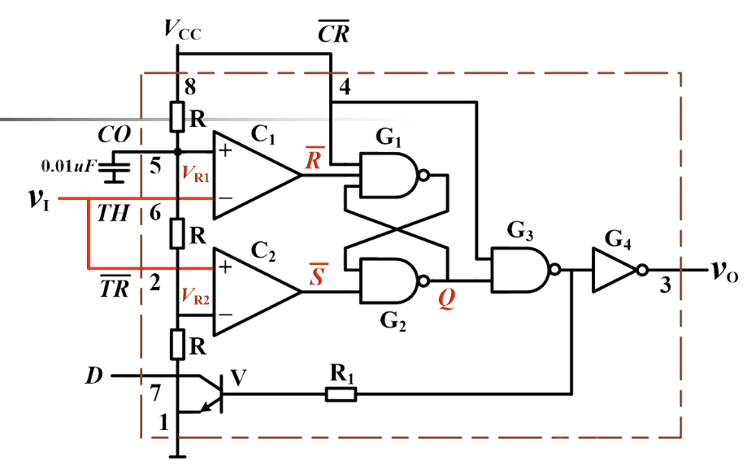
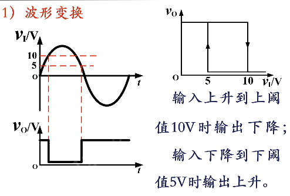
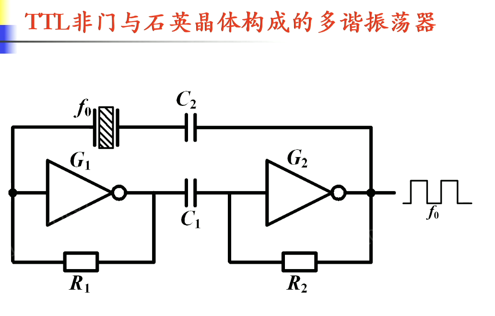

下图中，左上角是 555 定时器本体。右上角是施密特触发器，左下角是单稳态触发器，右下角是多谐振荡器。这一章就围绕这几个东西展开。

产生矩形脉冲的方法：各种形式的多谐振荡器
波形变换电路：比较器、施密特触发器

集成 555 定时器。长这样。

三个电阻 R，是电阻分压器。两个比较器（开环的运放）。右边是 RS 锁存器。左下角是一个开关三极管，基极高电平导通， 低电平截止。最右侧反向器充当输出缓冲功能

- CO 不是进位输出，是 control 的意思。
	- CO 端没有外加电压（即通过小电容接地，通常是 $0.01\ \mu\text{F}$）时，$V_{R1}=\dfrac23V_{CC}$，$V_{R2}=\dfrac13V_{CC}$
	- CO 端外加电压时，$V_{R1}=V_{CO}$，$V_{R2}=\dfrac12V_{CO}$
- 开环的运放叫做电压比较器，当 $V_+>V_-$ 时输出正电压，$V_+<V_-$ 时输出负电压，电压绝对值即运放供电电压最大值。一般不会相等，因为灵敏度很高基本不可能稳定相等
- RS 锁存器，低电平有效。即比较器结果决定输出状态
- 开关三极管，当 $Q=1$ 时 $G_3$ 输出低电平，$V_O$ 低电平，三极管截止；当 $Q=0$ 时 $G_3$ 输出高电平，$V_O$ 高电平，三极管导通

综上可以给出的工作状态总结表

| $V_{TH}$  | $V_{\overline{TR}}$ | $\overline{CR}$ | $V_O$ | 三极管 | 工作状态 |
| :-------: | :-----------------: | :-------------: | :---: | :-: | :--: |
|  $\phi$   |       $\phi$        |        0        |   0   | 导通  |  清零  |
| $>V_{R1}$ |      $>V_{R2}$      |        1        |   0   | 导通  | 置 0  |
| $<V_{R1}$ |      $>V_{R2}$      |        1        |  原状态  | 原状态 |  保持  |
|  $\phi$   |      $<V_{R2}$      |        1        |   1   | 截止  | 置 1  |

## 施密特触发器，两个稳定状态

施密特触发器：有两个稳定的输出状态（高/低电平），状态的维持与转化均与输入电压有关。两个阈值电压 $V_{T+}>V_{T-}$，他就是拿来整形的，把边沿变得陡峭。

施密特触发器传输特性

当输入电压增加到上限阈值时，输出翻转；当输入电压下降到**上限**阈值时，输出**不翻转**，只有小到下限阈值时才翻转。此为滞回特性。当输入小、输出小时称为同相型，当输入小、输出大时称为反相型。*如果只有一个阈值，那么当数值在阈值附近波动时状态会反复切换。所以才引入了两个阈值，构造滞回区间，增加稳定性*。回差电压 $\Delta V=V_{T+}-V_{T-}$

555 定时器构成施密特触发器的方法：把 $TH$ 和 $\overline{TR}$ 接一起，外接输入电压。实现滞回的，就是 RS 的保持状态。这样构成的是一个反相型施密特触发器。

- 输入电压增大的过程：
	- 当 $V_I<V_{R2}$ 时，输出电压为高电平
	- 当 $V_{R1}<V_I<V_{R2}$，输出电压保持刚才的高电平状态
	- 当 $V_I>V_{R1}$ 时，输出电压变成低电平。
- 输入电压减小的过程：
	- 当 $V_I>V_{R1}$ 时，输出电压为低电平
	- 当 $V_{R1}<V_I<V_{R2}$，输出电压保持刚才的低电平状态
	- 当 $V_I<V_{R2}$ 时，输出电压变为高电平

阈值电压 $V_{T+}=V_{R1},\ \ \  V_{T-}=V_{R2}$ 回差电压 $\Delta V=V_{T+}-V_{T-}=V_{R1}-V_{R2}$

施密特触发器的三个功能。
- 波形变换
- 整形，即消除畸变
- 鉴幅，即选出高于某电压的脉冲，其他的都洗掉

我们说，某某类型的触发器，只代表电路的功能。所以施密特触发器也是可以使用其他方式实现的。

## 单稳态触发器，一个稳定一个暂态

单稳态触发器只有一个稳态。在外加触发脉冲的作用下，电路进入暂态，经过一段时间后自动返回稳态。这段时间是一个固定的值，只取决于电路的参数，与外加触发脉冲的宽度无关。

用 555 定时器构成单稳态触发器

- 左边的 RC 就是定时用的。$V_{TH}$ 就是电容的充电电压。负触发脉冲到来之前，低触发端处于高电平，锁存器输出状态保持低电平（稳态），$V_O$ 输出低电平，三极管导通，相当于电容两端都接地，电容短路掉，什么都不会发生。
- 负脉冲来了，$V_{TR}$ 减小，S 端有效，锁存器变高电平，$V_O$ 输出高电平，三极管截止，VCC 开始给电容充电。充电过程，TH 的电压逐渐增大，直到增大到 $\dfrac23V_{CC}$ 时，R 端有效，锁存器变低电平，$V_O$ 输出低电平，三极管导通，电容放电，回到上一点。而 RC 充电过程时间是确定的。

根据电路分析知识可得 $t_w=\tau\ln\dfrac{u(\infty)-u(0)}{u(\infty)-u(t_w)}$，代入 $u(\infty)=V_{CC}$ 得 $t_w=1.1RC$

注意：
- 输出脉冲宽度与输入脉冲无关，但输入脉冲不能太宽，否则充完电后还有负脉冲，导致充电超过三分之二
- 输入脉冲间隔不能太小，因为电容放电也需要时间，要等电容放完电才能来下一个脉冲

同样，单稳态触发器作为一种功能触发器，也可以有其他实现方式。下面这个电路便是一个。没有 RC 的时候存在竞争冒险，会有一个信号快一些。而“快一些”本身就是一种暂态，使用 RC 将这个暂态的时间延长，也可以实现控制脉冲宽度

## 多谐振荡器，两个暂态
输出有两个暂态，不需要外部信号，就能在两个暂态之间连续交替转换，产生矩形脉冲信号。

用 555 定时器构成多谐振荡器（红色的电阻是 $R_2$）。其实是一个施密特触发器和两组 RC

充电是 $(R_1+R_2)C$，放电是 $R_2C$（通过 $R_1$ 和 $R_2$ 之间的钮流到 $D$）

因此由电分知识有
-  $T_1=(R_1+R_2)C\ln 2$
- $T_2=R_2C\ln2$
- $T=T_1+T_2=(R_!+2R_2)C\ln2$
- 占空比 $q=\dfrac{T_1}{T}=\dfrac{R_1+R_2}{R_1+2R_2}$，可知占空比始终大于 50%

占空比可调且可以调到比 50% 小：如图，充电时候经过二极管 1 和 $R_1C$，放电时候经过二极管 2 和 $R_2C$，占空比 $q=\dfrac{R_1}{R_1+R_2}$

施密特触发器可以构成多谐振荡器

门电路可以构成多谐振荡器，利用的是反向器的延时。注意要用**奇数个**反向器才行。同样使用 RC 延长这段时间差。这叫做环形振荡器。最下面的是实用环形振荡器

对称式多谢振荡器可以产生方波。当然还有非对称

石英晶体的特征：当外加信号频率等于石英晶体的固有频率（$32768\text{ Hz}=2^{15}$，可以用分频电路整出秒脉冲）一致时，等效阻抗最小且为纯电阻，信号最容易通过。利用 TTL 非门与石英晶体构成多谐振荡器。

改进：可控

