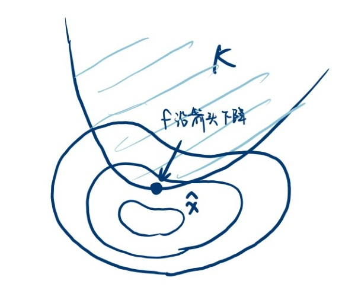

import { Aside } from 'astro-pure/user'

<Aside type="caution">
更新中。目前只有 Section E 的内容，是为了写优化算法的笔记临时补充的。前面的有时间再补上
</Aside>

本章速通：[数学分析 记忆佛脚（下） - Chapter 9 多元函数微分学 ↗](./fojiao2#chapter-9-多元函数微分学)

{/* ## Section A 偏导与全微分
### 9.1 偏导
### 9.2 全微分
### 9.3 高阶偏导
### 9.4 高阶微分
### 9.5 向量值函数的导数与微分
### 9.6 复合函数微分

## Section B 多元中值定理
### 9.7 中值定理
### 9.8 Taylor 公式

## Section C 隐函数与逆映射
### 9.9 隐函数存在定理
### 9.10 逆映射存在定理

## Section D 切线法平面、法线切平面
### 9.11 曲线的切线与法平面
### 9.12 曲面的法线与切平面 */}

## Section E 多元函数极值

对于 $f$，若 $\forall x\in U_\rho( \hat{x})$ 有 $f(x)\leq f(\hat{x})$，则称 $\hat{x}$ 为 $f$ 的极大值点。极小值类似定义

### 9.13 无条件极值
**曰（极值点的必要条件）**：若 $f$ 可偏导，则偏导均为零，即 $f_{x_1}(\hat{x})=f_{x_2}(\hat{x})=\cdots=f_{x_n}(\hat{x})=0$

证明：
- 令 $\varphi_1(x)=(x,\hat{x}_2,\cdots,\hat{x}_n)$，当 $\hat{x}$ 为 $f$ 极值点时，由定义知 $\hat{x}_1$ 也得是 $\varphi _1(x)$ 的极值点，所以 $f_{x_1}(\hat{x})=\varphi _1'(\hat{x}_1)=0$
- 令 $\varphi_2(x)=(\hat{x}_1,x,\cdots,\hat{x}_n)$，当 $\hat{x}$ 为 $f$ 极值点时，由定义知 $\hat{x}_2$ 也得是 $\varphi _2(x)$ 的极值点，所以 $f_{x_2}(\hat{x})=\varphi _2'(\hat{x}_2)=0$
- 以此类推。$\square$

***
极值情况判定定理。一元情形时：$f'(x_0)=0$，$f''(x_0)\gt 0$ 时为极小，$f''(x_0)\lt 0$ 时为极大，$f''(x_0)=0$ 时情况不定。这是因为 Taylor 公式 $f(x_0\!+\!\Delta x)-f(x_0)=f'(x_0)\Delta x+\dfrac12f''(x_0\!+\!\theta \Delta x)\Delta x^2$，一阶导为零，所以等号左边是正是负就要看二阶导的正负。

二元情形：
$$
\begin{aligned}
f(x_0\!+\!\Delta x,y_0\!+\!\Delta y)-f(x_0,y_0)&=f_x(x_0,y_0)\Delta x+f_y(x_0,y_0)\Delta y+\\ 
&\quad\dfrac12\bigg(f_{xx}(\tilde{\rho})\Delta x^2+f_{yy}(\tilde{\rho})\Delta y^2+2f_{xy}(\tilde{\rho})\Delta x\Delta y\bigg)
\end{aligned}
$$
其中 $\tilde{\rho}=(x_0\!+\!\theta \Delta x,y_0\!+\!\theta \Delta y)$

由连续性，设
- $f_{xx}(\tilde{\rho})=f_{xx}(x_0,y_0)+\alpha,\quad\alpha =o(1)$
- $f_{xy}(\tilde{\rho})=f_{xy}(x_0,y_0)+\beta ,\quad\beta  =o(1)$
- $f_{yy}(\tilde{\rho})=f_{yy}(x_0,y_0)+\gamma ,\quad\gamma  =o(1)$

于是
$$
\begin{aligned}
f(x_0\!+\!\Delta x,y_0\!+\!\Delta y)-f(x_0,y_0)&=\dfrac12\bigg(f_{xx}(x_0,y_0)\Delta x^2+f_{yy}(x_0,y_0)\Delta y^2+2f_{xy}(x_0,y_0)\Delta x\Delta y+\\
&\quad\quad\quad\alpha \Delta x^2+2\beta  \Delta x\Delta y+\gamma \Delta y^2\bigg)
\end{aligned}
$$

令
- $A=f_{xx}(x_0,y_0)$、$B=f_{xy}(x_0,y_0)$、$C=f_{yy}(x_0,y_0)$
- $\rho=\sqrt{\Delta x^2+\Delta y^2}$、$\xi=\dfrac{\Delta x}{\rho}$、$\eta=\dfrac{\Delta y}{\rho}$，这样 $\xi^2+\eta^2=1$

于是 $f(x_0\!+\!\Delta x,y_0\!+\!\Delta y)-f(x_0,y_0)=\dfrac12\rho^2\bigg(A\xi^2+2B\xi\eta+C\eta^2+o(1)\bigg)$。括号里头就是一个二次型，所以等号左边的正负就相当于考虑右边二次型的定性（*严格来说是在单位圆上的定性，但可以验证 $g(k\xi,k\eta)=k^2g(\xi,\eta)$，所以等价于直接考虑在整个平面上的定性*）。令二次型
$$
g(\xi,\eta)=
\begin{pmatrix}
\xi&\eta
\end{pmatrix}
\begin{pmatrix}
A&B\\B&C
\end{pmatrix}
\begin{pmatrix}
\xi\\\eta
\end{pmatrix}
$$

1. 当 $g$ 正定时，$(x_0,y_0)$ 为极小值点
2. 当 $g$ 负定时，$(x_0,y_0)$ 为极大值点
3. 当 $g$ 不定时，既不是极大值点 又不是极小值点

回忆：正定负定的判断方法
- 正定：任一 $k$ 阶顺序主子式的行列式都 $>0$
- 负定：任一 $k$ 阶顺序主子式的行列式的 $(-1)^k$ 都 $>0$

**对于二次型矩阵而言**：
- 正定 $\Leftrightarrow A>0,\,AC\!-\!B^2>0$，则为极小值点
- 负定 $\Leftrightarrow A<0,\,AC\!-\!B^2>0$，则为极大值点
- 若 $AC\!-\!B^2<0$，则不是极值点（鞍点）
- 若 $AC\!-\!B^2=0$，则情况不定。例如 $f(x,y)=x^4$ 是极小值、$-x^4$ 是极大值、$x^3$ 不是极值
***

**对于 n 元情形**：那个二次型就是 $g(\xi)=\sum\limits_{i,j} f_{x_ix_j}(\hat{x})\xi_i\xi_j$，二次型矩阵 $\big(f_{x_ix_j}(\hat{x})\big)_{n\times n}$ 就是函数在 $\hat{x}$ 的二阶微分，称为 Hessian 矩阵。记它的 $k$ 阶顺序主子式为 $\Delta _k$：
- 当 $\forall k$，$\det(\Delta _k)>0$ 时，$g$ 正定，$\hat{x}$ 为极小值点
- 当 $\forall k$，$(-1)^k\det(\Delta _k)>0$ 时，$g$ 负定，$\hat{x}$ 为极大值点
- $g$ 不定时，不是极值点

### 9.14 条件极值
例：求原点到直线 $l:\begin{cases}x+y+z=1\\x+2y+3z=6\end{cases}$ 的距离

称 $f(z,y,z)=x^2+y^2+z^2$ 为目标函数，$\begin{cases}G(x,y,z)=x+y+z-1=0\\ H(x,y,z)=x+2y+3z-6=0\end{cases}$ 为约束条件。于是问题转化为“求目标函数在约束条件下的最小值”。

设 $f$、$G$、$H$ 偏导连续，Jacobi $\begin{pmatrix}G_x&G_y&G_z\\H_x&H_y&H_z\end{pmatrix}$ 在约束条件下秩为 2。不妨设 $\dfrac{\partial (G,H)}{\partial (y,z)}$ 在极值点处不为 0，则唯一确定 $\begin{cases}y=y(x)\\z=z(x)\end{cases}$，于是原问题转化为求 $\varphi (x)=f(x,y(x),z(x))$ 的无条件极值：
$$
\begin{aligned}
\varphi '(x)&=f_x+f_y\cdot y'(x)+f_z\cdot z'(x)\\
&=\begin{pmatrix}
f_x&f_y&f_z
\end{pmatrix}\begin{pmatrix}
1\\y'\\z'
\end{pmatrix}=(\mathbf{grad}\,f)\cdot\vec\tau=0
\end{aligned}
$$

把约束条件 $G=0$、$H=0$ 也对 $x$ 求导
$$
\begin{cases}
G_x+G_y\cdot y'(x)+G_z\cdot z'(x)=0\quad\Rightarrow (\mathbf{grad}\,G)\cdot\vec\tau=0\\
H_x+H_y\cdot y'(x)+H_z\cdot z'(x)=0\quad\Rightarrow (\mathbf{grad}\,H)\cdot\vec\tau=0
\end{cases}
$$
这说明 $\mathbf{grad}\,f$ 落在 $\mathbf{grad}\,G$ 和 $\mathbf{grad}\,H$ 张成的平面里（因为事先假设过 Jacobi rank=2，这两个梯度不共线），于是存在常数 $\lambda,\,\mu$ 使得
$$
\mathbf{grad}\,f+\lambda \cdot\mathbf{grad}\,G+\mu \cdot\mathbf{grad}\,H=\vec0
$$
展开 $x,y,z$ 三个分量 就相当于三个方程，再加上两个约束 $G=0$、$H=0$，总共五个方程、$x,y,z,\lambda ,\mu$ 五个未知数，因此原问题相当于求
$$
L(x,y,z,\lambda ,\mu )=f(x,y,z)+\lambda G(x,y,z)+\mu H(x,y,z)
$$
这个五元函数的无条件极值，其中令 $\lambda,\mu$ 偏导为零 等价于 $G=0,\,H=0$

上述求条件极值的方法称为 Lagrange 乘子法。其中那个五元函数称为 Lagrange 函数，$\lambda,\,\mu$ 称为 Lagrange 乘子。由于还是基于无条件极值，所以这个方法给出的仍然是必要条件。

***
完整的 Lagrange 乘子法：

<Aside type="note" title="Lagrange 乘子法">
- 目标函数 $f(x_1,\cdots,x_n)$
- 约束条件 $G_1(x)=0,\cdots,G_m(x)=0$
- 假设 $f$ 及所有约束 $G_i(x)$ 偏导连续，$\text{rank} \dfrac{\partial(G_1, \dots, G_m)}{\partial(x_1, \dots, x_n)} = m$

相当于求 Lagrange 函数的无条件极值：
$$
L(x_1, \dots, x_n, \lambda_1, \dots, \lambda_m) = f + \sum_{i=1}^m \lambda_i G_i
$$
也即极值点的必要条件为
$$
\begin{cases} \dfrac{\partial L}{\partial x_j} = 0, & j=1, \dots, n \\ \dfrac{\partial L}{\partial \lambda_i} = G_i = 0, & i=1, \dots, m \end{cases}
$$
</Aside>

***

条件极值情况判定定理：考虑矩阵 $\left(\dfrac{\partial ^2L}{\partial x_i\partial x_j}\right)_{n\times n}$ 在 Lagrange 函数极值点的定性，正定矩阵时为条件极小值点，负定矩阵时为条件极大值点，不定时情况不定。

> 为什么只看 $x$ 不看 $\lambda$ 呢？因为当满足约束时 $G=\vec0$，得
> $$
> \begin{aligned}
> L(x,\lambda)-L(\hat{x},\hat{\lambda})&=\big(f(x)+\lambda^TG(x)\big)-\big(f(\hat{x})+\lambda^TG(x)\big)\\
> &=f(x)-f(\hat{x})\\
> &=\dfrac12\rho^2(二次型+o(1))
> \end{aligned}
> $$
> 与 $\lambda$ 无关

> 无条件极值情形下，矩阵不定表示 $\hat{x}$ 不是极值点；为什么这里矩阵不定表示 $\hat{x}$ 不定？ 因为这里没看 $\lambda$

### 9.15 不等式约束

对于优化问题
$$
\begin{aligned}
\min\limits_{x}\quad &f(x)\\
s.t.\quad &g(x)\leq0
\end{aligned}
$$
这个 $g(x)\leq0$ 就是不等式约束。定义可行域：满足不等式约束的 $x$ 的集合，记为 $K$

我们先强行把 $g$ 看作等式约束。写出该问题的 Lagrange 函数
$$
L(x,\lambda)=f(x)+\lambda g(x)
$$
由 Lagrange 乘子法，最优解 $\hat{x}$ 的必要条件是 $\nabla f(\hat{x})+\lambda \nabla g(\hat{x})=0$。把这个解代回原问题，讨论这个最优解是否受到不等式约束的影响：
- 若 $g(\hat{x})<0$（内部解），此时约束恒成立，相当于没有这个约束（称为松弛的）。说明 $\hat{x}$ 已经是 $f$ 的极小值，也即 $\nabla f=0$，因此 Lagrange 乘子 $\lambda$ 只能 $=0$
- 若 $g(\hat{x})=0$（边界解），说明 $g(x)$ 约束的存在拦住了 $f$ 继续变小的道路，使得 $\hat{x}$ 停了下来。

也就是说，不管 $\hat{x}$ 是否在边界，$g(\hat{x})$ 和 $\lambda$ 必有一个是 0，即 $\lambda g(\hat{x})=0$。这被称为互补松弛条件。

还不够。对于边界解的 $\lambda$ 还要有所限制。如下图所示，其中一圈一圈的代表 $f$ 的等高线、弧线代表 $g(x)=0$。最优解 $\hat{x}$ 被 $g(x)=0$ 这条墙拦住了去路，说明这个地方 $\hat{x}$ 本来还想往下走的，因此 $\nabla f(\hat{x})$ 一定指向 $K$ 的内部；可行域内部 $g(x)<0$，所以 $\nabla g(\hat{x})$ 指向 $K$ 的外部。而 Lagrange 乘子法又说 $\nabla f+\lambda \nabla g=0$，因此这个 $\lambda$ 必须 $\geq0$。

也就是说，极值点的必要条件为（略去 hat 号，相当于解方程）：
1. Lagrange 函数偏导得 0：$\nabla f+\lambda \nabla g=0$
2. 原始约束：$g(x)\leq0$
3. 互补松弛条件：$\lambda g(x)=0$
4. 梯度方向限制：$\lambda \geq0$

这四个条件，合称为 **KKT 条件（Karush-Kuhn-Tucker）**。

加入多个不等式约束、再加入等式约束，完整版的 KKT 长这样

<Aside type="note" title="KKT 条件">
对于优化问题
$$
\begin{aligned}  
\min\limits_{x}\quad &f(x)\\  
s.t.\quad &g_k(x)\leq0,\quad k=1,\cdots,K\\  
\quad & h_\ell(x)=0,\quad \ell =1,\cdots,L  
\end{aligned}
$$

定义 Lagrange 函数
$$
L(x,\alpha ,\beta )=f(x)+\alpha ^Tg(x)+\beta ^Th(x)
$$
$$
\begin{aligned}  
\alpha =(\alpha_1,\cdots,\alpha_K)^T\quad &g(x)=\big(g_1(x),\cdots,g_K(x)\big)^T\\  
\beta  =(\beta_1,\cdots,\beta_K)^T\quad &h(x)=\big(h_1(x),\cdots,h_L(x)\big)^T  
\end{aligned}
$$
KKT 条件为
1. Lagrange 函数偏导得 0：$\nabla L(x,\alpha ,\beta)=0$
2. 原始约束：$g_k (x)\leq0,\quad h_\ell (x)=0$
3. 互补松弛条件：$\alpha_kg_k(x)=0$
4. 梯度方向限制：$\alpha_k\geq0$
</Aside>