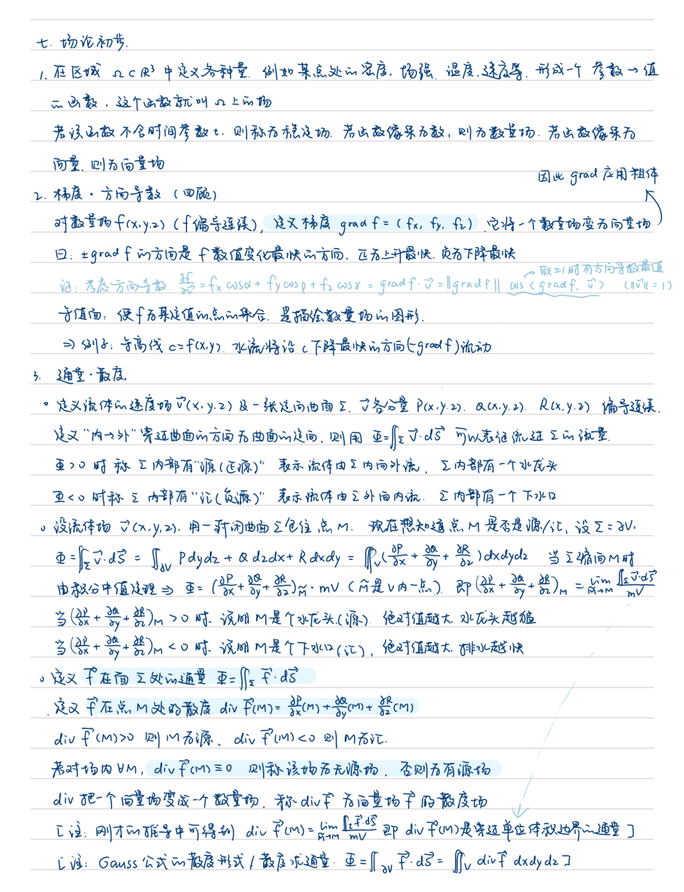
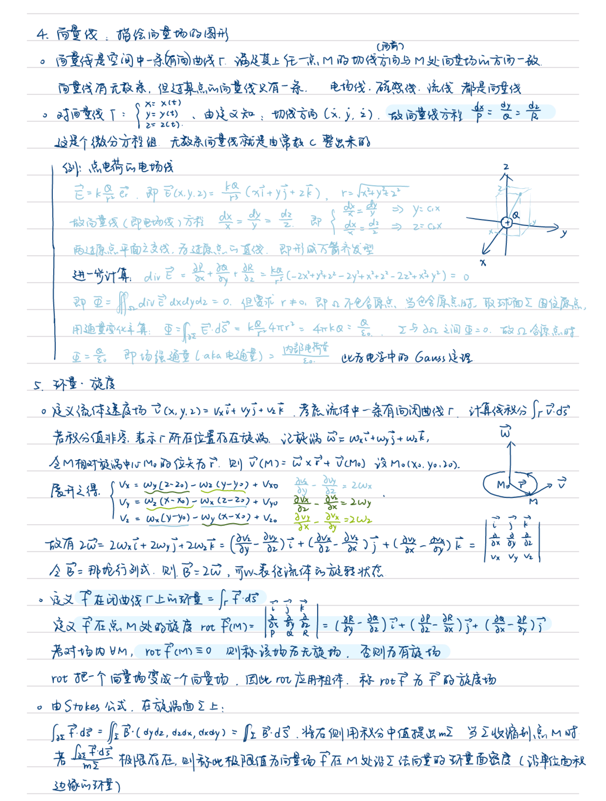
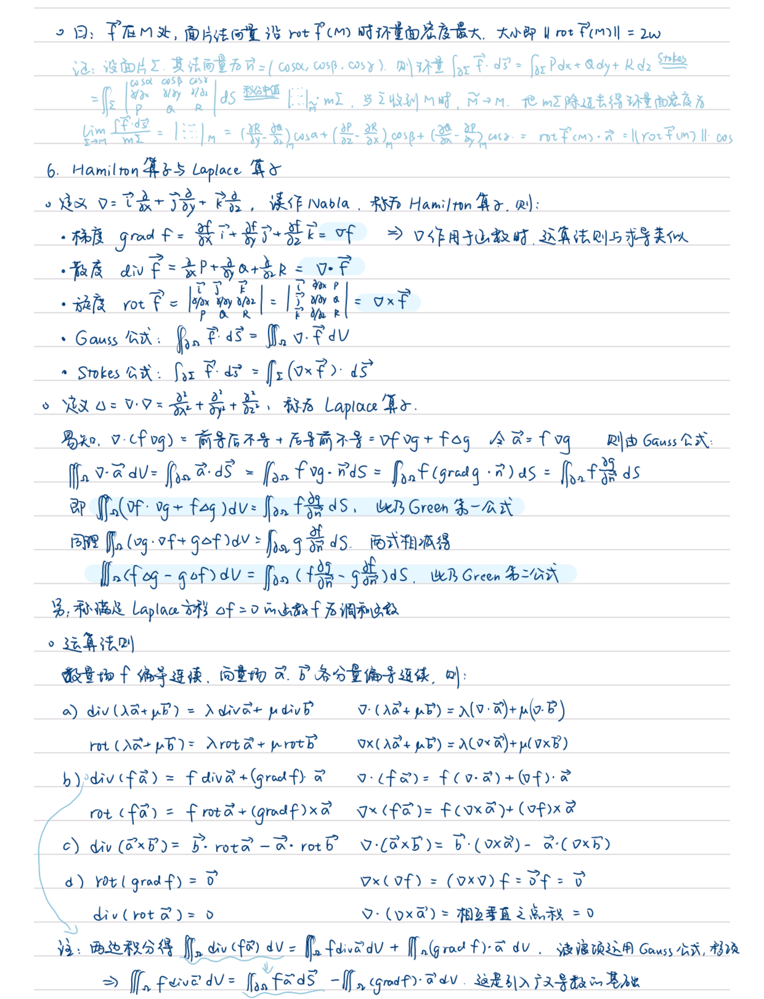
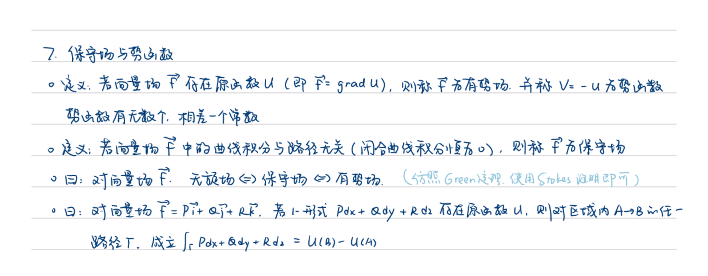
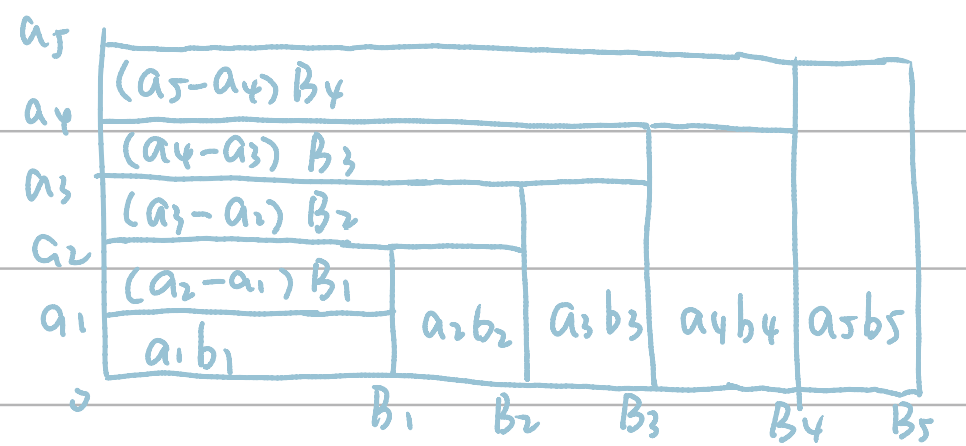

（上册）
- 主线第一篇：极限论
	- Chapter 1 函数与极限
	- Chapter 2 导数与微分
	- Chapter 3 函数与极限二周目
- 主线第二篇：积分学
	- Chapter 4 不定积分
	- Chapter 5 定积分
- 支线 1：Chapter 6 线性空间理论概述
- 支线 2：Chapter 7 常微分方程

（下册）
- 主线第三篇：多元微积分
	- Chapter 8 欧氏空间上的函数与极限
	- Chapter 9 多元函数微分学
	- Chapter 10 重积分
	- Chapter 11 曲线积分与曲面积分
- 主线第四篇：级数与广义积分
	- Chapter 12 数项级数
	- Chapter 13 函数项级数
	- Chapter 14 广义积分与含参变量积分
	- Chapter 15 Fourier级数与Fourier积分

## Chapter 8 欧氏空间上的函数与极限  

### 8.1 欧氏空间与解析几何  
（这一节最终放到第六章中）  
点列的极限

### 8.2 开集与闭集  
补集、内点、外点、边界点、孤立点、聚点；聚点三个等价定义：点的任一邻域都有集合中无穷多个点；点的任一邻域都有集合中不同于这个点的点；集合中可以构造出一个点列（无穷多项不为零）收敛于这个点  

开集、闭集（单点集为闭集）；开集之补为闭，闭集之补为开；开集之并为开集，闭集之交为闭集，开集之有限交为开集，闭集之有限并为闭集

### 8.3 完备性等价表述
1. 矩形套定理. 推广：Cantor 闭区域套定理
2. BW 定理，有界点列必有收敛子列. 推广：聚点原理：有界无穷点集必有聚点
3. Cauchy 收敛准则，点列收敛 $\Leftrightarrow\forall\varepsilon>0,\exists N \ \text{s.t.}\ k,l>N$ 时 $|\vec{x_k}-\vec{x_l}|<\varepsilon$
4. Heine-Borel 定理，紧集等价于有界闭集. 紧集：任意开覆盖必有有限子覆盖的集合

### 8.4 多元函数的极限与连续
多元函数，多元函数在某点的极限，多元函数的连续. 多元初等函数在定义域内连续. 连续的复合还是连续

- 存在极限（全面极限）：不管怎么趋向都有极限且极限相同.
- 累次极限：先 x 取极限后 y 取极限或者先 y 后 x.
- 关系：
	- 累次极限与全面极限无关，累次极限之间也无关. 
	- 如果全面极限存在，累次极限中先取的极限也存在，则累次极限必存在，且等于全面极限. 
	- 如果全面极限存在且两个累次极限都存在，则它们都相等
	- 函数在连续点上的累次极限与全面极限均存在且相等

### 8.5 向量值函数
向量值函数连续，等价于每一个分函数在这个点都连续

### 8.6 有界闭集上的连续函数
边界点的邻域：邻域与集合相交的部分. 以此定义紧集上的连续. “有界闭集上的连续函数”，以下简称“闭连函数”

连续映射将紧集映射到紧集. 由此推出有界性定理（闭连函数必有界）、最值定理（闭连函数的值域存在最大最小值）.

连通集. 连通有界闭集才是闭区间的推广. 连续映射把连通集映射到连通集（特别地，连续函数将连通紧集集映射到闭区间）. 由此推出介值定理.

一致连续：存在一个与点的选取无关的 $\varepsilon$. Cantor 定理：闭连必一致连

## Chapter 9 多元函数微分学

分为五个副章节：
- Section 1: 9.1~9.6 偏导与全微分：偏导，全微分，高阶偏导，高阶微分，向量值函数导数微分，复合函数微分
- Section 2: 9.7~9.8 多元中值定理：中值定理，Taylor 公式
- Section 3: 9.9~9.10 隐函数：隐函数存在定理，逆映射存在定理
- Section 4: 9.11~9.12 切线法平面、法线切平面
- Section 5: 9.13~9.14 多元函数极值：无条件极值，条件极值

### 9.1 偏导
偏导的定义，方向导数的定义. 注意方向导数要求除以的方向向量要是单位向量. 方向向量可以表示为 $(\cos\alpha,\cos\beta,\cos\gamma,\cdots)$. 当方向与坐标轴相同时等于偏导，相反时等于偏导的负数. 对多元函数而言，可导即是可偏导.

“可导必连续”不成立，原因：偏导只考虑导的那个方向的性质，而连续要所有方向的性质

### 9.2 全微分
定义：$\exists A,B \ \text{s.t.}{}$ 某一点处 $\Delta f=A\Delta x+B\Delta y+o(\sqrt{(\Delta x)^2+(\Delta y)^2})$，则 $f$ 可微，${\rm d}f=A {\rm d}x+B {\rm d}y$ 称为 $f$ 在该点的全微分

可微是一个很强的条件：
- 可微 $\Rightarrow$ 可导，$A=f_x(x_0,y_0)$，$B=f_y(x_0,y_0)$
- 可微 $\Rightarrow$ 方向导数存在，且对于 $\vec v=(\cos\alpha,\cos\beta,\cdots)$，$\dfrac{\partial f}{\partial\vec v}=f_x(x_0,y_0,\cdots)\cdot\cos\alpha+f_y(x_0,y_0,\cdots)\cdot\cos\beta+\cdots$
- 可微 $\Rightarrow$ 连续
- 可导 $\xcancel{\Rightarrow}{}$ 可微，可导都推不出连续了当然推不出可微
- 可导+连续+任一方向导数都存在 $\xcancel{\Rightarrow}{}$ 可微
- 可微唯一充分条件：偏导均连续 $\Rightarrow$ 可微

### 9.3 高阶偏导
两种表示方法：$\dfrac{\partial^2f}{\partial x\partial y}{}$，$f_{xy}{}$. 注意两个的顺序，第一种是先 y 后 x，第二种是先 x 后 y. 混合偏导之间不一定相等.

混合偏导连续 $\Rightarrow$ 混合偏导相等. 若函数有 $n$ 阶连续偏导，导的次数 $\leqslant n$，则混合偏导的顺序不影响结果. 注：反过来则不行，即混合偏导相等 $\xcancel\Rightarrow$ 混合偏导连续

Leibniz 二项展开仍然可以用

### 9.4 高阶微分
${\rm d}f=\dfrac{\partial f}{\partial x}{\rm d}x+\dfrac{\partial f}{\partial y}{\rm d}y$，若 $f_x$、$f_y$ 可微、$f_{xy}{}$、$f_{yx}{}$ 连续，则可以再微分，${\rm d}^2f=({\rm d}x\dfrac{\partial}{\partial x}+{\rm d}y\dfrac{\partial}{\partial y})^2f$. 类推：${\rm d}^kf=({\rm d}x\dfrac{\partial}{\partial x}+{\rm d}y\dfrac{\partial}{\partial y})^kf$.

对 $n$ 元函数：${\rm d}^kf=({\rm d}x_1\dfrac{\partial}{\partial x_1}+{\rm d}x_2\dfrac{\partial}{\partial x_2}+\cdots+{\rm d}x_n\dfrac{\partial}{\partial x_n})^kf$.

### 9.5 向量值函数的导数与微分
向量值函数：许多数量值函数的组合.

导数 $\vec{f}'(\vec{x_0})$ 为 Jacobi 矩阵，同一行为同一分函数，同一列为同一自变量.

若存在矩阵 $A \ \text{s.t.}\ \Delta\vec f=\vec f(\vec{x_0}+\Delta \vec{x})-f(\vec{x_0})=A\Delta \vec{x}+o(\Delta\vec{ x})$ 则称 $f$ 在 $\vec{x_0}{}$ 可微，${\rm d}\vec f=A {\rm d}\vec{x}{}$.

若可微则 $A=\vec{f}'(\vec{x_0})$

可微等价于每个分函数都可微

### 9.6 复合函数微分
链式法则：外层导一下 $\times$ 内层导一下，中间的乘号是矩阵相乘. $z=f(u,v),\vec g=\left\{\begin{matrix}u=u(x,y)\\v=v(x,y)\end{matrix}\right.$，则 $\dfrac{\partial z}{\partial x}=\dfrac{\partial f}{\partial u} \dfrac{\partial u}{\partial x}+\dfrac{\partial f}{\partial v} \dfrac{\partial v}{\partial x}{}$，$\dfrac{\partial z}{\partial y}=\dfrac{\partial f}{\partial u} \dfrac{\partial u}{\partial y}+\dfrac{\partial f}{\partial v}\dfrac{\partial v}{\partial y}{}$

链式法则成立条件：外层函数可微

一阶全微分有形式不变性：函数自变量不管是否是中间变量，其微分的公式是一样的.

高阶微分不具有形式不变性，除非中间变量是线性变量

### 9.7 中值定理
$f(x_0+\Delta x,y_0+\Delta y)-f(x_0,y_0)=f_x(x_0+\theta\Delta x,y_0+\theta\Delta y)\Delta x+f_y(x_0+\theta\Delta x,y_0+\theta\Delta y)\Delta y$，$0<\theta<1$，四个 $\theta$ 是一样的. 由这个式子可知，两个点的连线必须在集合内. 这里引出凸区域和星形域.

推论：函数在区域上偏导恒为零，则函数为常函数

### 9.8 Taylor 公式
$$
\begin{aligned}
f(x_0+\Delta x,y_0+\Delta y)=f&(x_0,y_0)\\
+&(\Delta{x}\dfrac { {\rm d} } { {\rm d}x}+\Delta{y}\dfrac { {\rm d} } { {\rm d}y})f(x_0,y_0)\\
+&\dfrac{1}{2!}(\Delta{x}\dfrac{ {\rm d} } { {\rm d}x}+\Delta{y}\dfrac{ {\rm d} } { {\rm d}y})^2f(x_0,y_0)\\
+&\cdots\\
+&\dfrac{1}{k!}(\Delta{x}\dfrac{ {\rm d} } { {\rm d}x}+\Delta{y}\dfrac{ {\rm d} } { {\rm d}y})^kf(x_0,y_0)\\
+&\dfrac{1}{(k+1)!}(\Delta{x}\dfrac{ {\rm d} } { {\rm d}x}+\Delta{y}\dfrac{ {\rm d} } { {\rm d}y})^{k+1}f(x_0+\theta\Delta x,y_0+\theta\Delta y)
\end{aligned}
$$

经常展开到两次：
$$
\begin{aligned}
f(x_0+\Delta x,y_0+\Delta y)=f&(x_0,y_0)\\
+&f_x(x_0,y_0)\Delta x+f_y(x_0,y_0)\Delta y\\
+&f_{xx}(x,y)(\Delta x)^2+2f_{xy}(x,y)(\Delta x\Delta y)+f_{yy}(x,y)(\Delta y)^2
\end{aligned}
$$

其中 $(x,y)=(x_0+\theta\Delta x,y_0+\theta\Delta y)$

注意，用 Taylor 算高阶导数，==除了要乘以 $k!$，还要除以 $C_k^m$（二项式系数）!!!==

### 9.9 隐函数存在定理
- 若
	1. 原方程（组）有零点
	2. 各方程偏导连续
	3. 对因变量求导不为零（Jacobi 行列式不为零）
- 则
	- 存在隐函数
	- 隐函数连续
	- 隐函数可导，$\dfrac{\partial 因}{\partial 自}=-\dfrac{把分母中的因换成自}{第三条件的式子}{}$

例如 $F(x_1,\cdots,x_n,y)=0$，若 $\dfrac{\partial F}{\partial y}\neq0$，则 $\dfrac{\partial y}{\partial x_i}=-\dfrac{\dfrac{\partial F}{\partial x_i} }{\dfrac{\partial F}{\partial y} }{}$

例如 $F_j(x_1,\cdots,x_n,y_1,\cdots,y_m)=0$，若 $\dfrac{\partial(F_1,\cdots,F_j,\cdots,F_m)}{\partial(y_1,\cdots,y_j,\cdots,y_m)}\neq0$，则 $\dfrac{\partial y_j}{\partial x_i}=-\dfrac{\dfrac{\partial(F_1,\cdots,F_j,\cdots,F_m)}{\partial(y_1,\cdots,x_i,\cdots,y_m)} }{\dfrac{\partial(F_1,\cdots,F_j,\cdots,F_m)}{\partial(y_1,\cdots,y_j,\cdots,y_m)} }{}$

### 9.10 逆映射存在定理
$\vec f=\left\{\begin{matrix}u=u(x,y)\\v=v(x,y)\end{matrix}\right.$，把 $\vec f$ 作为隐函数塞进方程组 $\left\{\begin{matrix}F(x,y,u,v)=u-u(x,y)=0\\G(x,y,u,v)=v-v(x,y)=0\end{matrix}\right.$，当 $\vec f$ 行列式不为零时 $\dfrac{\partial(F,G)}{\partial(x,y)}\neq0$，唯一确定 $\vec g=\left\{\begin{matrix}x=x(u,v)\\y=y(u,v)\end{matrix}\right.$，就是 $\vec f$ 的逆映射，$\vec g$ 有连续导数，导数矩阵是 $\vec f$ 导数矩阵的逆矩阵

### 9.11 曲线的切线与法平面
曲线 $\left\{\begin{matrix}x=x(t)\\y=y(t)\\z=z(t)\end{matrix}\right.$，$x_0=x(t_0)$，类推. 曲线在 $P_0(x_0,y_0,z_0)$ 处的切向量：$\vec\tau=(x'(t_0),y'(t_0),z'(t_0))$

曲线 $\left\{\begin{matrix}F(x,y,z)=0\\G(x,y,z)=0\end{matrix}\right.$. 曲线在 $P_0(x_0,y_0,z_0)$ 处的切向量：$\vec\tau=\left(\dfrac{\partial(F,G)}{\partial(y,z)},\dfrac{\partial(F,G)}{\partial(z,x)},\dfrac{\partial(F,G)}{\partial(x,y)}\right)$

在 $P_0(x_0,y_0,z_0)$ 处的切向量 $\vec\tau=(a,b,c)$，则
- 切线 $\dfrac{x-x_0}{a}=\dfrac{y-y_0}{b}=\dfrac{z-z_0}{c}{}$，若分母是 $0$ 则分子恒为 $0$ 且这一项剥出连等式.
- 法平面 $(x-x_0)a+(y-y_0)b+(z-z_0)c=0$

### 9.12 曲面的法线与切平面
曲面 $F(x,y,z)=0$. 曲面在 $P_0(x_0,y_0,z_0)$ 处的法向量： $\vec n=(F_x,F_y,F_z)\big|_{(x_0,y_0,z_0)}{}$

曲面 $z=f(x,y)$，改写为 $f(x,y)-z=0$. 曲面在 $P_0(x_0,y_0,z_0)$ 处的法向量： $\vec n=(f_x,f_y,-1)\big|_{(x_0,y_0)}{}$

曲面 $\left\{\begin{matrix}x=x(u,v)\\y=y(u,v)\\z=z(u,v)\end{matrix}\right.$. 曲面在 $P_0(x_0,y_0,z_0)$ 处的法向量： $\vec n=\left(\dfrac{\partial(y,z)}{\partial(u,v)},\dfrac{\partial(z,x)}{\partial(u,v)},\dfrac{\partial(x,y)}{\partial(u,v)}\right)\big|_{(u_0,v_0)}{}$

在 $P_0(x_0,y_0,z_0)$ 处的法向量 $\vec n=(a,b,c)$，则
- 法线 $\dfrac{x-x_0}{a}=\dfrac{y-y_0}{b}=\dfrac{z-z_0}{c}{}$，若分母是 $0$ 则分子恒为 $0$ 且这一项剥出连等式.
- 切平面 $(x-x_0)a+(y-y_0)b+(z-z_0)c=0$

### 9.13 无条件极值
极值点必要条件：若可偏导则偏导必为零，对每个自变量偏导都是零

极值判定定理：对某一点，泰展到二次，考虑二次项系数构成的二次型矩阵的定性，正定则为该点极小值点，负定则该点为极大值点，不定则不是极值点.

注：正定：任意阶主子式行列式为正；负定：奇数阶主子式行列式为负，偶数阶主子式行列式为正.

二元情形具体化为：令 $A=f_{xx}(x_0,y_0)$，$B=f_{xy}(x_0,y_0)$，$C=f_{yy}(x_0,y_0)$
- $AC-B^2>0$，$A>0$，则正定，为极小值点
- $AC-B^2>0$，$A<0$，则负定，为极大值点
- $AC-B^2<0$，不是极值点
- $AC-B^2=0$，情况不定

### 9.14 条件极值
条件极值点必要条件：Lagrange 乘数法，即将条件塞进同一个函数（Lagrange 函数 $L(x_1,\cdots,x_n,\lambda_1,\cdots,\lambda_m)$）求这个函数的无条件极值

条件极值判定定理：对某一点，把 Lagrange 函数泰展到二次，考虑==只含 $x$ 的==二次项系数构成的二次型矩阵的定性（因为作为限制条件，$\lambda$ 取值是固定的，在泰展中取值只能是本身，不存在变数），正定则为该点极小值点，负定则该点为极大值点，不定则==情况不定==（限制条件内可能恒正或恒负）.

## Chapter 10 重积分

### 10.1 重积分的概念与性质
平面点集的面积，二重积分的概念，多重积分的概念

性质：
- 闭连必可积（闭连：有界闭集上的连续函数）
- 可积必有界
- 可积之线性组合也可积，积分值也线性组合
- 可积相乘也可积，但积分值无关
- 可积则绝对可积，$|\int f {\rm d}V|\leqslant\int|f|{\rm d}V$
- 区域可加性
- 保序性（$f\leqslant g\Rightarrow \int f {\rm d}V\leqslant\int g {\rm d}V$）
- 介值性（$\inf f\cdot V\leqslant\int f {\rm d}V\leqslant \sup f\cdot V$）
- 典中典：$f$ 闭连，非负，积分值为 $0$，则 $f\equiv0$（证明：假设不恒为零，则存在保号区域，其上积分大于零，又非负故整个积分区域上积分值必大于零，矛盾）

### 10.2 累次积分
把重积分拆成多个定积分计算. 前提：函数可重积分、对某一个变量可定积分.

交换次序：先化成重积分，找出积分区域的表达式，再拆成累次

### 10.3 重积分换元法则
${\displaystyle\iint}_{T(D)}f(x,y){\rm d}x {\rm d}y={\displaystyle\iint}_Df(x(u,v),y(u,v))\left|\dfrac{\partial(x,y)}{\partial(u,v)}\right|{\rm d}u {\rm d}v$，其中 $T:\left\{\begin{matrix}x=x(u,v)\\y=y(u,v)\end{matrix}\right.$. 

$\left|\dfrac{\partial(x,y)}{\partial(u,v)}\right|$ 即为 $T$ 的 Jacobi 行列式. Jacobi 行列式是变换前后面积微元变化的倍数，即 ${\rm d}u {\rm d}v$ 作变换 $T$ 之后 ${\rm d}x {\rm d}y=\left|\dfrac{\partial(x,y)}{\partial(u,v)}\right|{\rm d}u {\rm d}v$

有时候已知的是 $T^{-1}{}$ 的 Jacobi 行列式，这时候不用反解，$\dfrac{\partial(x,y)}{\partial(u,v)}\cdot\dfrac{\partial(u,v)}{\partial(x,y)}=1$，即 $T$ 的 Jacobi 行列式就是 $T^{-1}{}$ Jacobi 行列式的倒数.

（二重）极坐标变换  
$\left\{\begin{matrix}x=r\cos\theta\\y=r\sin\theta\end{matrix}\right.$，Jacobi $=r$

（二重）广义极坐标变换  
$\left\{\begin{matrix}x=ar\cos\theta\\y=br\sin\theta\end{matrix}\right.$，Jacobi $=abr$

（三重）柱坐标变换  
$\left\{\begin{aligned}x&=r\cos\theta\\y&=r\sin\theta\\z&=z\end{aligned}\right.$，Jacobi $=r$

（三重）球坐标变换  
$\left\{\begin{aligned}x&=r\sin\varphi\cos\theta\\y&=r\sin\varphi\sin\theta\\z&=r\cos\varphi\end{aligned}\right.$，Jacobi $=r^2\sin\varphi$.  
其中 $\varphi$ 是向径与 $+z$ 的夹角，$0\leqslant\varphi\leqslant\pi$，$0\leqslant\theta<2\pi$. $(\frac12\pi-\varphi)$ 才是仰角

（$n$ 重）球坐标变换  
$\left\{\begin{aligned}x_1&=r\cos\varphi_1\\x_2&=r\ {\color{red}\sin\varphi_1}\cos\varphi_2\\x_3&=r\ {\color{red}\sin\varphi_1}\ {\color{red}\sin\varphi_2}\cos\varphi_3\\x_4&=r\ {\color{red}\sin\varphi_1}\ {\color{red}\sin\varphi_2}\ {\color{red}\sin\varphi_3}\cos\varphi_4\\\vdots\\x_{n-1}&=r\ {\color{red}\sin\varphi_1}\ {\color{red}\sin\varphi_2}\ {\color{red}\sin\varphi_3}\cdots\ {\color{red}\sin\varphi_{n-2} }\cos\varphi_{n-1}\\x_n&=r\ {\color{red}\sin\varphi_1}\ {\color{red}\sin\varphi_2}\ {\color{red}\sin\varphi_3}\cdots\ {\color{red}\sin\varphi_{n-2} }\ {\color{red}\sin\varphi_{n-1} }\end{aligned}\right.$，Jacobi $=r^{n-1}\sin^{n-2}\varphi_1\sin^{n-3}\varphi_2\cdots\sin\varphi_{n-2}{}$.  
把三元球坐标变换的 $z$ 提前，就和这个形式一样了. 各个角度的理解：要把 $n$ 维空间想象成一个平面+ $(n-2)$ 个竖直轴. $\varphi_{n-1}{}$ 是平面指向角，相当于以前的 $\theta\in[0,2\pi)$，这个角是不出现在 Jacobi 里头的. 其他就是相对于各个竖直轴正向的夹角 $\in [0,\pi]$

## Chapter 11 曲线积分与曲面积分

### 11.1 & 11.3 曲线积分  
对于曲线 $\left\{\begin{matrix}x=x(t)\\y=y(t)\\z=z(t)\end{matrix}\right.$，记字母头上一点为对 $t$ 求导，则由弧长公式 $\overset{\frown}{s}={\displaystyle\int}_a^b\sqrt{(\dot x)^2+(\dot y)^2+(\dot z)^2}\rm{d}t$ 得到：
- 第一类曲线积分  
	-  ${\rm d}s=\sqrt{(\dot x)^2+(\dot y)^2+(\dot z)^2}\rm{d}t$    
- 第二类曲线积分 
	-  ${\rm d}\vec s=(\dot x,\dot y,\dot z){\rm d}t$  
  
### 11.2 & 11.4 曲面积分  
对于曲面 $\left\{\begin{matrix}x=x(u,v)\\y=y(u,v)\\z=z(u,v)\end{matrix}\right.$：
- 第一类曲面积分
	- ${\rm d}S=|\vec{r_u}\times\vec{r_v}|{\rm d}u{\rm d}v$
	- ${\rm d}S=\sqrt{EG-F^2}{\rm d}u {\rm d}v$，其中 $E=\vec{r_u}\cdot\vec{r_u}{}$，$G=\vec{r_v}\cdot\vec{r_v}{}$，$F=\vec{r_u}\cdot\vec{r_v}{}$
	- ${\rm d}S=\sqrt{J_1^2+J_2^2+J_3^2}{\rm d}u {\rm d}v$，其中 $(J_1,J_2,J_3)=\left(\dfrac{\partial(y,z)}{\partial(u,v)},\dfrac{\partial(z,x)}{\partial(u,v)},\dfrac{\partial(x,y)}{\partial(u,v)}\right)$，与 $\vec n$ 的方向一致.  
- 第二类曲面积分
	- ==${\rm d}\vec{S}=({\rm d}y{\rm d}z,{\rm d}z {\rm d}x,{\rm d}x{\rm d}y)$==
	- ${\rm d}\vec{S}=\dfrac{\vec n}{|\vec n|}{\rm d}S=(\cos\alpha,\cos\beta,\cos\gamma){\rm d}S$，代入上面合适的 ${\rm d}S$ 计算公式即可. 特别地，选择第三个公式时 ${\rm d}\vec S=\left(\dfrac{\partial(y,z)}{\partial(u,v)},\dfrac{\partial(z,x)}{\partial(u,v)},\dfrac{\partial(x,y)}{\partial(u,v)}\right){\rm d}u{\rm d}v$   
	- 计算时，先用第一条把 ${\rm d}\vec S$ 分出来，写成一个向量点乘形式（$(P,Q,R)\cdot{\rm d}\vec S$），再用第二条把 ${\rm d}\vec S$ 变成向量数乘以 ${\rm d}S$，化成第一类曲面积分.
  

对于曲面 $z=z(x,y)$，$\vec r=(x,y,z(z,y))$，取自变量为 $x$ 和 $y$： 
- $\vec{r_x}=(1,0,z_x)$，$\vec{r_y}=(0,1,z_y)$，$\sqrt{EG-F^2}=\sqrt{1+z_x^2+z_y^2}{}$，$(J_1,J_2,J_3)=(-z_x,-z_y,1)$.

### 11.5 第二类积分与重积分的关系
诱导定向，“左边”

Green 公式：${\displaystyle\int}_{\partial D} P {\rm d}x+Q {\rm d}y={\displaystyle\iint}_D(Q_x-P_y){\rm d}{x}{\rm d}{y}{}$.

要求 $D$ 为单连通区域，若有有限个洞可以割开算

Green 定理：下列四个命题等价
1. 对 $D$ 内任一闭曲线 $L$，${\displaystyle\oint}_LP{\rm d}x+Q {\rm d}y=0$
2. ${\displaystyle\int}_LP{\rm d}x+Q {\rm d}y$ 与路径无关，只与起点终点有关
3. 存在 $D$ 上可微函数 $U(x,y)\ \text{s.t.}\ {\rm d}U=P {\rm d}x+Q {\rm d}y$，即 1-形式 $P {\rm d}x+Q {\rm d}y$ 存在原函数
4. $D$ 上 $Q_x\equiv P_y$

循环常数：一条曲线包围了一个瑕点，包围区域内所有点除了瑕点都满足 $Q_x\equiv P_y$. 这时候找一个逆时针闭合曲线围住瑕点，计算它上面的积分，其值称为循环常数. 则曲线上的积分值 $=$ 环绕瑕点的圈数（带正负，逆时针为正，顺时针为负）$\times$ 循环常数

Gauss 公式：${\displaystyle\iint}_{\partial\Omega}P{\rm d}y{\rm d}z+Q{\rm d}z{\rm d}x+R{\rm d}x{\rm d}y={\displaystyle\iiint}_\Omega(P_x+Q_y+R_z){\rm d}x{\rm d}y{\rm d}z$

要求 $\Omega$ 为单连通区域，若有有限个洞可以割开算.

Stokes 公式：${\displaystyle\int}_{\partial\Sigma}P{\rm d}x+Q{\rm d}y+R{\rm d}z={\displaystyle\iint}_{\Sigma}(R_y-Q_z){\rm d}y{\rm d}z+(P_z-R_x){\rm d}z{\rm d}x+(Q_x-P_y){\rm d}x{\rm d}y$

行列式形式：${\displaystyle\int}_{\partial\Sigma}P{\rm d}x+Q{\rm d}y+R{\rm d}z={\displaystyle\iint}_{\Sigma}\begin{vmatrix}{\rm d}y{\rm d}z & {\rm d}z{\rm d}x & {\rm d}x{\rm d}y\\\frac{\partial}{\partial x}&\frac{\partial}{\partial y}&\frac{\partial}{\partial z}\\P&Q&R\end{vmatrix}={\displaystyle\iint}_{\Sigma}\begin{vmatrix}\cos\alpha&\cos\beta&\cos\gamma\\\frac{\partial}{\partial x}&\frac{\partial}{\partial y}&\frac{\partial}{\partial z}\\P&Q&R\end{vmatrix}{\rm d}S$

### 11.6 场论初步

## Chapter 12 数项级数

### 12.1 级数收敛
级数收敛定义；几何级数 $\sum\limits x^n$，$|x|\geqslant1$ 时发散，$|x|<1$ 时收敛，$\sum\limits_{n=1}^\infty x^n=\dfrac{x}{1-x}{}$；p-级数 $\sum\limits \dfrac{1}{n^p}{}$，$p>1$ 时收敛，$p\leqslant1$ 时发散

级数收敛 $\Rightarrow$ 通项趋于零，用于证明级数发散

收敛级数线性组合也收敛，收敛值也是线性组合

结合律，收敛 $\Rightarrow$ 加括号收敛且和不变，加括号发散 $\Rightarrow$ 发散

积化和差：$\forall x$，$\sum\limits\sin nx$ 有界. $\sum\limits\cos nx$，$x\neq 2k\pi$ 时有界，$x=2k\pi$ 时发散.

### 12.2 正项级数敛散性判断

部分和判别法：正项级数部分和有界则收敛，无界则发散

比较判别法：正项级数，通项 $a_n\leqslant Ab_n$，则 $\sum\limits b_n$ 敛则 $\sum\limits a_n$ 敛，$\sum\limits a_n$ 散则 $\sum\limits b_n$ 散.

比较判别法极限形式：$\sum\limits a_n$ 与 $\sum\limits b_n$ 为正项级数. 记 $\lim\limits_{n\to\infty}\dfrac{a_n}{b_n}=l$（未知比已知之极限为 $l$），则  
- $0<l<+\infty$ 时，分子分母同敛散
- $l=0$ 时，分母敛则分子敛
- $l=+\infty$ 时，分母散则分子散 
  

比较判别法迫敛形式：$\sum\limits a_n$、$\sum\limits b_n$ 收敛，若 $a_n\leqslant u_n\leqslant b_n$，则 $\sum\limits u_n$ 收敛.

Cauchy 判别法：正项级数，$\limsup\limits_{n\to\infty}\sqrt[n]{x_n}=r$，则  
- $r<1$ 时级数收敛
- $r>1$ 时级数发散
- $r=1$ 时不定 

d'Alembert 判别法：正项级数，$\lim\limits_{n\to\infty}\dfrac{a_{n+1} }{a_n}=r$，则
- $r<1$ 时级数收敛
- $r>1$ 时级数发散
- $r=1$ 时不定

Raabe 判别法：正项级数，$\lim\limits_{n\to\infty}n(\dfrac{a_n}{a_{n+1} }-1)=r$，则
- $r>1$ 时级数收敛
- $r<1$ 时级数发散
- $r=1$ 时不定

积分判别法：$f(x)$ 在 $[a,+\infty)$ 非负单减，任意区间 $[a,A]$ 可积，则 $\sum\limits_{n=N}^\infty f(n)$ 与 ${\displaystyle\int}_a^{+\infty}f(x){\rm d}x$ 同敛散

### 12.3 任意项级数敛散性判断
Cauchy 收敛原理：部分和收敛的 Cauchy 收敛原理

Leibniz 判别法：一正一负，绝对值单减趋零

Abel 变换：$\sum\limits_{n=1}^p a_nb_n=B_pa_p-\sum\limits_{n=1}^{p-1}B_n(a_{n+1}-a_n)$，几何直观：

Abel 引理：$\{a_n\}{}$ 单调，$\{B_n\}{}$ 有界（$|B_n|\leqslant M$），则 $|\sum\limits_1^pa_kb_k|\leqslant M(|a_1|+2|a_p|)$

A-D 判别法
- Abel 判别法：单调有界 $\times$ 部分和收敛
- Dirichlet 判别法：单调趋零 $\times$ 部分和有界

### 12.4 绝对收敛与条件收敛

绝对收敛 $\Rightarrow$ 收敛

绝对发散 $\xcancel\Rightarrow$ 发散，但 Cauchy 判出来绝对发散或 d'Alembert 判出来绝对发散的，原级数必发散

正负部拆分：$x_n^+=\left\{\begin{matrix}x_n,\ x_n>0\\0, \ x_n\leqslant0\end{matrix}\right.$，$x_n^-=\left\{\begin{matrix}-x_n,\ x_n<0\\0, \ x_n\geqslant0\end{matrix}\right.$. 有两个等式：$|x_n|=x_n^++x_n^-$，$x_n=x_n^+-x_n^-$

重排级数：
- 对绝对收敛的级数，任一重排级数都绝对收敛，收敛值不变
- 对条件收敛的级数，存在重排级数收敛于任意一个给定实数，或者发散到无穷（Riemann 定理）

级数相乘
- 两个收敛级数 $\sum\limits a_n=A$ 和 $\sum\limits b_n=B$ 按正方形排列的乘积，收敛于 $AB$
- 两个绝对收敛级数 $\sum\limits a_n=A$ 和 $\sum\limits b_n=B$ 相乘，不论怎么排序都收敛且收敛于 $AB$
- Cauchy 乘积 $c_n=\sum\limits_{i+j=n+1}a_ib_j$，若 $\sum\limits a_n$、$\sum\limits b_n$ 、$\sum\limits c_n$ 都收敛，那么 $\sum\limits c_n=AB$（这个的证明在 13.5）

### 12.5 无穷乘积

代换，$p_n=1+a_n$

$\prod\limits p_n$ 与 $\sum\limits\ln p_n$ 同敛散

$a_n$ 不变号时 $\prod\limits(1+a_n)$ 与 $\sum\limits a_n$ 同敛散. 等价形式：$p_n$ 不跨过 1 的分界线时 $\prod\limits p_n$ 与 $\sum\limits(p_n-1)$ 同敛散.

$\sum\limits a_n$ 收敛，则 $\sum\limits a_n^2$ 与 $\prod\limits(1+a_n)$ 同敛散

$\prod\limits p_n$ 绝对收敛，即 $\sum\limits\ln p_n$ 绝对收敛. 绝对收敛的无穷乘积可以换序.

$\prod\limits(1+a_n)$ 绝对收敛、$\prod\limits(1+|a_n|)$ 收敛、$\sum\limits|a_n|$ 收敛，三者等价

Wallis 公式：$\dfrac {2}{\pi}=\dfrac{1\cdot1\cdot3\cdot3\cdot5\cdot5\cdots}{2\cdot2\cdot4\cdot4\cdot6\cdot6\cdots}{}$

Viète 公式：$\dfrac{2}{\pi}=\cos\dfrac{\pi}{4}\cdot\cos\dfrac{\pi}{8}\cdot\cos\dfrac{\pi}{16}\cdot\cdots$

Stirling 公式：$n!\sim\sqrt{2\pi n}\cdot(\dfrac ne)^n\ ,n\to+\infty$. 这使得 $n!$ 有了一个含 $n$ 次方的等价逼近. 极限形式：$\lim\limits_{n\to\infty}\dfrac{n!e^n}{n^{n+\frac12} }=\sqrt{2\pi}{}$

## Chapter 13 函数项级数

### 13.1 点态收敛
点态收敛，收敛域，部分和函数，和函数，对偶性

### 13.2 一致收敛
一致收敛，内闭一致收敛

一致收敛 $\Leftrightarrow$ 部分和函数与和函数的距离趋于零，距离即 $\sup\limits_{x\in D}|f(x)-g(x)|$

### 13.3 一致收敛判别法
想判断不一致收敛：证明 sup>0 且可被达到，这样 sup 不趋于零，不一致收敛

Cauchy 收敛原理：部分和函数收敛的 Cauchy 收敛原理

Weierstrass 判别法/ M 判别法：若 $\forall x\in D$，成立 $|u_n(x)|\leqslant a_n$ 且 $\sum\limits a_n$ 收敛，则 $\sum\limits u_n(x)$ 在 $D$ 上一致收敛，而且绝对一致收敛

A-D 判别法
- Abel 判别法：单调一致有界 $\times$ 部分和函数一致收敛
- Dirichlet 判别法：单调一致趋零 $\times$ 部分和函数一致有界
- 注：其中“单调”指的是对任意==固定的 $x_0$==，数列 $\{a_n(x_0)\}{}$ ==随 $n$ 单调==；“一致有界”指的是对一切 $n$，函数值域有一个一致的界；“一致趋零”指的是随着 $n\to 0$，函数通项趋于 $f(x)\equiv 0$.
- 注：$\sum\limits\cos kx$、$\sum\limits\sin kx$ 在 $(0,2\pi)$ 内闭一致有界.

### 13.4 一致收敛的性质
一致收敛的函数项级数，可逐项求极限、可逐项积分.

逐项求导定理：若① $u_n(x)$ 导数连续、② $\sum\limits u_n(x)$ 点态收敛、③ $\sum\limits u_n'(x)$ 一致收敛，则可逐项求导. 条件③实际上可以推得 $\sum\limits u_n(x)$ 一致收敛

可逐项推不出一致收敛. 

Dini 定理：若①闭区间上 $u_n(x)$ 连续、② $\sum\limits u_n(x)$ 点态收敛、③部分和函数对任意==固定的 $x_0$ 随 $n$ 单调==（对任意固定的 $x_0$，$\sum\limits u_n(x_0)$ 是定号级数，要么正项要么负项），则 $\sum\limits u_n(x)$ 一致收敛.

### 13.5 幂级数及其性质
形式：$\sum\limits a_n(x-x_0)^n$

收敛域：是以 $x_0$ 为中心的区间（Abel 第一定理），==端点收敛情况不一定，需要单独判断==. 区间长度的一半称为收敛半径，收敛半径 $R=+\infty$ 表示对一切 $x$ 幂级数都收敛，收敛半径 $R=0$ 表示只有 $x_0$ 点处幂级数收敛.

收敛半径计算公式：$R=\dfrac1A$，$A=0$ 时 $R=+\infty$，$A=+\infty$ 时 $R=0$
- Cauchy-Hadamard 公式：$A=\limsup\limits_{n\to\infty}\sqrt[n]{|a_n|}{}$
- d'Alembert 公式：$A=\lim\limits_{n\to\infty}\left|\dfrac{a_{n+1} }{a_n}\right|$

幂级数在收敛域的内闭区间上一致收敛（Abel 第二定理）. 据此推出：
- 幂级数的和函数在收敛域上连续，端点开则开连，闭则闭连. 
- 幂级数在收敛域的内闭区间上可逐项积分，积分后收敛半径不变. ==注意积完之后求和从哪里开始==. 一般可以由连续性将这一性质推广到开区间上. 
- 幂级数在收敛域内可逐项求导，求导后收敛半径不变. ==注意导完之后求和从哪里开始==. ==注意闭端点不是收敛域的内部==.

### 13.6 函数的幂级数展开
说一个函数可以展开成级数，就是说级数一致收敛于这个函数，函数和级数之间可以画等号.

逻辑：（之后三角级数展开也是这个逻辑）
1. 假设某个函数可以被展开成幂级数，发现幂级数被函数唯一确定，$a_n=\dfrac{f^{(n)}(x_0)}{n!}{}$
2. 据此，任意给一个函数，都按上面的规则构造出一个级数，称为这个函数的 Taylor 级数. 这个 Taylor 级数收不收敛、收敛的话收不收敛到 $f(x)$、是不是一致收敛，这都是后话. 所以这里函数和级数之间只能画波浪号而不能画等号.
3. 可以证明，当 $f$ 在 $x_0$ 处任意阶可导时，余项一致趋零，$f$ 的 Taylor 级数一致收敛于 $f$，就是说 $f$ 可以展开成幂级数，这时候 Taylor 级数就可以叫 Taylor 展开式了.

当 $x_0=0$ 时也称为 Maclaurin 级数

Taylor 级数的余项：Peano、Lagrange，补充一个积分形式余项，$r_n(x)=\dfrac{1}{n!}{\displaystyle\int}_{x_0}^xf^{(n+1)}(t)(x-t)^n{\rm d}t$.

对于积分形式余项，运用积分第二中值定理（见 Chapter 14）
- 把 $f^{(n+1)}(t)$ 移出积分，得 $r_n(x)=\dfrac{1}{n!}f^{(n+1)}(\xi){\displaystyle\int}_{x_0}^x(x-t)^n{\rm d}t=\dfrac{1}{(n+1)!}f^{(n+1)}(\xi)(x-x_0)^{n+1}{}$，即 Lagrange 余项.
- 把 $f^{(n+1)}(t)(x-t)^n$ 移出积分，得 $r_n(x)=\dfrac{1}{n!}f^{(n+1)}(\xi)(x-\xi)^n(x-x_0)$，令 $\xi=x_0+\theta(x-x_0)$ 得 $r_n(x)=\dfrac{1}{n!}f^{(n+1)}(\xi)(1-\theta)^n(x-x_0)^{n+1}{}$，称为 Cauchy 余项.

初等函数 Taylor 表（在 $x_0=0$ 处展开，注意求和从哪里开始）.  $(1+x)^\alpha$ 收敛域，$\alpha>0$ 时两端闭 $\alpha< -1$ 时两端开，$-1<\alpha<0$ 时左开右闭）

|       初等函数       | Taylor 展开式                                                               |      收敛域      |
| :--------------: | :-----------------------------------------------------------------------: | :-----------: |
| $\dfrac{1}{1+x}{}$ | $\sum\limits_{n=0}^\infty (-1)^nx^n$                                     |   $(-1,1)$    |
|      $e^x$       | $\sum\limits_{n=0}^\infty \dfrac{x^n}{n!}{}$                               |  $\mathbb R$  |
|     $\sin x$     | $\sum\limits_{n=0}^\infty \dfrac{(-1)^{n} }{(2n+1)!}x^{2n+1}{}$             |  $\mathbb R$  |
|     $\cos x$     | $\sum\limits_{n=0}^\infty \dfrac{(-1)^{n} }{(2n)!}x^{2n}{}$                 |  $\mathbb R$  |
|   $\arctan x$    | $\sum\limits_{n=0}^\infty \dfrac{(-1)^{n} }{2n+1}x^{2n+1}{}$                |   $[-1,1]$    |
|    $\ln(1+x)$    | $\sum\limits_{n=1}^\infty\dfrac{(-1)^{n+1} }{n}x^n$                       |   $(-1,1]$    |
|  $(1+x)^\alpha$  | $\sum\limits_{n=0}^\infty\begin{pmatrix}n\\\alpha\end{pmatrix}x^n$       | $(-1,1)$，开闭见上 |
|   $\arcsin x$    | $\sum\limits_{n=1}^\infty\dfrac{(2n-1)!!}{(2n)!!}\dfrac{x^{2n+1} }{2n+1}{}$ |   $[-1,1]$    |

求 Taylor 展开式的思路
- 思路一，对已知的展开式求导. 例如计算 $\dfrac{1}{x^2}{}$ 在 $x_0=1$ 的泰展，$\dfrac1x=\dfrac{1}{1+(x-1)}=\sum\limits_{n=0}^\infty(-1)^n(x-1)^n$，逐项求导即可
- 思路二，线性拆分. 例如计算 $\dfrac{1}{3+5x-2x^2}{}$ 在 $x_0=0$ 的泰展，原式 $=\dfrac17(\dfrac{1}{3-x}+\dfrac{2}{1+2x})$，两个都有现成的公式
- 思路三，运用 Cauchy 乘积  
	- 对于乘法，合并次数相同的项
	- 对于除法，设 $\dfrac{f(x)}{g(x)}=\sum\limits c_n(x-x_0)^n$，得 $\sum\limits a_n(x-x_0)^n=(\sum\limits b_n(x-x_0)^n)(\sum\limits c_n(x-x_0)^n)$，待定系数解 $c_n$
- 思路四，整体代入. 例如计算 $\ln\dfrac{\sin x}{x}{}$ 在 $x_0=0$ 的泰展，$\dfrac{\sin x}{x}=1-(\dfrac16x^2-\dfrac{1}{120}x^4+\cdots)$，令括号里面为 $u$，则 $\ln\dfrac{\sin x}{x}=\ln(1-u)=-(u-\dfrac12u^2+\dfrac13u^3-\cdots)$

## Chapter 14 广义积分

（含参变量积分不考）
### 14.1 & 14.3 无穷积分/瑕积分
瑕点：无穷远点/函数值为无穷大的点. 把被积区间划分成若干只含一个或不含瑕点的部分，每段单独看. 
- 对于不含瑕点的，直接积分即可
- 对于无穷远瑕点，若  $\lim\limits_{A\to\infty}{\displaystyle\int}_a^Af(x){\rm d}x$ 存在则收敛. p-积分 ${\displaystyle\int}_1^{+\infty}\dfrac{1}{x^p}{\rm d}x$，$p>1$ 收敛，$p\leqslant1$ 发散.
- 对于无穷大瑕点，若  $\lim\limits_{\eta\to0^+}{\displaystyle\int}_{a+\eta}^bf(x){\rm d}x$ 存在则收敛. p-瑕积分 ${\displaystyle\int}_a^b\dfrac{1}{(x-a)^p}{\rm d}x$，$0<p<1$ 收敛，$p\geqslant1$ 发散. ==这与 p-积分结论相反==
- 如果两个端点都是瑕点，则两个极限过程都收敛整体才收敛，且极限过程都是独立的

### 14.2 无穷积分敛散性判断
Cauchy 收敛准则（假设瑕点是正无穷）：$\forall\varepsilon>0,\exists N \ \text{s.t.}\ A,A'>N$ 时 $\left|{\displaystyle\int}_{A}^{A'}f(x){\rm d}x\right|<\varepsilon$

比较判别法，要求函数非负. 结论与级数的比较判别法相同. 也有极限形式，是让 $x$ 趋向瑕点（正无穷或负无穷）

Cauchy 判别法，本质是与 p-积分比较，不如直接用比较判别法

级数判别法（级数的积分判别法逆用）

A-D 判别法
- 积分第二中值定理：单调的提前，代入端点，代哪端积分靠哪侧. $f$、$g$ 在 $[a,b]$ 可积，$f$ 在 $[a,b]$ 单调，则 $\exists\xi\in[a,b] \ \text{s.t.}\ {\displaystyle\int}_a^bf(x)g(x){\rm d}x=f(a){\displaystyle\int}_a^\xi g(x){\rm d}x+f(b){\displaystyle\int}_\xi^bg(x){\rm d}x$
- Abel 判别法：单调有界（==这回是关于 $x$ 单调，注意与函数项级数区分==）$\times$ 无穷积分收敛
- Dirichlet 判别法：单调趋零 $\times$ 无穷积分有界（指任给积分上界，积分值有界）

绝对收敛必收敛，积分绝对值 $\leqslant$ 绝对值积分. 同样有绝对可积和条件可积

### 14.4 瑕积分敛散性判断
Cauchy 收敛准则（假设瑕点是区间下界）：$\forall\varepsilon>0,\exists\delta \ \text{s.t.}\ 0<\eta<\eta'<\delta$ 时 $\left|{\displaystyle\int}_{a+\eta}^{a+\eta'}f(x){\rm d}x\right|<\varepsilon$

比较判别法，要求函数非负. 结论与级数的比较判别法相同. 也有极限形式，是让 $x$ 趋向瑕点（上界或下界）.

Cauchy 判别法，本质是与 p-瑕积分比较，不如直接用比较判别法

A-D 判别法（假设下界为瑕点）
- Abel 判别法：单调有界 $\times$ 瑕积分收敛
- Dirichlet 判别法：单调趋零（当自变量趋于下界）$\times$ 瑕积分有界

化为无穷积分判别：设 $a$ 为瑕点，作变量替换 $x=a+\dfrac1t$，则 ${\displaystyle\int}_a^bf(x){\rm d}x={\displaystyle\int}_{\frac{1}{b-a} }^{+\infty}f(a+\dfrac1t)\dfrac{1}{t^2}{\rm d}t$

### 14.5 Cauchy 主值
Cauchy Principal Value

即对于某个瑕点，有两个极限过程（或是负无穷到正无穷积分），让这两个极限过程的趋向速度相同，若这样的极限存在，则称在 Cauchy 主值意义下收敛，Cauchy 主值即为极限值，记为 $({\rm cpv}){\displaystyle\int}_a^bf(x){\rm d}x$

cpv 意义下的瑕积分称为奇异积分

普通意义下收敛，则 cpv 意义下收敛，反过来不定

### 14.6 Euler 积分
（应该也不考）  

$\Gamma$ 函数，aka 第二类 Euler 积分：$\Gamma(\alpha)={\displaystyle\int}_0^{+\infty}x^{\alpha-1}e^{-x}{\rm d}x$
- 定义域（右边积分的收敛域）：$(0,+\infty)$
- $\Gamma(\alpha)$ 连续
- $\Gamma(\alpha)$ 任意阶可导，$\Gamma^{(n)}(\alpha)={\displaystyle\int}_0^{+\infty}x^{\alpha-1}e^{-x}(\ln x)^n{\rm d}x$
- $\Gamma(\alpha+1)=\alpha\Gamma(\alpha)$，$\alpha>0$，取正整数得 $\Gamma(n+1)=n!$
- $\Gamma(\alpha)$ 在 $(1,2)$ 取得唯一最小值，$0^+$ 和 $+\infty$ 处函数趋于正无穷
- Legendre 公式：$\Gamma(s)\Gamma(s+\dfrac12)=\dfrac{\sqrt{\pi} }{2^{2s-1} }\Gamma(2s)$，$s>0$
- 余元公式：$\Gamma(s)\Gamma(1-s)=\dfrac{\pi}{\sin s\pi}{}$，$0<s<1$
	- 引理：$\dfrac{\pi}{\sin s\pi}=\dfrac1x+\sum\limits_{n=1}^\infty(-1)^n(\dfrac{1}{x+n}+\dfrac{1}{x-n})$

${\rm B}{}$ 函数，aka 第一类 Euler 积分：${\rm B}(p,q)={\displaystyle\int}_0^1x^{p-1}(1-x)^{q-1}{\rm d}x$
- 定义在第一象限，连续，任意阶可导且导数连续
- 递归式
    - ${\rm B}(p,q)=\dfrac{(q-1)}{p+(q-1)}{\rm B}(p,q-1)$，$p>0$，$q>1$
    - ${\rm B}(p,q)=\dfrac{(p-1)}{(p-1)+q}{\rm B}(p-1,q)$，$p>1$，$q>0$

关系：
- ${\rm B}(p,q)=\dfrac{\Gamma(p)\Gamma(q)}{\Gamma(p+q)}{}$，$p,q>0$，代入正整数得 ${\rm B}(m,n)=\dfrac{(m-1)!(n-1)!}{(m+n-1)!}{}$

## Chapter 15 Fourier 级数

（Fourier 积分不考）
### 15.1 & 15.2 三角级数与 Fourier 级数
三角级数：$\dfrac12a_0+\sum\limits_{n=1}^\infty(a_n\cos nx+b_n\sin nx)$

逻辑：（和幂级数是一个逻辑）
1. 假设某个 $T=2\pi$ 的周期函数可以被展开成三角级数，发现三角级数被函数唯一确定，$a_n=\dfrac{1}{\pi}{\displaystyle\int}_{-\pi}^\pi f(x)\cos nx{\rm d}x$，$b_n=\dfrac{1}{\pi}{\displaystyle\int}_{-\pi}^\pi f(x)\sin nx{\rm d}x$
2. 据此，任意给一个函数，都按上面的规则构造出一个级数，称为这个函数的 Fourier 级数. 这个 Fourier 级数收不收敛、收敛的话收不收敛到 $f(x)$、是不是一致收敛，这都是后话. 所以这里函数和级数之间只能画波浪号而不能画等号.
3. 可以证明，当 $f(x)$ 满足下面两个条件之一时，$f(x)$ 的 Fourier 级数点态收敛于 $\sigma(x)=\dfrac{f(x^+)+f(x^-)}{2}{}$：
	- Dirichlet-Jordan 判别法：$x$ 的邻域内分段单调且有界
	- Dini-Lipschitz 判别法：$x$ 处满足 α-Holder 条件（$\forall\varepsilon>0$，$\exists L>0$、$\exists\alpha\in(0,1] \ \text{s.t.}\ 0<u<\delta$ 时，$|f(x\pm u)-f(x^\pm)|<Lu^\alpha$，$\alpha=1$ 时称为 Lipschitz 条件）. α-Holder 条件中 α 越大条件越强. 可导一定收敛于 $\sigma(x)=f(x)$  

对于 $T=2l$ 的，设辅助函数 $g(x)=f\left(\dfrac l\pi t\right)$，把 $g$ 傅展后代入 $t=\dfrac{\pi x}{l}{}$ 即可

偶延拓，奇延拓，周期延拓

偶函数的傅展只含 cos，奇函数的傅展只含 sin.

### 15.3 Fourier 级数的性质
（针对 $T=2\pi$）
1. Fourier 系数趋于零
2. 可逐项积分
3. 逐项微分：周期内连续、周期头尾相接、导数处处存在或只有有限个点不存在、导数可积或绝对可积，四个条件推出导函数的 Fourier 级数为（函数的 Fourier 级数）的导数，并不知道收敛性
4. 是所有三角级数中的最佳均方逼近
5. Parseval 等式：$\dfrac12a_0^2+\sum\limits(a_n^2+b_n^2)=\dfrac{1}{\pi}\displaystyle\int_{-\pi}^{\pi}f^2(x){\rm d}x$  
	(Bessel 不等式：上面等号改成 $\leqslant$)