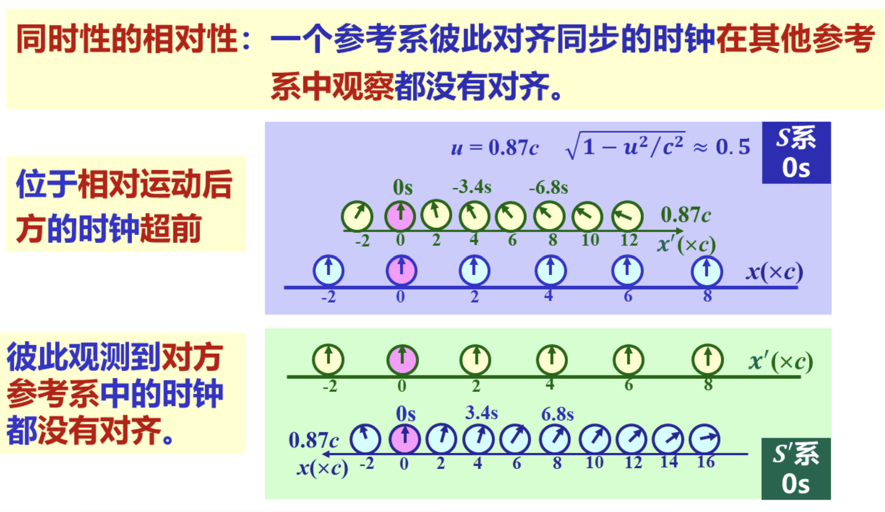

import { Aside } from 'astro-pure/user'

<Aside type="caution">
更新中
</Aside>

看起来很抽象很难。但是，如果只是想把考试题做对，只需要知道**1 个事实**、**2 个公式**、**3 个模型**。

<Aside type="danger" title="These are all you need.">
- 一个事实：同时性的相对性
- 两个公式：
	- 钟慢效应：$\Delta t'=\dfrac{\Delta t}{\sqrt{1-u^2/c^2}}$
	- 尺缩效应：$\Delta x'=\Delta x\cdot\sqrt{1-u^2/c^2}$
 - 三个模型：飞翔米尺问题、火车刻刀问题、追光问题
</Aside>

## 1 钟慢与尺缩
只给结论和理解方式。推导很简单，这里不写了，任何一本近代物理课本中都应该会有。
<Aside type="tip" title="钟慢效应">
曰：你相对于我以速度 $u$ 运动。在**你**的坐标系下的**同一个地点**先后发生了两个事件，**你**测量这两个事件的时间间隔为 $\Delta t$。在**我**看来，这两件事发生的时间间隔比 $\Delta t$ 要**长**，长多少呢：
$$
\Delta t'=\dfrac{\Delta t}{\sqrt{1-u^2/c^2}}
$$
</Aside>

这里我忽略掉了固有时和运动时的概念，事实上这种理解是错误的。但我这里不提这个事，是因为容易把自己绕进去。不影响做题。

<Aside type="tip" title="尺缩效应">
曰：你相对于我以速度 $u$ 运动。在**你**的坐标系下一段长 $\Delta x$ 的尺子，在**我**看来，这段尺子会变**短**，短多少呢：
$$
\Delta x'=\Delta x\cdot\sqrt{1-u^2/c^2}
$$
说得更加一般：一个坐标系一旦相对我动起来，在我看来它的刻度就会缩起来。比如原本刻度 1 的地方，在我这里对应的位置是 0.8，原本刻度 2 的地方，在我这里的对应的位置是 1.6。
</Aside>

同样的，这里其实也有一个固有长度和运动长度的概念，同样不提这个事，不影响做题。

## 2 同时性的相对性

*“光速不变”在我这里并不算一个“事实”。因为光知道一个光速不变，对做题没什么帮助。*

同时性的相对性主要包括两个事情。
1. **同一个参考系内可以定义同步钟，只有同一参考系的同时才是真正意义的同时**。我们在坐标的每一个刻度处都放一个钟，而且全部调成同步，称为一列同步钟。例如地面系，它是一个参考系，在这个参考系中，我们定义了“北京时间”。将全国的钟都按照北京时间调准，那么当授时中心的钟指向 11:45:14 的这一刻，全国的钟都会指向 11:45:14 的这一刻；一个火箭于北京时间 11:45:14 这一刻在海南发射，一列火车于北京时间 11:45:14 这一刻在上海发车，这两个事件在地面系看来，就是同时发生的。这个同时是真正的同时，和一般认知是一致的。
2. **观察相对于我运动的参考系中的同步钟，运动前方的钟滞后，运动后方的钟超前，简称“前滞后超”**。也即坐标系相对于我运动起来之后，我看到的同步钟不再同步。怎么个不同步法呢，前滞后超。
   例如，飞机从上海飞往海南，那么“海南火箭发射”这个事情发生在运动前方、“上海火车发车”这个事情发生在运动后方，因此在飞机的视角看来，地面系上同时发生的这两个事件，“火箭发射”事件滞后 (即后发生)，“火车发车”事件超前 (即先发生)。

同时性的相对性，说的就是这个事情，也即**我的同时和你的同时是不一样的**。如何直观理解这个事：

一列长 $l$ 的火车以速度 $u$ 往前动。在火车中点同时向车头尾各发送一个光子，这样在火车参考系下，就构造出了“光子到达车头 (记为事件 H, head)”和“光子到达车尾 (记为事件 T, tail)”两件同时发生的事件。

但是在地面参考系的我看来，向车头发送的光子与车头同向运动、向车尾发送的光子与车尾相向运动。由于光速不变，事件 H 发生发生的时间就长了一些、事件 T 发生所需的时间就短了一些。这就是“前滞后超”的原因。

***

那么具体相差了多少时间呢：首先，由于尺缩，从地面系看火车长度为 $l'=l \cdot \sqrt{1-u^2/c^2}$，于是在我地面系看来，两件事发生的时间分别为：
- 对于往车头发送的光子有 $l'/2=ct_H-ut_H \Rightarrow t_H=\dfrac{l'/2}{c-u}$
- 对于往车尾发送的光子有 $l'/2=ct_T+ut_T \Rightarrow t_T=\dfrac{l'/2}{c+u}$

因此在**我**看来，这两个事件时间差为 $t_H-t_T=\dfrac{l'u}{c^2-u^2}=\dfrac{lu\cdot \sqrt{1-u^2/c^2}}{c^2-u^2}=\dfrac{lu/c^2}{\sqrt{1-u^2/c^2}}$。

这两个事件在**你**那里是同时发生的，但由于两件事间隔了 $l$ 长度，在**我**这里产生了 $\dfrac{lu/c^2}{\sqrt{1-u^2/c^2}}$ 的时间差，也即**你**那里 $lu/c^2$ 的时间差。这就是同时性的相对性。

<Aside type="tip" title="同时性的相对性">
在**你**的参考系中有一列同步钟。在**我**看来，**你**那里相隔 $l$ 长度的钟，时间相差了**你**那里 $\dfrac{lu}{c^2}$，前滞后超。
</Aside>

## 3 三个模型

### 3.1 飞翔米尺问题
<Aside type="tip" title="模型 1：飞翔米尺问题">
一个长 $l$ 的尺子从地面上一个观察者身边以 $u$ 的速度飞过去，问观察者量这个尺子长多少？

**答**： $l\cdot\sqrt{1-u^2/c^2}$。*我都不好意思管这玩意叫一个模型，因为这只不过是把尺缩重新说了一遍*。
</Aside>

同类题：

<Aside type="note" title="同类题：线段过点">
一个长 $l$ 的火车从我面前以 $u$ 的速度开过去，问：在我看来，火车经过我花了多久？
</Aside>

**答**：我看火车，火车相当于一个飞翔米尺，那么我看到火车的长度变成 $l\cdot\sqrt{1-u^2/c^2}$，那么求通过我的时间，只需要除以速度即可，即 $\dfrac lu\cdot\sqrt{1-u^2/c^2}$

<Aside type="note" title="同类题：点过线段">
一艘飞船要飞往与地球相距 $l$ 的星系。飞船速度为 $u$，问：在飞船中的人看来，要飞多久？
</Aside>

**答**：想象地球上伸出去一根长 $l$ 的大棒子，飞船沿着这根大棒子往前飞。视角切换到飞船上，就是一根大棒子反方向以 $u$ 往回飞。飞船上看这根大棒子，由于尺缩，会变成 $l\cdot\sqrt{1-u^2/c^2}$，那么求飞船飞完这根棒子的时间，只需要除以速度即可，即 $\dfrac lu\cdot\sqrt{1-u^2/c^2}$。这就是飞船上认为要飞的时间。

<Aside type="note" title="同类题：粒子寿命">
某个粒子以速度 $u$ 飞行，实验室测得它在衰变之前飞行距离为 $l$，问：静止的该粒子寿命是多久？
</Aside>

**答**：

先说**正确的理解**：以 $l=52\rm{\,m}$，$u=0.6c$ 为例。实验室有一把尺子，一粒子从尺子旁边飞过去。飞到实验室系刻度 $52\rm{\,m}$ 处时候两眼一黑噶了，在粒子视角下噶的那一刻就是粒子寿命。于是转化为线段过点的问题，实验室系的 $52\rm{\,m}$ 尺子，在粒子的参考系中长 $l\times\sqrt{1-u^2/c^2}=52\times0.8=41.6\rm{\,m}$，因此在粒子看来寿命就是 $\dfrac lu \cdot\sqrt{1-u^2/c^2}$

然后再谈谈**错误的理解**：飞行了 $l'$ 被我量，我量你的长度会比你自己的长度短，所以你实际飞行的长度 $l'=\dfrac{l}{\sqrt{1-u^2/c^2}}$，所以飞行时间 $\dfrac{l/u}{\sqrt{1-u^2/c^2}}$。

**错因**：“我看你的长度”，必须是你那里一个实际的尺子给我看，也就是说“尺子的头”和“尺子的尾”在我的视角下是同时看到的。我的视角的某一瞬间，尺子的头在它自己参考系下的坐标为 $x_1$、在我的参考系下坐标为 $y_1$，尺子的尾在它自己参考系下的坐标为 $x_2$、在我的参考系下坐标为 $y_2$，那么我看你的长度就是 $y_2-y_1$；这个长度和尺子原长 $x_2-x_1$ 之间满足尺缩关系式，$x_1$、$y_1$、$x_2$、$y_2$ 这四个数在我的参考系下是同时读出的。而在本题中，这 $52\rm{\,m}$ 并不是粒子系一把尺子给我量的结果，而是粒子产生时刻在我坐标系下的位置和粒子消失时刻在我坐标系下的位置，这两个事件在粒子参考系中的坐标是一致的。

基于这个错解，**错误的辩解方式是**：既然没有实际的尺子，我就用大棒子的思想，也即一个粒子后面拖着一个 $l_0=\dfrac{52 \rm{\,m}}{\sqrt{1-u^2/c^2}}$ 的大棒子往前飞，粒子死掉那一刻在我的参考系量一下发现是 $52\rm{\,m}$ 不行吗？

**答案是否定的**。因为这相当于用大棒子前端的钟标记出生时间、用大棒子末端的钟标记死亡时间。由于前滞后超，出生时间偏早、死亡事件偏迟，减一下肯定时间偏长。偏长了多少呢：$\dfrac{l_0u}{c^2}=\dfrac{lu/c^2}{\sqrt{1-u^2/c^2}}$。而这个时间差，正好是刚才那个错解和正确答案之间的差。

### 3.2 火车刻刀问题

一句话：同时发生的事件，事件之间的空间间隔就是运动长度

### 3.3 追光问题
刚才提到的问题，都是两个坐标系贴在一起相对滑动、问坐标重合处之间的关系。而追光问题，则要考虑光在两个参考系之间传播需要的时间。实际上就是反映同时性的相对性的题。

飞船以速度 $u=0.6c$ 飞离地球，它发射一个无线电信号，经过地球的反射，$40\rm{\,s}$ 后信号回到飞船，求飞船发射信号、地球反射信号、飞船接收信号的时候，分别在地球系和飞船系测量，飞船和地球的距离是多少？

一颗星以 $0.6c$ 的速度远离地球，地球上测得星球的闪光周期为 $5\rm{\,s}$，求星球实际的闪光周期

## 4 Lorentz 变换

做题的时候，全部想象成刚才的三个模型来做题，不建议背公式。

## 5 速度变换式

## 6 相对论质能关系
- 看一个动起来的东西质量会变大。$m=\dfrac{m_0}{\sqrt{1-u^2/c^2}}$，其中 $m_0$ 称为静止质量，$m$ 称为运动质量
- 动量公式 $p=mu$，$m$ 要用运动质量代进去
- 一个有质量的物体本身就具有能量，$E=mc^2$，这个式子是与参考系无关的。我们说能量守恒，说的是 $E=mc^2$ 守恒
	- 当这个东西与我没有相对运动时，$E_0=m_0c^2$
	- 当这个东西与我有相对运动时，它不仅有因质量带来得能量 $E_0=m_0c^2$，还有一个动能，所以 $E=mc^2+E_k$，即 $E_k=mc^2-m_0c^2$。这个动能不是传统意义上只和速度有关的东西，因为它动起来导致的质量增加也算在里面了，所以这个 $E_k$ 叫做相对论动能
		<Aside type="tip" title="当远小于光速时与经典力学观点一致">
		$$
        \begin{aligned}E_k&=mc^2-m_0c^2\\&=mc^2\left(1-\sqrt{1-u^2/c^2}\right)\\&\sim mc^2\left(1-\left(1-\dfrac12u^2/c^2\right)\right)\\&=mc^2\dfrac12\dfrac{u^2}{c^2}=\dfrac12mu^2\end{aligned}
        $$
        </Aside>
- 能量与动量的关系：$E$ 做斜边，$m_0c^2$ 与 $pc$ 做直角边，满足勾股：$E^2=\left(m_0c^2\right)^2+\left(pc\right)^2$
- 动能与动量的关系：$E_k^2+2m_0c^2E_k=p^2c^2$
- 一些常见的数据要记的
	- $1 \text{ eV}=1.6\times10^{-19}\text{ J}$
	- 电子的静止质量 $9.1\times10^{-31}\text{ kg}$
	- 电子的静止能量 $0.51\text{ MeV}$